# Activity Analytics

In this section:

- [Description](#description)
- [Dependent Azure resources](#dependent-azure-resources)
- [Reports deployment](#reports-deployment)
- [Data model description and available metrics](data_model.md)

## Description

Using the M365 Advanced Analytics database, this feature aims to allow an administrator to create profiles for different types users depending on their usage of the different M365 services used.

A new set of tables is created in the database that aggregate the data from the activity tables of the M365 Advanced Analytics engine. These tables are then used in a Power BI report that allows to analyze the users' activity.

Since the data available in the database/report shows aggregated usage and activity per user per week, it allows anyone, not only tenant admins to analyze this data and make decisions about adoption plans, license usage, etc.

## Dependent Azure resources

The resources that automate the weekly aggregation of the data used by the Power BI report are:

* Automation Account: used to run scheduled PowerShell runbooks.
* Runbooks: several runbooks will be created for different tasks.

    Name | Description | Schedule
    -|-|-
    Weekly|Aggregates data for the report|Sunday 6pm
    Database_Maintenance|Keeps SQL indexes and statistics updated|Sunday 1pm and Sunday 11pm
    Aggregation_Status|Outputs table sizes and row counts.|On-demand (manual)

    These runbooks are PowerShell scripts that execute SQL stored procedures, so all the work is done at the SQL level. Runbooks are only used to schedule their run.

For this extra reporting to work, the automation jobs to compile the data all need to be enabled.

By default, if usage imports are enabled in the installer, the automation resources to compile these statistics are created but not scheduled, so they won’t run. This is due to the extra demand for the SQL Server database that this extra processing requires.

### Where are the PowerShell scripts stored?

As part of the installation, the PowerShell scripts needed are taken from the solution zip files, copied into your storage blob container (private access):

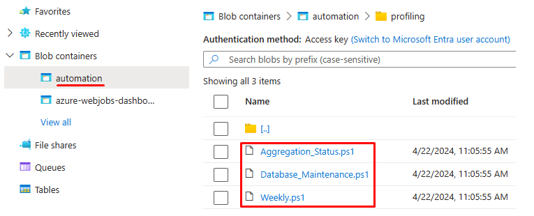

Shared Access Signature URLs are generated from uploaded PS files to give read-only access to these files and these URLs are what the automation account uses to download and run the scripts when the runbooks are created. In any case, the runbooks do not contain any installation specific data.

### How much extra resources are needed?

**Recommended performance**: minimum 50 DTUs for small organizations (up-to 20k users) for SQL Database, 100-200 DTUs for larger organizations.

**Space**: approximately 8gb per 10 thousand users, for 1 year of retention.

You can control retention with the `WeeksToKeep` variable:

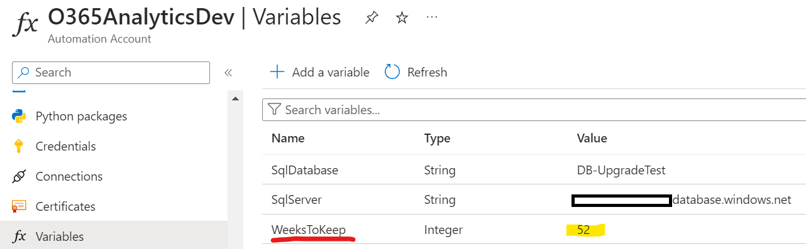

This variable is read by the maintenance script.

### Automation variables

There are some variables in the automation account:

Variable|Type|Value|Description
-|-|-|-
SqlDatabase|String|database|Name of the analytics database
SqlServer|String|server.database.windows.net|URL of the database server
WeeksToKeep|Integer|52|Retention in weeks of the analytics data. Data is cleaned every week

### Automation credentials

These are the credentials used by the runbooks to access the database.

Name|Username|Password
-|-|-
SQLCredential|*sqladmin (default)*|*SQL password*


## Reports deployment

Once the installation of the engine is completed follow these steps to set up the analytics reports:

1. Confirm that there is data available to aggregate.
2. Link runbooks to schedules.
3. Wait for the runbooks to run.
4. Connect and publish the Power BI reports.

### 1. Confirm data availability

Open the Automation Account and click on the `Aggregation_Status` runbook.


Start it from the toolbar:

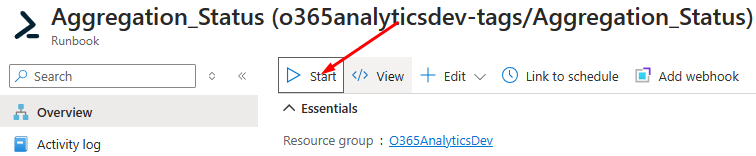

Wait for it to finish and review the Output tab:

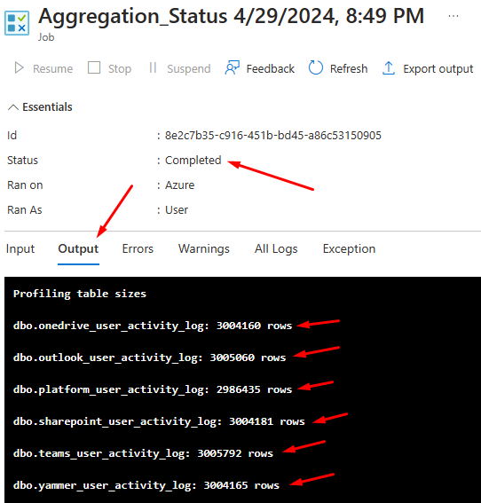

If you see data in the dbo.* tables, you can move forward.

### 2. Runbook schedules

Schedules are pre-created in the automation account; they just need linking to the right runbooks. Link the schedules by going to the Automation account in Azure portal.

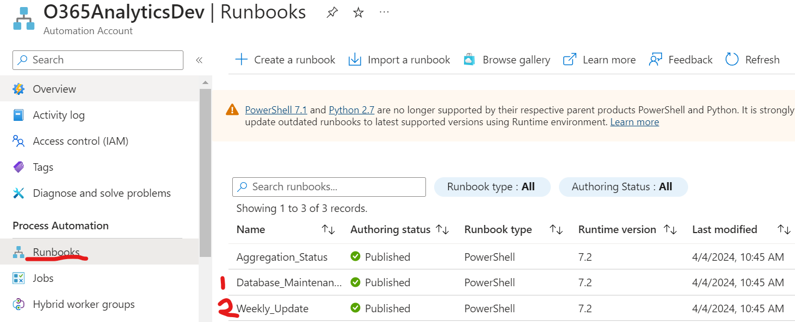

**Create Schedules for “Database Maintenance”**

Find the runbooks and click on `Database_Maintenance`.

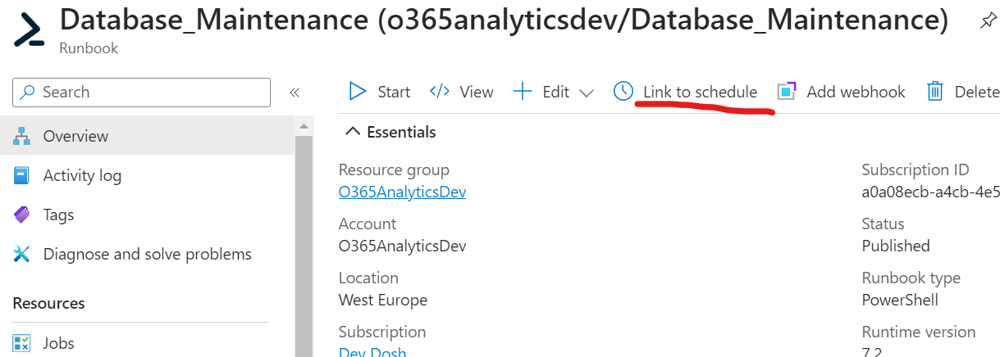

Link the runbook to a schedule – we’ll add this runbook to two schedules, one by one. First one is `activitylog` maintenance, every `Sunday at 1pm`:

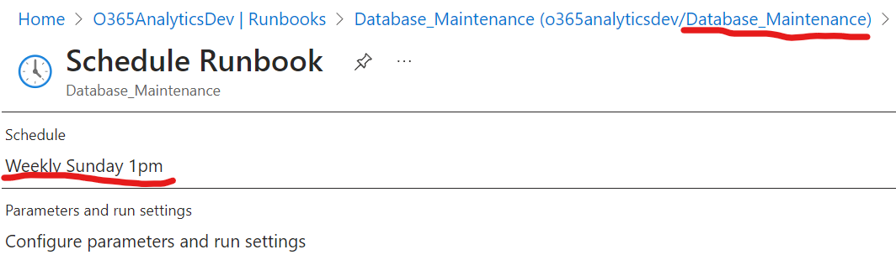

Now set the parameter to start. Click “configure parameters and run settings” and enter `activitylog` in the MAINTENANCETYPE parameter box:

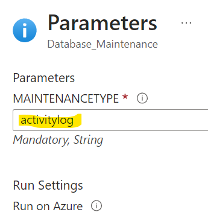

Click OK to confirm parameters. Click OK to confirm this schedule.

Now link another schedule for this runbook to create one for weekly DB maintenance:
- Schedule: `Weekly Sunday 11pm`
- Parameters:
    - MAINTENANCETYPE = `weekly`

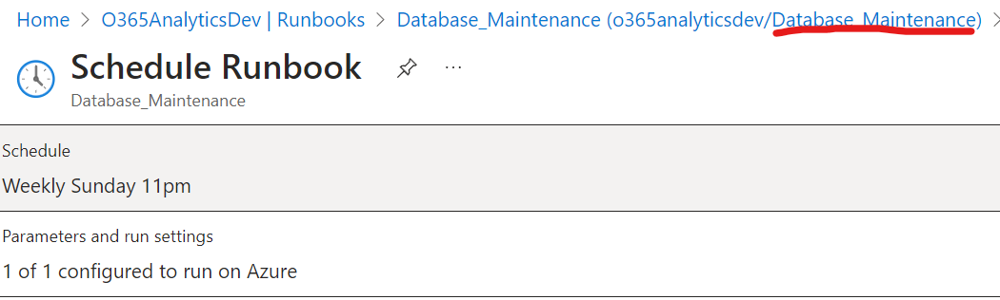

Click OK to save.

Confirm you see both schedules for the maintenance runbook:

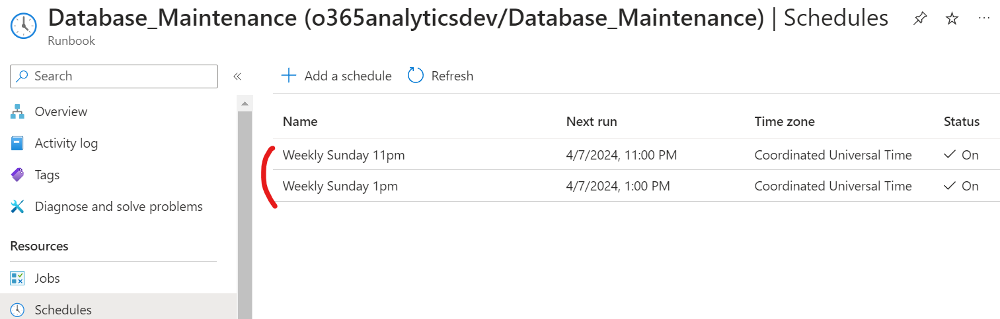

**Create Schedule for “Weekly Update”**

Link a new schedule for the runbook `Weekly_Update`:
- Schedule: `Weekly Sunday 6pm`
- No parameters

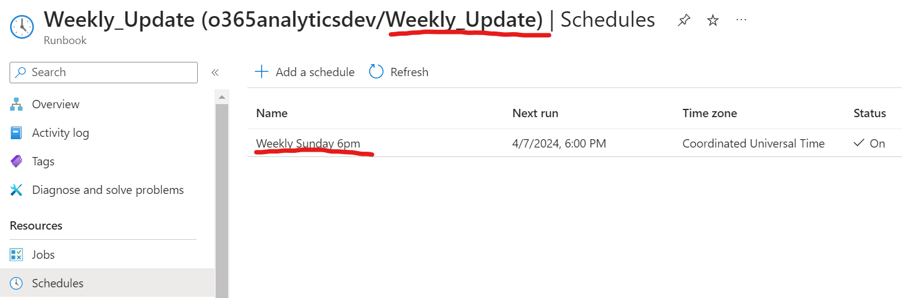

Both these jobs should run without errors but should only be run out of peak hours.

### 3. Wait for runbooks to run

The aggregation runbook `Weekly` will run on the next Sunday. You can start it manually and wait for it to finish.

>Note: Sometimes the data to aggregate can be large and the runbook may timeout. Runbooks have a 3 hour maximum execution time. You can start the runbook and the work will continue where it stopped the last time.

Run again the `Aggregation_Status` runbook. If you see data in the profiling.* tables, you can move forward with the report.

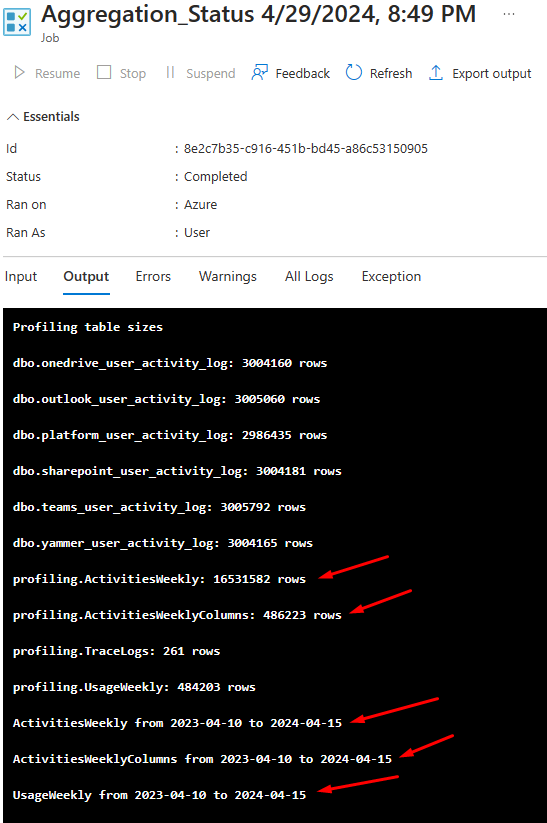

### 4. Connect and publish the reports

There are two report templates in this folder: [Analytics reports](/reports/Usage%20Analytics/)

#### 1st report: Data model

File: `Analytics_DataModel.pbit`

This report is intended for creating the tables in the Power BI service. This report is not intended to be consumed directly by end users. The idea is to keep this report unchanged. This way, if the data model changes after an update, the report that users see will not break.

1. Open the report directly from the file explorer. This way, after loading, it's request to fill in the following parameters:
- Database server URL: `yourserver.database.windows.net`
- Database name.
- The `Use Yammer` parameter will filter out some Yammer metrics if not needed. Use `true` or `false` here.

If you open the template from Power BI, the parameters dialog will not appear and you'll have to manually change them in the **Transform data** menu.

2. Once the parameters are completed, Power BI will try to make the connection to the database server. At that moment a message will appear to authenticate the connection. In the new dialog, on the left, select database and then fill in the database user and password. The default user is sqladmin.

3. Once authentication is completed, the report will load the data and, if everything goes well, the data will be shown in the report.

4. On the toolbar click Publish. The workspaces to which the user has access will appear in the publishing dialog. Choose the appropriate workspace and publish the report. If the report has already been published before, it will ask for confirmation before overwriting.

Note: If you haven't authenticated before when you open the Power BI Desktop app, it will now ask for authentication. You must sign in with a user who has a Pro license or access to a Premium Power BI workspace.

#### 2nd report: Generic report

File: `Analytics_Report.pbit`

This report template connects live to the data model you've just published in Power BI and the one that should be used by end users.
The information is displayed in the matrix that can be changed dynamically based on the metrics you choose in the metrics selector.

1. When loading the report, Power BI will return an error because you'll not be able to access the development cube. This is expected. Close the error message and the report will be displayed, albeit with errors.
3. In the toolbar click on the **Transform Data** menu and from that menu select **Data Source Configuration**.
4. A new window will appear where there will be a DirectQuery connection against a data model. Select that connection from the list, right-click, and then click Change Source.
5. A new dialog will appear where the data model that we created in the previous point should appear: `Analytics_DataModel`.
6. Once the data loads, the report should display correctly.
7. At this point, we can publish the report to the same workspace as the previous one.

>**Important!** If you want to extend the report to load additional data, create new calculated columns or measures, you should use this report template and not `Analytics_DataModel.pbit`.

## Additional considerations

### Audit events

For audit events to be crawled, the table dbo.OrgUrls must have at least one row. If you are not using SPO Advanced Analytics your table will be empty.

By default, `Audit.SharePoint` and `Audit.General` are crawled.

You can add a new row with any content to enable audit logging crawling:

```SQL
INSERT [dbo].[org_urls] ([url_base]) VALUES ('this-is-here-so-audit-data-can-be-imported');
```