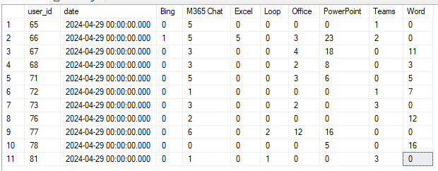

# Copilot Audit logs

**[WIP]**

Copilot related event logs can be captured.

Additional required **application** permissions:

* Files.Read.All
* OnlineMeetings.Read.All

## SQL aggregation

TODO:
* Needs aggregation by date



```SQL
SELECT
	ev.user_id
	,chats.app_host
	,count(ev.time_stamp) event_count
FROM [dbo].[audit_events] ev
join dbo.event_meta_general g on ev.id = g.event_id
left join dbo.event_copilot_chats chats on ev.id = chats.event_id
where chats.app_host is not null
group by user_id, app_host;

with
copilot_events as (
	SELECT
		ev.user_id
		,chats.app_host
		,files.file_name
		,meet.name as meeting_name
	FROM [dbo].[audit_events] ev
	join dbo.event_meta_general g on ev.id = g.event_id
	left join dbo.event_copilot_chats chats on ev.id = chats.event_id
	-- Files
	left join dbo.event_copilot_files c_files on chats.event_id = c_files.copilot_chat_id
	left join dbo.event_file_names files on c_files.file_name_id = files.id
	-- Meetings
	left join dbo.event_copilot_meetings c_meet on chats.event_id = c_meet.copilot_chat_id
	left join dbo.online_meetings meet on c_meet.meeting_id = meet.id
	where chats.app_host is not null
),
file_events as (
	select user_id, app_host, count(file_name) as related_count
	from copilot_events
	where file_name is not null
	group by user_id, app_host
),
meeting_events as (
	select user_id, app_host, count(meeting_name) as related_count
	from copilot_events
	where meeting_name is not null
	group by user_id, app_host
)
select * from file_events
union
select * from meeting_events
```

## Notes

* when apphost == Teams, events are not imported. These are interactions with copilot in the chat in teams

Check `SaveSingleCopilotEventToSql`.

* Once the events are imported, they are not updated in the database. To clean the Copilot events use this:

```SQL
begin try
begin transaction
truncate table dbo.event_copilot_files
truncate table dbo.event_copilot_meetings
delete from  dbo.event_copilot_chats
truncate table [dbo].[event_meta_general]
delete from dbo.audit_events where operation_id = 1
commit transaction
end try
begin catch
print error_message()
if @@trancount > 0
rollback transaction
end catch
```

* OneDrive files info seems to fail to load:

    >Files might have been renamed.

    ```
    Error getting file info for copilotDocContextId https://contoso-my.sharepoint.com/personal/billy_contoso_onmicrosoft_com/_layouts/15/Doc.aspx?sourcedoc=[...]

    No file info found for copilot context type 'docx' with ID https://contoso-my.sharepoint.com/personal/billy_contoso_onmicrosoft_com/_layouts/15/Doc.aspx?sourcedoc=[...]
```

* Whiteboard events are not recorded:
    * whiteboard are considered SPO events -> wrong

    ```
    No file info found for copilot context type 'whiteboard' with ID whiteboard.office.com/me/whiteboards/p/c3BvOmh0dH[...]
    ```