## Optional: Configure Runtime Account for Certificate Authentication

You can run the system with certificates instead of client secrets. Here’s how to set that up.

By default, no permissions are given for certificates in the key vault for any users – just service-accounts:

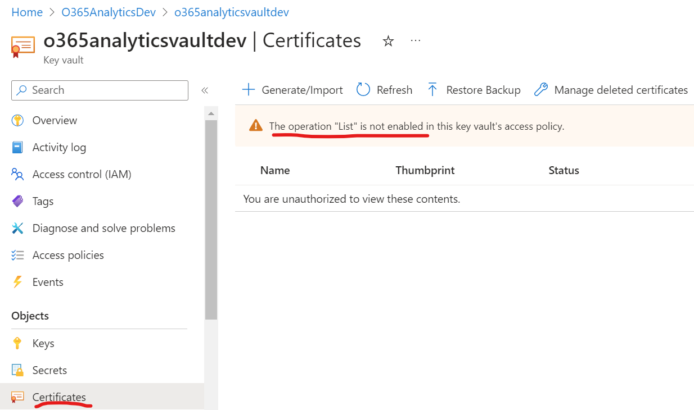

We need to add permissions for the current user in Azure portal & the application identity for certificates (note: the installer now grants the runtime account “get” rights for certificates).

Grant User Access to Key Vault

Go to vault access policies.

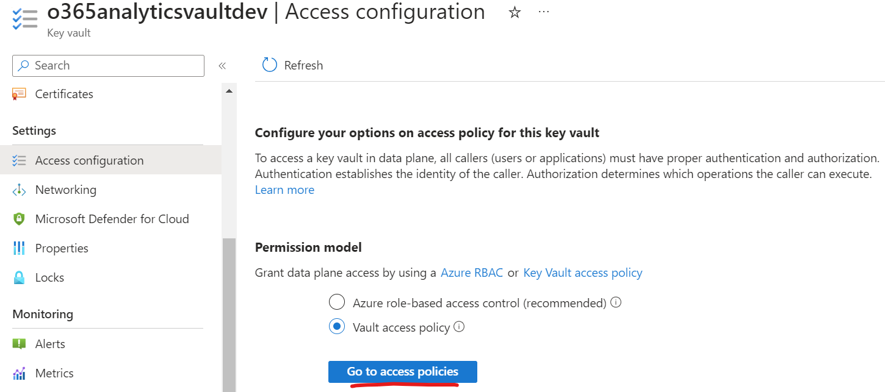

Create a new policy for the current user to manage certificates:

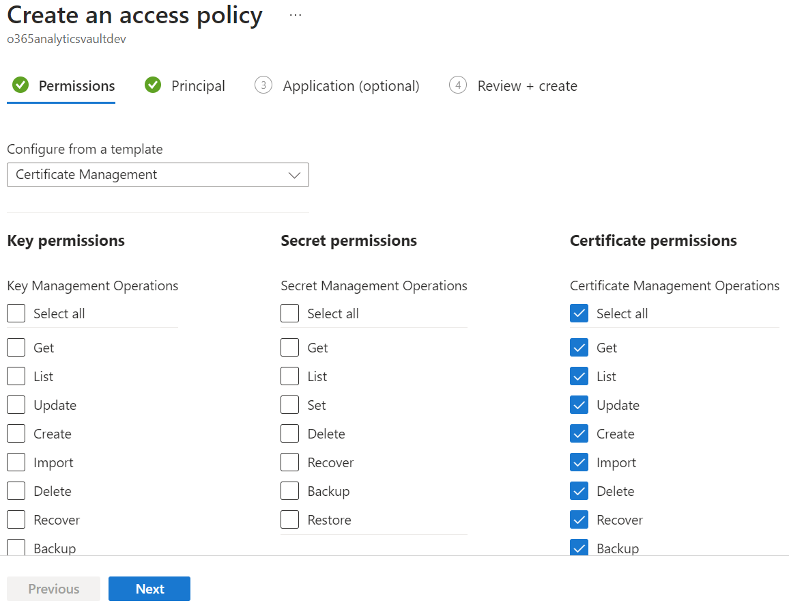

It’s up to you what permissions you give yourself; your user permissions aren’t used by the import web-jobs. Your permissions should include though the ability to upload/generate certificates.

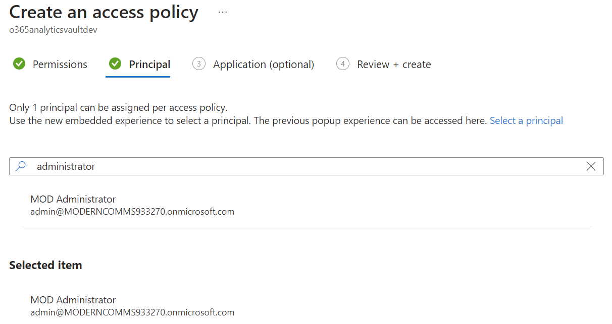

These are for your user only.

Grant Runtime Account Read Permissions

In case you haven’t got the permissions configured already, allow the runtime account read access to certificates.

We assume vault access policies are used.

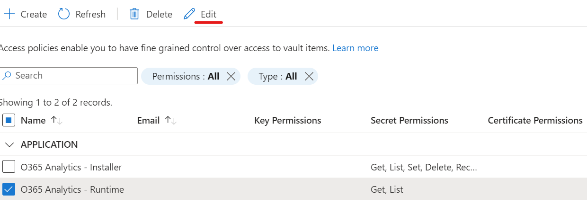

Make sure “get” is selected:

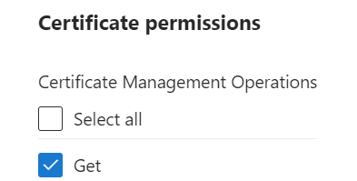

Click “Next” and “save” to apply the permission changes.

Generate Certificate to Authenticate With

Create a new certificate to use for authentication. You can have Key Vault generate it for you, or use your own CA if you prefer that way.

Recommended: give it a long validity as access to APIs will break when it expires until the configuration in the app service is manually updated with the new certificate.

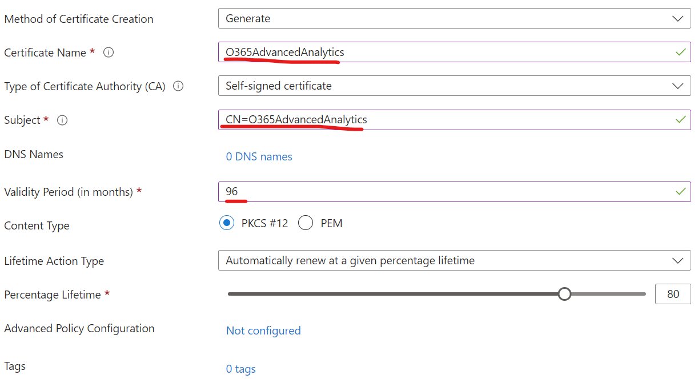

**Important**: the subject-name and certificate name must be “**O365AdvancedAnalytics**” (CN=O365AdvancedAnalytics) as that’s what the solution expects. For now, this isn’t configurable.

Also note: the private key for the generated certificate is stored as a managed secret, so the app service identity will need secret get permission too.

Now open and download the public key:

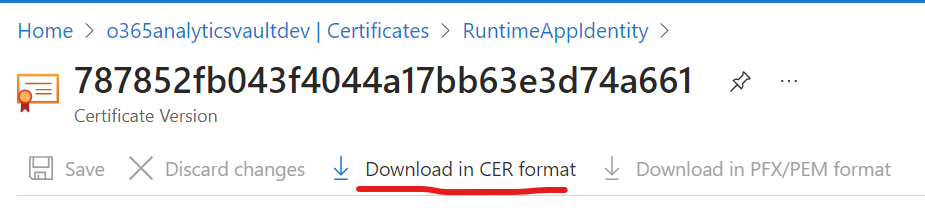

Take note of thumbprint:

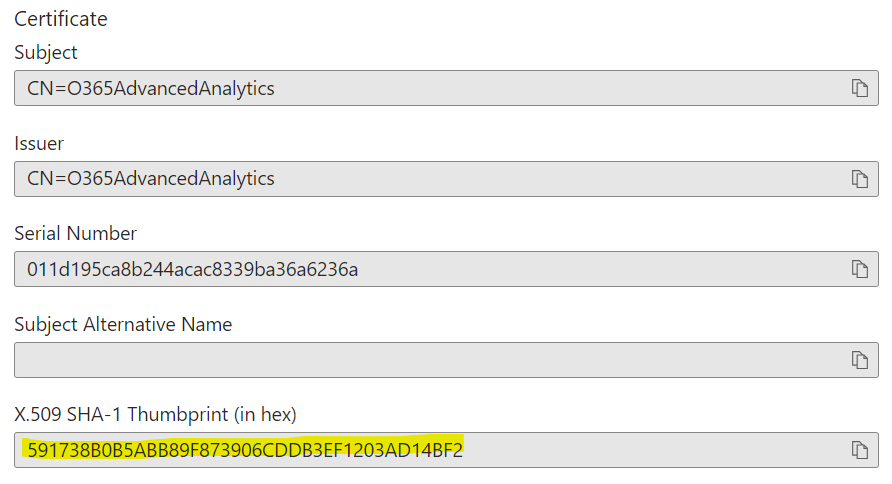

Upload Public Key to Entra ID (Azure AD) Application

The corresponding public-key can now be used for the application registration. In “certificates” for the application registration:

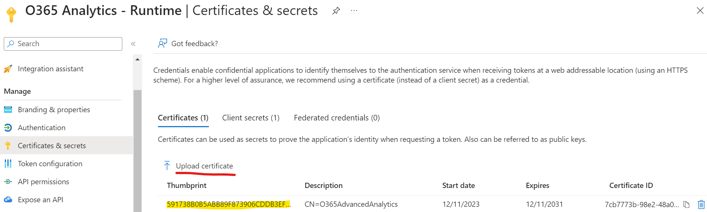

Verify thumbprint is the same as certificate stored in Key Vault.

How to Enable Certificate Authentication

By default the system will use client-secret authentication. To force certificate authentication, add a setting “UseClientCertificate” with value “true” to the app service configuration and save. You can optionally remove the “ClientSecret” value too; with the 1st setting as “true”, the secret is ignored.

Another mandatory setting to have is “WEBSITE_LOAD_USER_PROFILE” with value “1” so the app service can parse X509 certificates. [More information online](https://learn.microsoft.com/en-us/azure/app-service/reference-app-settings?tabs=kudu%2Cdotnet#build-automation).

Recommended: Verify Web-Job Logs

Make sure the certificate is read successfully by checking the logs of the “Office365ActivityImport” job:

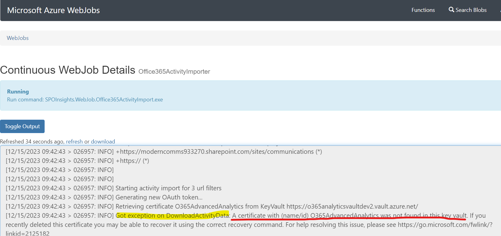

Here we see that the operation has failed because there’s no certificate in the key vault.

Certificate Rotation

There is no automatic certificate rotation support. When the certificate is renewed in Key Vault, you must overwrite the certificate in Entra ID with the new one too and restart the web-jobs.

