# Deployment Guidance

The following sections document the steps required to deploy the Office 365 Advanced Analytics Engine solution components. This is the solution architecture that will be setup & configured:

The deployment can be done automatically or manually - but installation is highly recommended to be done with the installer/control-panel application if possible.

## Access Release

Solution assets are available via the downloads - <https://m365advancedanalytics.azurewebsites.net/>

This site contains the latest stable & testing builds from the DevOps repository pipelines.

The primary package you will need is the installer/control-panel application which is what installs the solution. The installer will install or update an install but can also test the readiness of the configuration loaded without making any changes.

### Build Assets

Copy the Office 365 Advanced Analytics Engine solution component build assets provided to a machine that complies with the installer machines perquisites noted above.

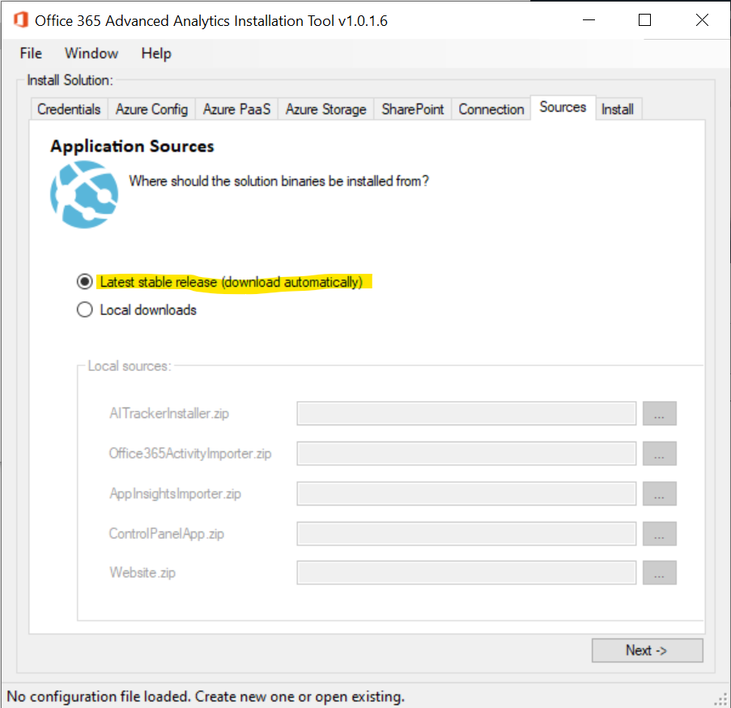

To deploy via the installer, you need only download that which will then download the other assets automatically. The installer is in “ControlPanelApp”; download, extract and run “AnalyticsInstaller.exe” (note: it’s called “Control Panel” as it was originally intended to do more than just install the solution).

If you are deploying manually or you’re installing a specific build via the installer, you will need to download the assets manually:

-   “**AITrackerInstaller.zip**”
    -   JavaScript + PowerShell to insert into SPO sites to track web-usage.
-   “**AppInsightsImporter.zip**”
    -   This is the web-job binaries to import data from Application Insights
-   “**Office365ActivityImporter.zip**”
    -   This is the web-job binaries to import activity from Office 365.
-   “**Website.zip**”
    -   The app-service website contents including the Graph webhook endpoint for call tracking.

The installer can install a specific build if needed:

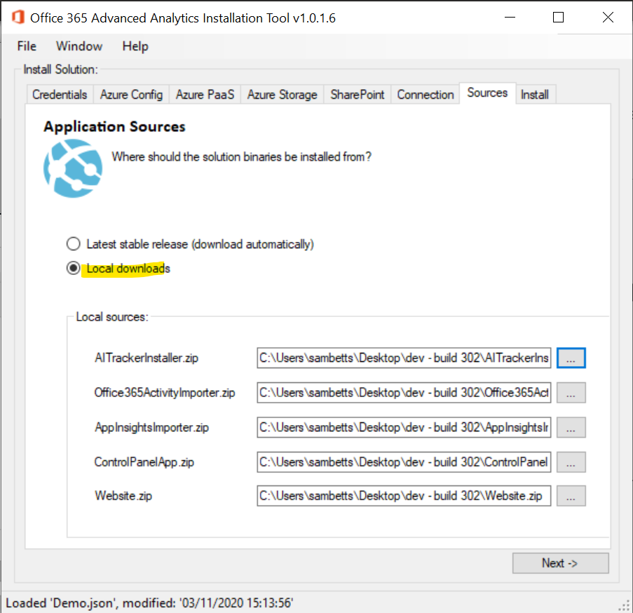

Unless otherwise requested, we recommend installing the latest stable build.

### Configuration Settings

Before being able to run the installation process either manually or automatically, the following information is needed.

| Input Parameter                               | Value Description                                                                                                                   |
|-----------------------------------------------|-------------------------------------------------------------------------------------------------------------------------------------|
| Installation service account credentials      | The service-account used by the installer/control-panel to create Azure resources.                                                  |
| Run-time service account credentials          | The service-account used by the runtime web-job to import Office 365 activity & Graph data.                                         |
| **Azure:**                                    |                                                                                                                                     |
| Resource group name                           | The target resource-group for all Azure resources created.                                                                          |
| Azure location                                | Region to create resources in.                                                                                                      |
| Subscription details                          | The ID + Name of the subscription to be used. Can be autodetected if installer account has permissions to read Azure subscriptions. |
| Blob storage account name + container name    | Name of storage account to create. Must be unique.                                                                                  |
| Application Insights name                     | Name of resource to create.                                                                                                         |
| App service & app-service plan names          | Names of App Service to create + plan. App Service name must be unique.                                                             |
| Azure cognitive services app (optional)       | Endpoint + key                                                                                                                      |
| Azure Service Bus                             | Connection string                                                                                                                   |
| Azure Cache for Redis                         | Connection string                                                                                                                   |
| SQL Server name, admin username and password. | Configuration for the database server to create. Must be a unique name.                                                             |
| SQL Database name.                            | Name of the database to create on the SQL Server.                                                                                   |
| **SharePoint**                                |                                                                                                                                     |
| Site-collection URLs                          | Where to deploy the tracking script & enable activity tracking. One URL per line.                                                   |
| App catalog URL                               | Site-collection of app catalogue for tenant.                                                                                        |
| SharePoint credentials                        | Credentials of a user with site-collection rights on each of the supplied site-collections to install solution on.                  |
| Tenant domain                                 | The “OnMicrosoft” FQDN: “contoso.onmicrosoft.com” for example.                                                                      |

Table 2 - Configuration settings

## Deploy and Configure Solution Components

There are two methods to deploy the solution: automatic via the control-panel application, and manually. If you are using the control-panel/installer automatic method (recommended), you need an installation service-account.

**Express version:**

If you just want a quick overview of the installation process:

1.  Register an application in Azure AD to install solution with.
2.  Register an application in Azure AD to read Office 365 activity data.
3.  Setup solution dependencies:
    1.  **Via the installer** – recommended as it automates many parts of the solution setup.
    2.  **Manually** – fallback for if the installer route isn’t an option.
        1.  Create Azure resources & configure app-service with corresponding keys.
        2.  Upload web-jobs.
        3.  Install SharePoint extension application.
        4.  Run PowerShell to staple AITracker.js to site-collections.
4.  Verify success: data is flowing & web-jobs are running continuously.

**Pre-Flight Checklist**:

Before installing, please check the following is verified:

1.  Runtime service account is created with permissions added and approved (see “**Prerequisite Permissions**”).
2.  Azure service providers enabled (see “**Prerequisite Azure & Office 365 Configuration**”).
3.  Ports open from installer machine for FTPS & SQL (see “**Prerequisite Firewall Rules**”).
4.  Office 365 reports anonymisation is **disabled** - <https://learn.microsoft.com/en-us/microsoft-365/troubleshoot/miscellaneous/reports-show-anonymous-user-name>
5.  **Recommended**: run a “test configuration” from installer before attempting any installation:

When no errors are seen here, there’s a good chance the installer will work. Any errors should be reviewed before installing.

### Solution Preparation

As described above, we need x2 service accounts – an installation account for installing the solution, and a runtime account to import data from Office 365.

For both accounts follow this process:

#### Create Runtime Service Principals

Create an app registration with Azure AD. Find the Azure AD section:

Add new app registration through portal.azure.com – the Azure AD blade.

New registration name: “**O365 Advanced Analytics - Runtime**” or “**O365 Advanced Analytics - Installer**” (you need to repeat this process for each registration).

Leave the “redirect URIs” for now, but we will need to add them later for the runtime account. Click “register” to create the application registration.

You should now be sent to the new application you’ve just created. Next, we need to add a client secret.

Create new client secret for app registration with the following information:

**Description**: whatever you want. Blank is fine.

**Expires**: the maximum amount you can (or a date you’ll have to change the secret & update configuration).

Click “add” and the secret will be generated. Copy & store key that’s shown.

Remember to save the secret **value** – we will need this later.

Go to application overview. Copy & store application registration ID and the directory ID:

The application should be now created. You need the client ID, secret value, and directory ID for both installer & runtime accounts.

**Important**: both accounts need to be in the same Azure AD directory.

**  
**

#### Grant Permissions to the Office 365 Activity and Graph APIs

The runtime service principal must have permissions granted to the activity and Graph API. This is not something granted by default, so needs to be added after registration.

In the runtime app registration, add the permissions in the following screenshot. Click “API permissions” and then “Add a permission”.

There are two sources we need to read data from: “Office 365 Management API”, and “Microsoft Graph”.

The permissions for the Office runtime account should look like this if you need all the permissions used (see your solution specific documentation):

When permissions are added initially, they are not granted until an Azure AD administrator can consent to them.

**Important:** grant admin consent to application to complete configuration.

This may take some time internally within your organisation to get approved.

All Azure AD permissions should now be configured for the runtime account.

#### Testing Runtime Account

Once the permissions above have been set, you can validate them in the installer application easily. Open the installer/control-panel, and just fill out these fields:

Then on the install tab, click “Test Configuration”

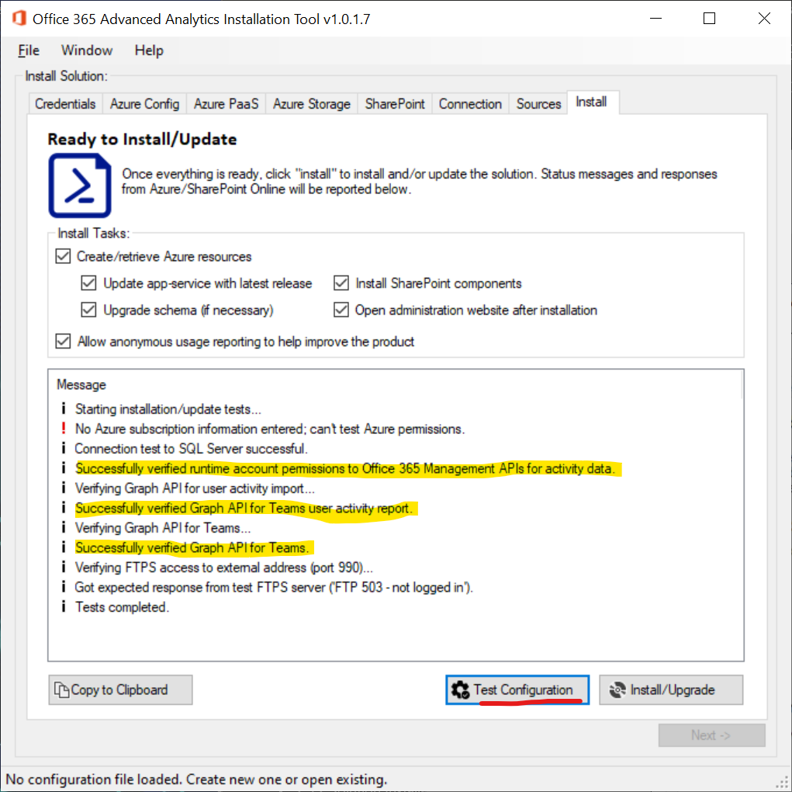

When testing configuration, no changes are made in any way to anything. The installer just simulates similar reads the importer web-jobs will do and reports their success.

**Add Platform configurations to Runtime Service Account Registration**

For the web application to correctly authenticate users, its URL must be set up in the runtime account.

**Note**: this authentication configuration step requires you know the URL of the Azure App-Service you have or will-have created. You may need to come back to this step once the app-service is created. Please don’t forget though, as this is required for the website to work.

1.  In the app registration, add a new platform configuration by clicking in Authentication and then “Add a platform”.
2.  Choose “Web application” and add the URL of the app service as redirect URL.

    

    Add your web-application URL as seen in the configuration wizard:

    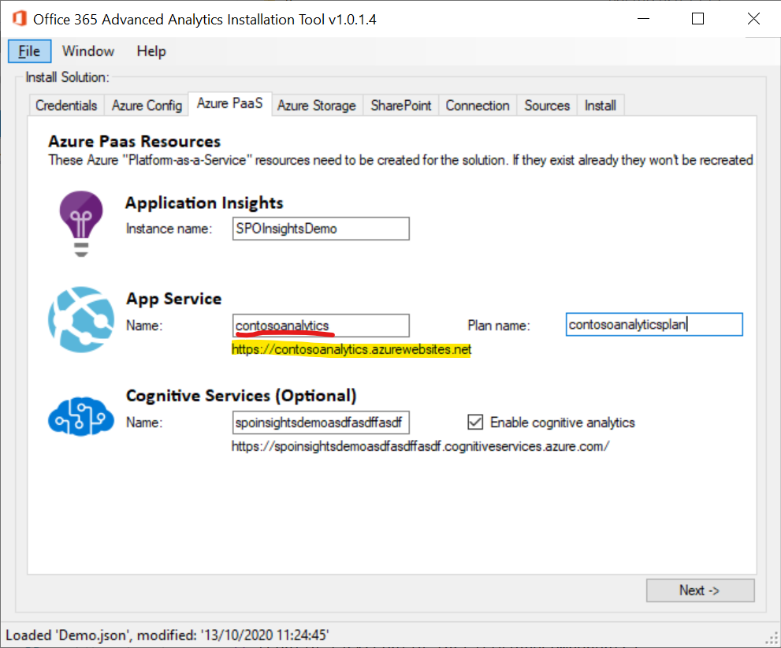

    Once the web-app is created (so you know the name is valid), copy the root URL into the application registration configuration.

    

    This redirect URL needs to be the root of your app-service, HTTPS.

3.  Click on “Configure” to add the configuration.

#### Create Installation Service Principal

Follow the same process above to create a runtime service principal. For this account, no permissions are added – we just need an application registration & secret.

#### Create Azure Resource Group

For the installer we need to grant it permissions to an existing resource group in the Azure subscription. From the portal, create a new group:

Once created we can add the installer permissions to it.

#### Grant Installer Permissions

In the resource-group, add the installer account to list of role assignments:

Next find the role: **owner**.

Next pick who we want to add as “owner” to this group.

Select members and search for the installer account. Selecting it will add it to the select list.

Confirm we have the right permissions:

Click “review + assign” to verify one last time.

When you click this a 2nd time, Azure will add the role:

The installer account has been added to the resource group.

Next, we need to do the same for the subscription, but with “reader” permissions. Go to the subscription that hosts the resource group:

In access control, add a new role:

This time add “reader” role:

Great! The installer should now be able to create all the resources needed.

#### Enable Implicit Grant Flow for Runtime Account

Implicit grant flow must be enabled so that users can login to the web application that’s created for the solution.

**Note**: we recommend doing this after the app-service has been created as you’ll need the app service URL.

First, we need to add “web” as a platform on the runtime app registration:

From the “authentication” blade, add “web”:

Enter the base URL of your app service:

Make sure that both “Access tokens” and “ID tokens” checkboxes are ticked.

Test the configuration by accessing the root URL of the web-app.

### Solution Installation – Automatic Setup

The first step is to set up the data collection.

There is an installer application to help setup everything, but it needs permissions in Azure AD to do so. If it doesn’t work because of permissions or any other reason, the manual installation is the fallback method & explained too.

**Important**: The installer account needs to be in the same tenant as Office 365.

#### Run Installer

Extract the control panel application & run “AnalyticsInstaller.exe”. You may be interrupted by Windows SmartScreen:

Click “more info” and then “run anyway”. If you don’t have that option, you need to configure Windows Defender SmartScreen to only warn (the default Windows setting).

#### Verify Resource Group Permissions

All the Azure resources will be created in a single resource-group. We recommend pre-creating this resource group and assigning “owner” rights to the installer account for this group only.

The installer can also create the resource group if the installer account has the right permissions on the subscription.

#### Fill in Installer Fields

Next, we need to fill out the remaining configuration. Trying to save the configuration will tell you if there’s any validation errors/missing data.

Please note, the screenshots in this documentation may not reflect the exact experience of the installer you see. The same information will be there however, just maybe differently presented.

**Targets**

Pick the data you want to import and/or the solution you wish to install. For Adoptify, the list of imports is preselected:

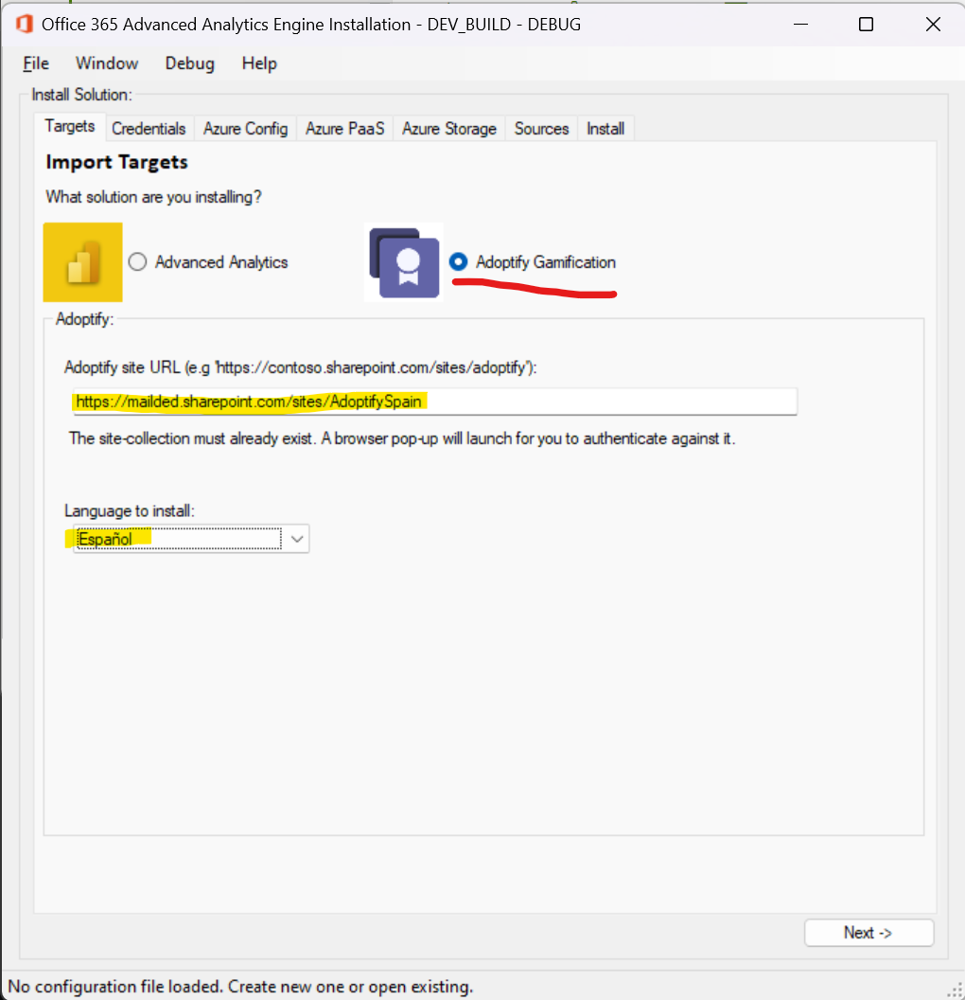

See the Adoptify deployment guide for more information about setting up this solution specifically.

For Advanced Analytics & Insights, you can customise what data-sources you wish to import:

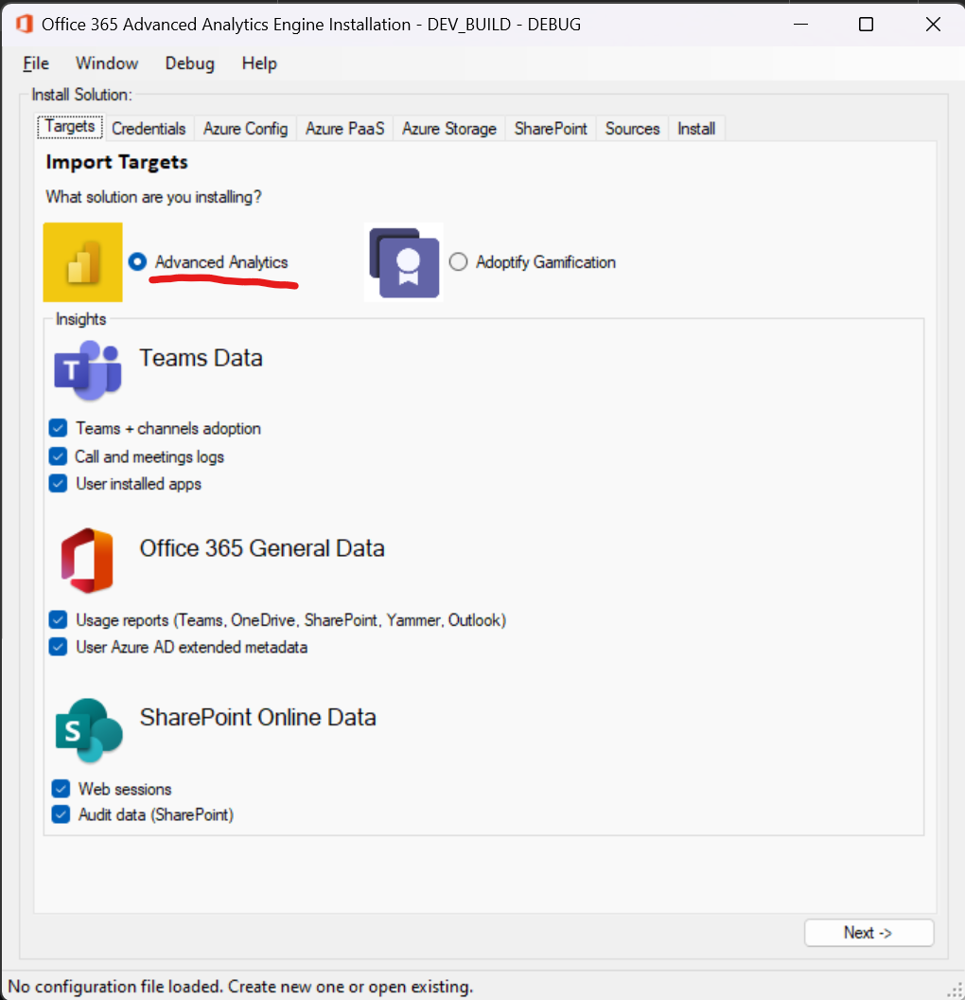

Later, you can also reconfigure which sources to include or ignore.

**Credentials**

At this point you should have both service accounts filled out in the installer from the above configuration.

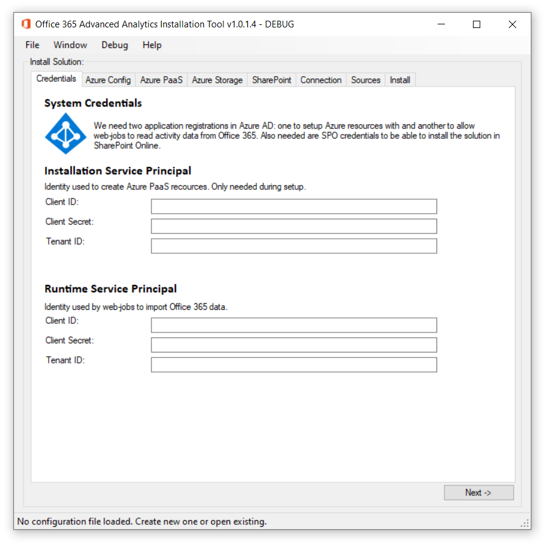

Azure Configuration

The resource-group needs to be the same name as the group we created previously (or not if we wish the installer to try and create the group).

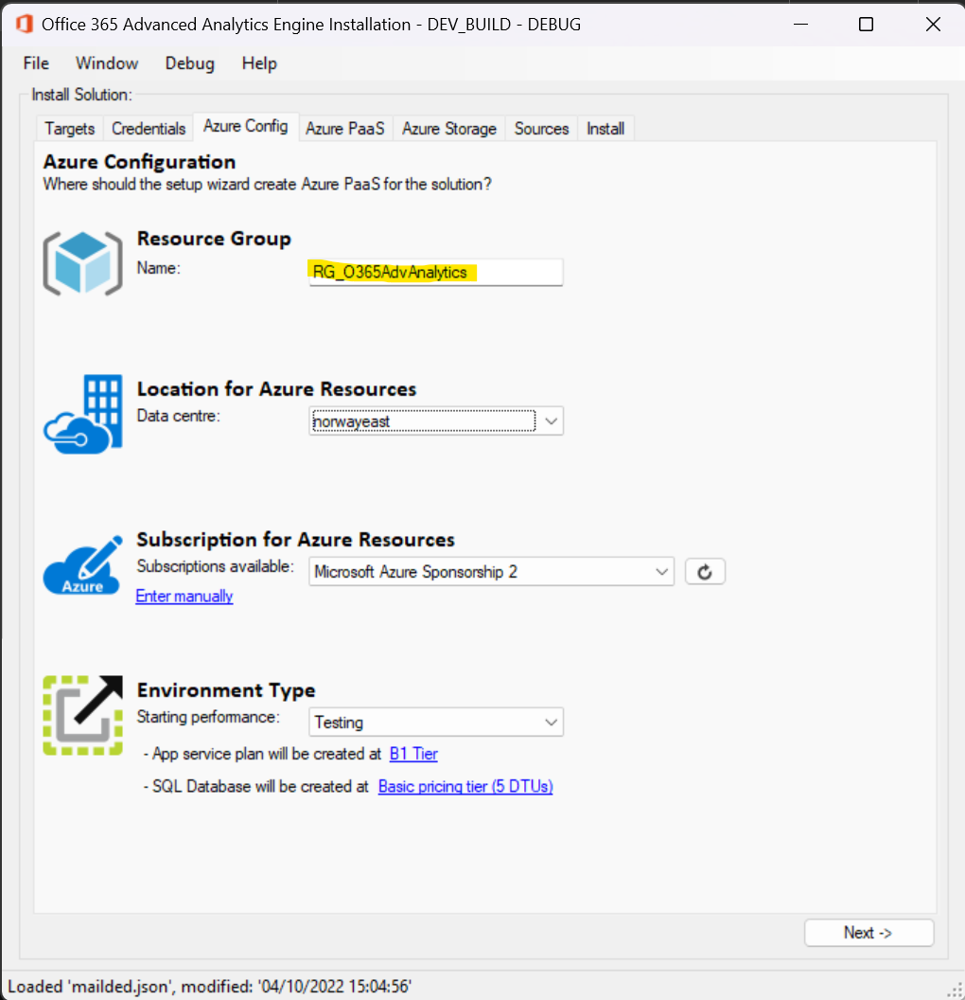

Make sure a subscription is selected. The refresh will use the supplied installer account details to try and refresh this. If it fails, you can enter the details manually.

The performance tier configuration gives you a chance to configure an initial pricing tier for the environment. This only applies for resources created for the 1st time (if Azure resources are found already the performance settings are left untouched) and are the general recommendations for each type of environment.

Later, we highly recommend tuning the performance tier to your specific needs.

Azure PaaS

On this screen, most fields will be pre-populated with some default values, but will almost certainly need modifying:

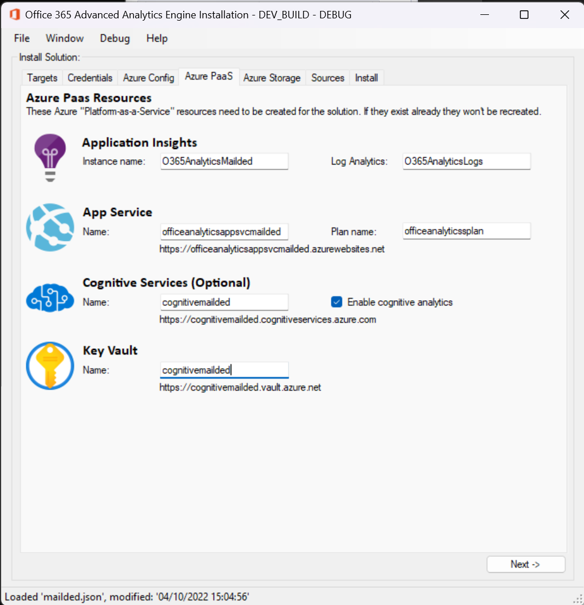

The following resources need unique names in Azure as they will by default have public endpoints, so public & unique DNS names are needed:

-   Key vault.
-   Storage.
-   SQL Server.
-   Redis.
-   App Service name (the plan can be shared).
-   Cognitive Services

Change these to something that’s unlikely to exist already.

Azure Storage

On this page, Azure PaaS storage related resources related can be configured. Again, names must be unique.

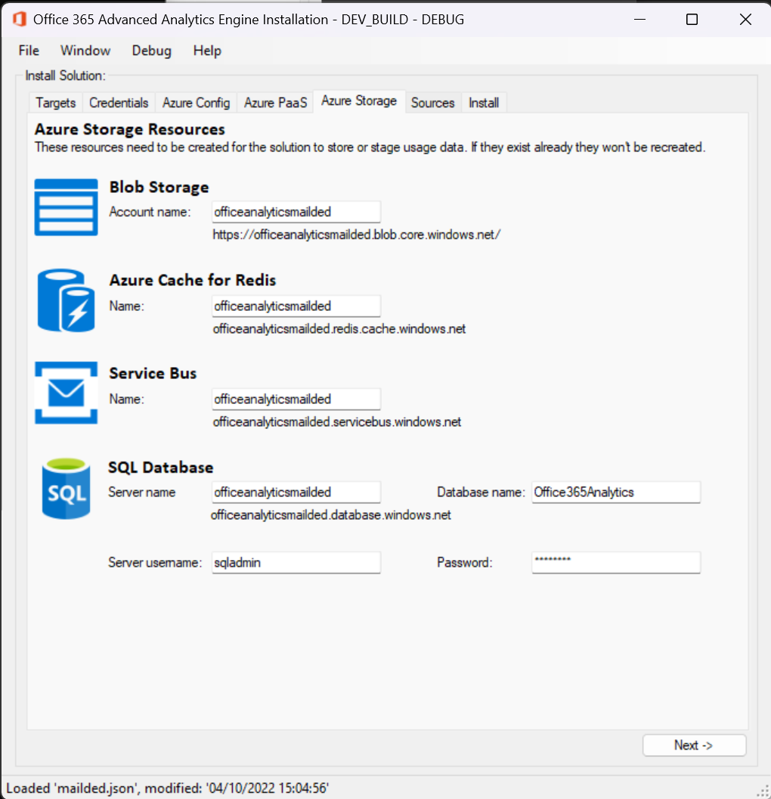

**  
**

SharePoint (Advanced Analytics & Insights Only)

This page needs the credentials for the SharePoint sites where the tracking code is going to be injected. This is a highly privileged process, so site-collection admin credentials are needed.

Also, to configure here are the list of site-collections where AITracker is to be installed, and the app-catalogue URL to install the SharePoint Framework Extension package to.

How to create an app-catalogue: <https://docs.microsoft.com/en-us/sharepoint/use-app-catalog>

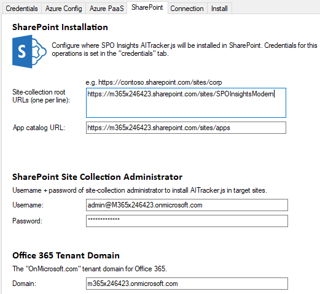

The “domain” field is taken from the Azure AD domain backing SharePoint & Office 365.

**  
**

Select Tasks & Install

When everything’s filled out, you should be ready to install. You can specify what tasks are to be done by the installer, from complete install & validation to just updating the solution components if needed.

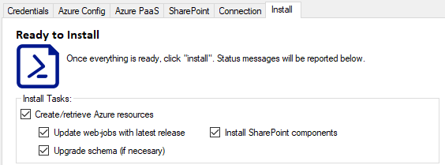

Click “install/upgrade” button once ready.

If there are any validation errors, this is when you’ll see them:

When the installer has all the required data it will begin the process.

Assuming there are no validation errors, the installer settings are saved locally so you don’t need to configure everything again.

Handle Installer Errors

If possible that errors will occur the first time at least; naming conflicts etc. These should be logged by the installer so you can make any configuration changes needed.

Save Configuration file

In order so you don’t have to fill out everything again, you can save the configuration data as a JSon file for later. The files are encrypted (or at least the sensitive fields in the file are), so a password is needed to load & save configuration files:

Once you are ready to go, click “install/upgrade” to apply your chosen configuration.

You’ll see the installer will create any resources that do not exist yet and will also run any actions specified above. If you’re upgrading an existing solution, it’s highly recommended you allow schema upgrades.

Any errors found will be logged & the installation can be run several times without any risk. If you do have any errors please verify the solution prerequisites are ready (see section 4.1).

### Solution Installation – Manual Setup

These are the steps to install the Office 365 Advanced Analytics Engine solution, from start to finish, done without the installer application if for some reason it’s not available to use.

Key configuration data to collect & store during this setup process:

-   **Application Insights Instrumentation Key** – from the Application Insights instance used.
-   **Connection strings** – for configuring the “connection strings” part of the app service:
    -   Azure storage account connection-string: used for storing web-job runtime data in App Services (names: “AzureWebJobsDashboard” and “AzureWebJobsStorage”).
    -   SQL Server connection string (“SPOInsightsEntities”) – used for the SQL Server database.
    -   Redis connection string.
    -   Service-bus connection string.
-   **Office 365/Azure AD runtime app registration** – used to grant access to activity data:
    -   Client ID – ID of app registration.
    -   Client secret – secret generated for app registration.
    -   Tenant GUID – Azure AD GUID of Office 365 tenant.

Here are all the configuration settings used which need to be configured in the app-service once created.

**Configuration Inventory**

App settings:

| Name                          | Example                                                                                                                        | Required? |
|-------------------------------|--------------------------------------------------------------------------------------------------------------------------------|-----------|
| AppInsightsApiKey             | h01yi……………………..fa                                                                                                              | Yes       |
| AppInsightsAppId              | 4da38010-2f83-40e2-0000-f0d96d292529                                                                                           | Yes       |
| AppInsightsInstrumentationKey | 84535beb-a3c1-4546-0000-1d8a56355213                                                                                           | Yes       |
| ClientID                      | 550bf80f-c279-47a5-0000-d9546493a882                                                                                           | Yes       |
| ClientSecret                  | veM…………………………………h                                                                                                              | Yes       |
| CognitiveEndpoint             | westeurope                                                                                                                     | No        |
| CognitiveKey                  | b06f6f………………………..8                                                                                                             | No        |
| ImportJobSettings             | Calls=True;GraphUsersMetadata=True;GraphUserApps=True;GraphUsageReports=True;GraphTeams=True;ActivityLog=True;WebTraffic=False | Yes       |
| TenantGUID                    | 4bcb41fb-fd0a-4fb3-0000-578912d2d4ed                                                                                           | Yes       |
| WebAppURL                     | https://contosoofficeanalytics.azurewebsites.net/                                                                              | Yes       |

Connection strings:

| Name                  | Example                                                                                                                                                                                                  | Type     |
|-----------------------|----------------------------------------------------------------------------------------------------------------------------------------------------------------------------------------------------------|----------|
| AzureWebJobsDashboard | --same as storage--                                                                                                                                                                                      | Custom   |
| AzureWebJobsStorage   | --same as storage--                                                                                                                                                                                      | Custom   |
| Redis                 | contoso.redis.cache.windows.net:6380,password=….=,ssl=True,abortConnect=False                                                                                                                            | Custom   |
| ServiceBus            | Endpoint=sb://contoso.servicebus.windows.net/;SharedAccessKeyName=ListenAndSendPolicy;SharedAccessKey=….;EntityPath=graphcalls                                                                           | Custom   |
| SPOInsightsEntities   | data source=metlifeanalyticsdemosvr.database.windows.net,1433;initial catalog=o365analytics;persist security info=True;user id=sqladmin;password=….;MultipleActiveResultSets=True;Connection Timeout=120 | SQLAzure |
| Storage               | DefaultEndpointsProtocol=https;AccountName=contoso;AccountKey=….;EndpointSuffix=core.windows.net                                                                                                         | Custom   |

All the connection strings are required.

#### Create Azure PaaS Resources

A key pillar of Office 365 Advanced Analytics Engine is Azure Application Insights and the data raised by that platform. In addition to storing the data in Application Insights, we need to export it outside of Application Insights before the 3-month retention limit, so more services in Azure are required.

**Create Storage Account**

1.  Create storage account to use for web-jobs storage.
    1.  Locally Redundant Storage (LRS) is fine for this scenario, and the most economical.

        

Copy the connection string for this storage account; they will be needed to configure the web-jobs later.

**Keep a copy of this key.** We’ll need it for later.

Create & Configure Application Insights

Application Insights is what Office 365 Advanced Analytics Engine uses to build user session data.

1.  Create Application Insights app to receive telemetry data from SharePoint. Use the same region as your storage account to avoid unnecessary data transfer fees.

    

    **Recommended**: create a workspace-based instance, which will also create a log analytics instance too. Classic-based Application Insights will be deprecated in the coming years.

    1.  Take note of the Application Insights **instrumentation key**, from properties blade.

        

        You also will need this instrumentation key later to configure the client-side code (AITracker.js) for Office 365 Advanced Analytics Engine.

        The instrumentation key is also the “**AppInsightsInstrumentationKey**” value used for web-job trace logging, and optionally “**APPINSIGHTS_INSTRUMENTATIONKEY**” configuration value used for Azure app-service general runtime logging.

    2.  Configure API access to Application Insights. Create a new API called “O365 Adv Analytics” and add permissions “Read telemetry” only. Click “generate key”
    3.  Copy the key value of the new permission:

        

        The key value is the “**AppInsightsApiKey**” configuration value for the app-service.

    4.  Back in the previous screen, copy the “Application ID” value. This is the “AppInsightsAppId” configuration value.

        Application Insights is now fully configured.

Create & Configure App Service Deployment Credentials

An Azure App Service is needed to host the web-jobs that perform the data processing in Office 365 Advanced Analytics Engine: both to import the data from Application Insights, and to import activity data from Office 365.

No website content is needed; it’s purely for the continuously running web-job functionality we need an App Service.

**Note***: It is also possible to just run these web-jobs as normal console applications on any Windows PC if App Services is not viable.*

1.  Create web-app (app service) to host the import web-jobs.
    1.  Create service-plan if needed. Requirements.
        1.  App-plan scale: **Basic (B1)** – **important:** remember to scale-up later if this is for production!
        2.  Location: **same location as storage account**.
        3.  Operating system: **Windows**.
1.  New App Service details:
    1.  Operating system: **Windows**
        1.  Runtime stack: **ASP.NET 4.8**
        2.  Location: **same location as storage account**.
        3.  Enabled Application Insights (monitoring tab): **no** – we don’t a separate instance from what we’ve already created.

1.  We’re now going to note the FTP credentials to use later.
    1.  Go to the app-service “deployment center” and select “FTPS credentials”, then “dashboard”:

        

    2.  **Copy the app-service FTP URL, username & password and save for later**.
1.  Let’s just test the credentials & firewall exceptions work…
    1.  Open FTP URL copied above into Windows Explorer or other FTP tool, to make sure credentials work.

        

If successful, you should see the contents of the app-service. If the app-service is new, it won’t contain much:

Later, we will copy the web-jobs into this FTP location – see “Publish Web-Jobs into App Service via FTP”.

**Note**: if you do not get access to the FTP root or encounter some error, you may have firewall restrictions or be hitting a limitation of Windows Explorer FTP functionality. We recommend troubleshooting with [FileZilla client](https://filezilla-project.org/download.php?type=client) if you encounter issues, or any other reputable FTP client software.

More information on FTP access with App Services- <https://docs.microsoft.com/en-us/azure/app-service/deploy-ftp>

Create SQL Database for Office 365 Advanced Analytics Engine

Office 365 Advanced Analytics Engine data is held within a SQL Server database, either on-premises or preferably in Azure SQL Database. We recommend creating a database in Azure DB:

1.  Create new SQL Database Server…
    1.  Search at the top of Azure portal “SQL” and select “SQL servers”.

        

        **Note**: a “SQL server” is not actually a server, just a virtual endpoint which will host databases later.

        New server details:

    2.  Same location as app-service.
    3.  Server name as you wish.
    4.  Create admin logon + password. **Save these details for later.** We need them to build a database connection-string.

        

    5.  In networking, make sure you enable

        

1.  …or select existing server in same region as App Service + storage account.
2.  Create new database on the SQL server you created/selected:
    1.  Basic tier should be fine initially for testing, but production databases should be on a minimum of S0.
    2.  No elastic pool.
    3.  Default collation for the database (SQL_Latin1_General_CP1_CI_AS).

Your database should now be ready!

The full connection-string we’ll formulate & configure later in section “Configure App Service Connection Strings & App Settings”.

Create Azure Cache for Redis

The solution depends on a Redis instance for various caching layers, so we need to create one.

1.  Search for “Azure Cache for Redis” and create an instance.
    1.  Cache type: can be basic C0, as we do not make heavy use of Redis.

1.  Leave the defaults and let it create.
2.  Once created, copy the primary connection string, and **save the value for later**:

Create Service Bus Namespace + Queue

The solution uses service-bus to queue asynchronous events for background processing, for example incoming call notifications.

1.  Search for “Service Bus” and create a new namespace.

Basic tier is enough for our needs for this solution, for now.

1.  Once the namespace is created, we need to add a queue with name “graphcalls”.

    

    The default values are fine.

2.  Add access policy to the namespace root.

1.  Name “ListenAndSendPolicy”, permissions “listen” and “send”.
    1.  Once created, click on the policy to copy the connection string:

        

    2.  At the end of this copied value, add to the end “;EntityPath=graphcalls” (no quotes).
    3.  Your connection-string should look like something this:

        Endpoint=sb://contosoanalytics.servicebus.windows.net/;SharedAccessKeyName=ListenAndSendPolicy;SharedAccessKey=XYZ=;EntityPath=graphcalls

    4.  **Save Service-Bus connection-string value & store for later**:

Optional: Cognitive Services

The solution can use cognitive services to extract sentiment analysis from Teams channel chat and other areas of M365, if enabled. If this is wanted, we need to create a service for it.

Search for “cognitive services” in the marketplace.

Create a new resource.

Ensure the same location is used as the rest of the solution.

Once created, copy the endpoint & 1st key values & **store for later**.

All Azure PaaS resources have now been created!

#### Publish Web-Jobs into App Service via FTP

Having prepared the web-jobs & the app-service, we need to upload them to the App Service we created via FTP in the steps above.

You’ll need to extract “Website.zip”, “AppInsightsImporter.zip” and “Office365ActivityImporter.zip” as below:

Make sure there’s only one subdirectory per folder

Now we can upload the web-jobs & website to the app-service.

You’ll need the FTP details configured earlier otherwise most FTP details are on the “overview” screen for the app-service.

1.  Open FTP site in an FTP upload tool (Windows Explorer normally works well enough).
    1.  **Note**: Username for FTP is the “sitename\\username” not just “username”.
2.  For web-jobs:
    1.  In directory “/site/wwwroot”, ensure the following exact directory structure exists:
        1.  “/site/wwwroot/app_data/jobs/continuous/”. **Note**: by default, only “/site/wwwroot” exists in new app services, so you need to create “app_data/jobs/continuous” manually.
        2.  In this folder, copy the web-job parent directories (make sure the web-job contents are directly in each web-job folder, and not in a sub-folder).

The web-jobs should be started automatically but verify this is the case from the app-service “web jobs” page in the Azure portal.

#### Publish App Service Website

As above, we need to also upload the contents of the app-service website via FTP.

Extract the website zip (website.zip doesn’t have a nested folder at the time of writing).

Copy the contents of the zip into the “wwwroot” folder of the app-service.

Verify the website worked by visiting the app-service URL, after configuring the app service below. See section 2.4.1 for how to verify the app-service.

#### Configure App Service Connection Strings & App Settings

Finally, with everything prepared, we need to configure the app service with the same configuration used with the web-jobs before.

1.  Configure settings for web-jobs.
    1.  Open “configuration” section of app-service.
        1.  Under “general settings” Make sure “always on” is enabled.

            

    2.  Configure “application settings”:
        1.  **ClientID** – runtime account application registration ID.
        2.  **ClientSecret** – runtime account application key created for app registration.
        3.  **TenantGUID** – runtime account Azure AD directory GUID.
        4.  **TenantDomain** – “XXX.**onmicrosoft.com**” (not any custom domain – “contoso.onmicrosoft.com” for example).
        5.  **StorageConnectionString** – connection-string of storage account.
        6.  **AppInsightsInstrumentationKey** – Application Insights key (a GUID) for trace logging.
        7.  **CognitiveEndpoint** – *optional* – cognitive services endpoint, if used.
        8.  **CognitiveKey** – *optional* – the API key for accessing cognitive services.
        9.  **WebAppURL** – the root URL for your app service, with trailing slash – e.g https://spoinsightsdemo.azurewebsites.net/
        10. **AppInsightsApiKey** – API key for App Insights REST access
        11. **AppInsightsAppId** – API app ID for App Insights REST access (not the same as instrumentation key)
    3.  **Optional**: enable import logging (not recommended for production).
        1.  In “app settings” add “ImportLogging” with value “True”. This will enable verbose logging for both web-jobs which can help troubleshooting if there’s any problem later.
    4.  Connection strings:
        1.  **SPOInsightsEntities**, type “**SQL Server**”. Copy and paste this connection-string, changing the highlighted areas –

1.  **AzureWebJobsStorage**, “custom” – storage connection from above.
    1.  **AzureWebJobsDashboard**, “custom” – storage connection from above.
        1.  **Redis**, “custom” – Redis primary connection string.
        2.  **ServiceBus**, “custom”, service-bus connection string.

Ignore any value not inside the red brackets (‘WEBSITE_NODE_DEFAULT_VERSION’ for example)

The app-service configuration is common for both web-jobs.

#### Deploy AITracker via PowerShell

Once Application Insights is setup & we have the AITrackerInstaller source, we need to deploy the Office 365 Advanced Analytics Engine “AITracker.js” file to the SharePoint Online sites we want to track users on.

Download “AITrackerInstaller.zip” from the builds website, and extract to your PC if you don’t have it already.

**Note**: this method can also be used later to automate the deployment to new SharePoint Online sites.

1.  Deploy AITracker.js to SharePoint site-collection(s).
    1.  Open the Office 365 Advanced Analytics Engine build folder, then “Scripts.AITrackerInstaller”.
    2.  Create/edit install json config file used by the PowerShell install script in the configuration file (DevConfig.json for example – edit or create your own).
    3.  Change mandatory values in your new configuration file:
        1.  **TargetSites** – a JSon array of the root sites (all sub-sites will be included automatically) to deploy to. **Important** – URL is the root-site URL only, with no trailing backslashes or pages/lists. See example config files shipped with the script.
        2.  **AdminUsername** – a user ID with site-collection admin rights to the target site-collection (not needed for PnP PowerShell version)
        3.  **ApplicationInsightsKey** – the “instrumentation key” for the Application Insights application created.
        4.  The other keys can be changed if desired but aren’t critical.

**Note**: you may need to unblock the script for the script to run:

1.  Run one of the scripts to deploy, depending on target needs, passing config filename as a parameter:
-   “**InstallSPOInsightsTracker.ps1**” to install AITracker.js to SharePoint Online site-collections(s). Use this one by default if the SharePoint account isn’t strictly limited to multifactor authentication logins.
-   “**InstallSPOInsightsTracker-OnPrem.ps1**” for on-premises SharePoint.
-   “**InstallSPOInsightsTracker.PnP.ps1**” for SharePoint Online with multifactor authentication (MFA) enabled. This uses a web-login, so no username is read from the configuration file.
    1.  . Example:
        1.  Example execution:

            .\\InstallSPOInsightsTracker.ps1 -ConfigFileName "MyConfig.json".

        2.  The first time it runs, it’ll need to save credentials in a secure-string file. A login box will appear; use the same username as configured in **AdminUsername**, set the password and click “OK”.

            

            1.  The script will test if the user has site-collection admin rights. If it does it’ll save the credentials in a secure string.

                ERROR: Problem reading password cipher from SecureString.txt. Please enter the password for admin@M365x246423.onmicrosoft.com in a sec...

                Refreshing secure-string file - please enter credentials

                Updated .\\SecureString.txt with refreshed password

                SUCCESS! .\\SecureString.txt updated with new password hash. Please run the script again & hopefully it'll work now!

                Couldn't upload tracker JS - see above!

        3.  **Run the PowerShell script again to now successfully install the tracker**.

AITracker uploads results to Application Insights to track “page views” and “custom events”, containing the time the users spent on the previous page. Accurate time-tracking for users on pages is not standard Application Insights functionality.

Read configuration for environment name 'Development M365x246423 - sambetts@microsoft.com'...

Read encrypted password from .\\SecureString.txt. Installing AITracker.js...

Checking if https://M365x246423.sharepoint.com/sites/spoinsights/Style%20Library/AITracker.js exists...

AITracker.js doesn't exist for user admin@M365x246423.onmicrosoft.com!

AITracker.js uploaded to https://M365x246423.sharepoint.com/sites/spoinsights/Style%20Library/AITracker.js

File is checked-out. Checking in major version of AITracker.js...

Setting custom-action on all subsites to include AITracker.js in the HTML header...

Checking SPWeb.UserCustomActions...

Inserted custom-action into web: 'https://m365x246423.sharepoint.com/sites/spoinsights'...

Checking sub-webs for site 'Office 365 Advanced Analytics Engine Classic'...

18:39:04 - AITracker.js uploaded to site-collection root & referencing custom-actions inserted in all sub-sites!

This is what you should see if it worked.

#### Deploy Modern UI Extension to App Catalogue

In order that modern sites load the AITracker too, we have a SharePoint Framework (SPFx) Extension that needs to be deployed to the SharePoint app catalogue.

Upload “spoinsights-modern-ui-aitracker.sppkg”, and you’ll be prompted with this dialogue:

**Important**: ensure this option is selected. This does not deploy the analytics solution to all sites but makes it available to “staple” (activate) – done by the PowerShell on the sites you select only.

Verify the extension is loaded once you’ve run the PowerShell/installer by checking the JavaScript console on a SharePoint site page:

Messages from this solution can be seen in the JavaScript console in sites where the PowerShell has added the tracker, prefixed with “SPOInsights ModernUI”.

On a site not targeted by the PowerShell/installer stage, you will see no messages of this type.

### Configure Reply URLs for Azure AD Runtime Application

Part of the solution is an ASP.Net administration website that is protected with Azure AD. So that access to the administration website login works, the reply URLs need to be set in your runtime account in Azure AD.

Under the runtime account in Azure AD, in “authentication” settings of the application registration ensure the URL matches exactly the root address of your app-service URL:

This value needs to be set to what was picked for your service-app URL:

**Important**: enable access tokens & ID tokens on the same page.

See below to check if these settings are correct & valid.

### Configure Filtered URLs

All SharePoint data for any import is ignored if it’s outside the scope of the “org_urls” table in the SQL database.

In this table the only important fields are “url_base” and “exact_match”.

“Exact match” is used to limit URLs accepted as only that site-collection, rather than a “starts-with” filter.

With the above table contents, valid & imported URLs would be:

-   https://m365x72460609.sharepoint.com/sites/Comms/SitePages/Home.aspx
-   https://m365x72460609.sharepoint.com/sites/Comms/subsite1/SitePages/MyInfo.aspx
-   https://m365x72460609.sharepoint.com/SitePages/Intranet.aspx
-   https://m365x72460609.sharepoint.com/Documents/Welcome.docx

Ignored URLs would be:

-   https://m365x72460609.sharepoint.com/sites/HR/Intranet.aspx (root site demands exact match).

If you’re not seeing data from any given site, ensure that there’s an entry in this table for that root site-collection URL.

### (Optional) Enable Deep Analytics for Teams

On the administration website is also where you can give analytics deeper access to Teams content; specifically channel chat.

**Important**: for enabled sites, chat content is read but never stored – just metadata for channel chat including:

-   Languages used
-   Sentiment analysis (positive vs negative).
-   Keywords.

In order to do this though, a user has to give analytics access to each Team proactively.

Note: the page can take a few seconds to load the 1st time.

Teams that have access given will be crawled next import cycle; usually 3-4 of hours later latest.

#### Enable Access to Yammer

If you’re running Yammer analytics, you need to grant access to Yammer data as an administrator so the importer can read anything.

Open the administration website and navigate to “/yammerauth” page.

You’ll be asked to login and authorise the application.

Once successful, Yammer will redirect back to the analytics site with a code that’ll be converted into an access key & stored in Redis for yammer crawling.

The Yammer export uses the [export](https://developer.yammer.com/docs/data-export-api) endpoint to retrieve data.

### (Optional) Enable Profiling SQL Extensions

There is an extension you can enable enhanced user profiling capabilities to the solution, so you can report on aggregate usage stats per demographic like “job title”, “department” etc.

This gives the ability to split by demographic and see which workloads and Office 365 capabilities aren’t being harnessed at a much more granular level than standard reports.

There are two Power BI reports that use these extra profiling tables to give you these statistics.

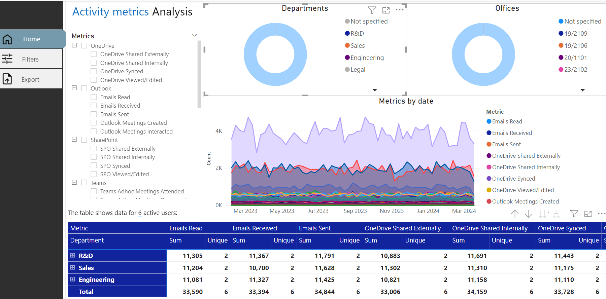

For this extra reporting to work, the automation jobs to compile the data all need to be enabled.

By default, if usage imports are enabled in the installer, the automation resources to compile these statistics are created but not scheduled, so won’t run. This is due to the extra demand for the SQL Server database that this extra processing requires.

Schedules are pre-created in the automation account; they just need linking to the right runbooks. Create schedules by going to the Automation account in Azure portal.

**Create Schedules for “Database Maintenance”**

Find the runbooks and click on “Database_Maintenance”.

Link the runbook to a schedule – we’ll add this runbook to two schedules, one by one. First one is “activitylog” maintenance, every Sunday at 1pm:

Now set the parameter to start. Click “configure parameters and run settings” and enter MAINTENANCETYPE “activitylog”:

Click OK to confirm parameters. Click OK to confirm this schedule.

Now link another schedule for this runbook to create one for weekly DB maintenance with “weekly” as the “MAINTENANCETYPE” parameter:

Click OK to save.

Confirm you see both schedules for the maintenance runbook:

**Create Schedule for “Weekly Update”**

Link a new schedule for the runbook “Weekly_Update”: 6pm every Sunday. No parameters.

Both these jobs should run without errors but should only be run out of peak hours.

#### How Much Extra Resources Are Needed?

**Recommended performance**: minimum 50 DTUs for small organizations (up-to 20k users) for SQL Database, 100-200 DTUs for larger organizations.

**Space**: approximately 8gb per 10 thousand users, for 1 year of retention.

You can control retention with the “WeeksToKeep” variable:

This variable is read by the maintenance script.

#### Where Are PowerShell Scripts Stored?

As part of the installation, the PowerShell scripts needed are taken from the solution zip files, copied into your storage blob container (private access):

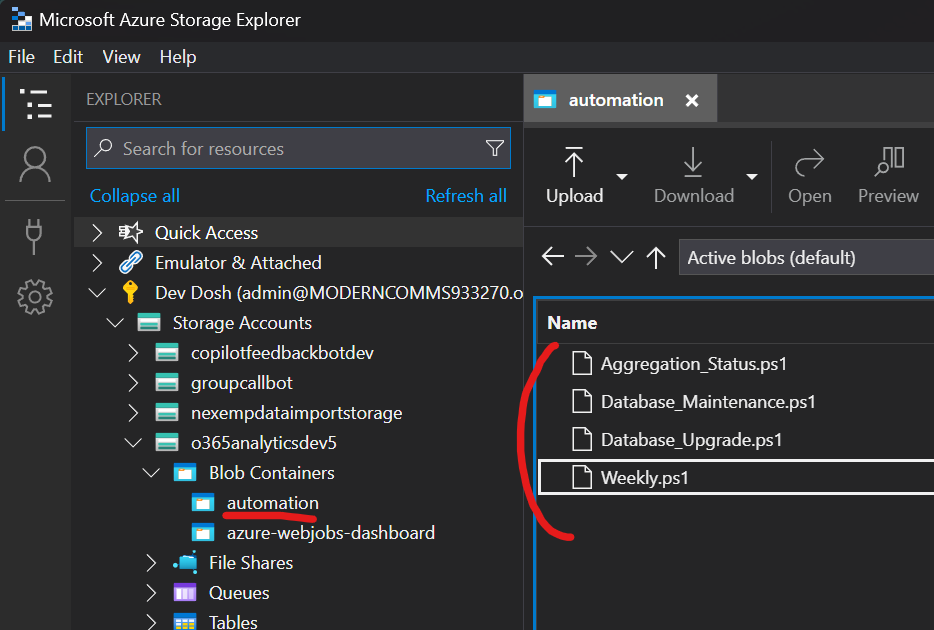

Shared Access Signature URLs are generated from uploaded PS files to give read-only access to these files and these URLs are what the automation account uses to download and run the scripts when the runbooks are created.
