### Solution Installation – Manual Setup

These are the steps to install the Office 365 Advanced Analytics Engine solution, from start to finish, done without the installer application if for some reason it’s not available to use.

Key configuration data to collect & store during this setup process:

-   **Application Insights Instrumentation Key** – from the Application Insights instance used.
-   **Connection strings** – for configuring the “connection strings” part of the app service:
    -   Azure storage account connection-string: used for storing web-job runtime data in App Services (names: “AzureWebJobsDashboard” and “AzureWebJobsStorage”).
    -   SQL Server connection string (“SPOInsightsEntities”) – used for the SQL Server database.
    -   Redis connection string.
    -   Service-bus connection string.
-   **Office 365/Azure AD runtime app registration** – used to grant access to activity data:
    -   Client ID – ID of app registration.
    -   Client secret – secret generated for app registration.
    -   Tenant GUID – Azure AD GUID of Office 365 tenant.

Here are all the configuration settings used which need to be configured in the app-service once created.

**Configuration Inventory**

App settings:

| Name                          | Example                                                                                                                        | Required? |
|-------------------------------|--------------------------------------------------------------------------------------------------------------------------------|-----------|
| AppInsightsApiKey             | h01yi……………………..fa                                                                                                              | Yes       |
| AppInsightsAppId              | 4da38010-2f83-40e2-0000-f0d96d292529                                                                                           | Yes       |
| AppInsightsInstrumentationKey | 84535beb-a3c1-4546-0000-1d8a56355213                                                                                           | Yes       |
| ClientID                      | 550bf80f-c279-47a5-0000-d9546493a882                                                                                           | Yes       |
| ClientSecret                  | veM…………………………………h                                                                                                              | Yes       |
| CognitiveEndpoint             | westeurope                                                                                                                     | No        |
| CognitiveKey                  | b06f6f………………………..8                                                                                                             | No        |
| ImportJobSettings             | Calls=True;GraphUsersMetadata=True;GraphUserApps=True;GraphUsageReports=True;GraphTeams=True;ActivityLog=True;WebTraffic=False | Yes       |
| TenantGUID                    | 4bcb41fb-fd0a-4fb3-0000-578912d2d4ed                                                                                           | Yes       |
| WebAppURL                     | https://contosoofficeanalytics.azurewebsites.net/                                                                              | Yes       |

Connection strings:

| Name                  | Example                                                                                                                                                                                                  | Type     |
|-----------------------|----------------------------------------------------------------------------------------------------------------------------------------------------------------------------------------------------------|----------|
| AzureWebJobsDashboard | --same as storage--                                                                                                                                                                                      | Custom   |
| AzureWebJobsStorage   | --same as storage--                                                                                                                                                                                      | Custom   |
| Redis                 | contoso.redis.cache.windows.net:6380,password=….=,ssl=True,abortConnect=False                                                                                                                            | Custom   |
| ServiceBus            | Endpoint=sb://contoso.servicebus.windows.net/;SharedAccessKeyName=ListenAndSendPolicy;SharedAccessKey=….;EntityPath=graphcalls                                                                           | Custom   |
| SPOInsightsEntities   | data source=metlifeanalyticsdemosvr.database.windows.net,1433;initial catalog=o365analytics;persist security info=True;user id=sqladmin;password=….;MultipleActiveResultSets=True;Connection Timeout=120 | SQLAzure |
| Storage               | DefaultEndpointsProtocol=https;AccountName=contoso;AccountKey=….;EndpointSuffix=core.windows.net                                                                                                         | Custom   |

All the connection strings are required.

#### Create Azure PaaS Resources

A key pillar of Office 365 Advanced Analytics Engine is Azure Application Insights and the data raised by that platform. In addition to storing the data in Application Insights, we need to export it outside of Application Insights before the 3-month retention limit, so more services in Azure are required.

**Create Storage Account**

1.  Create storage account to use for web-jobs storage.
    1.  Locally Redundant Storage (LRS) is fine for this scenario, and the most economical.

        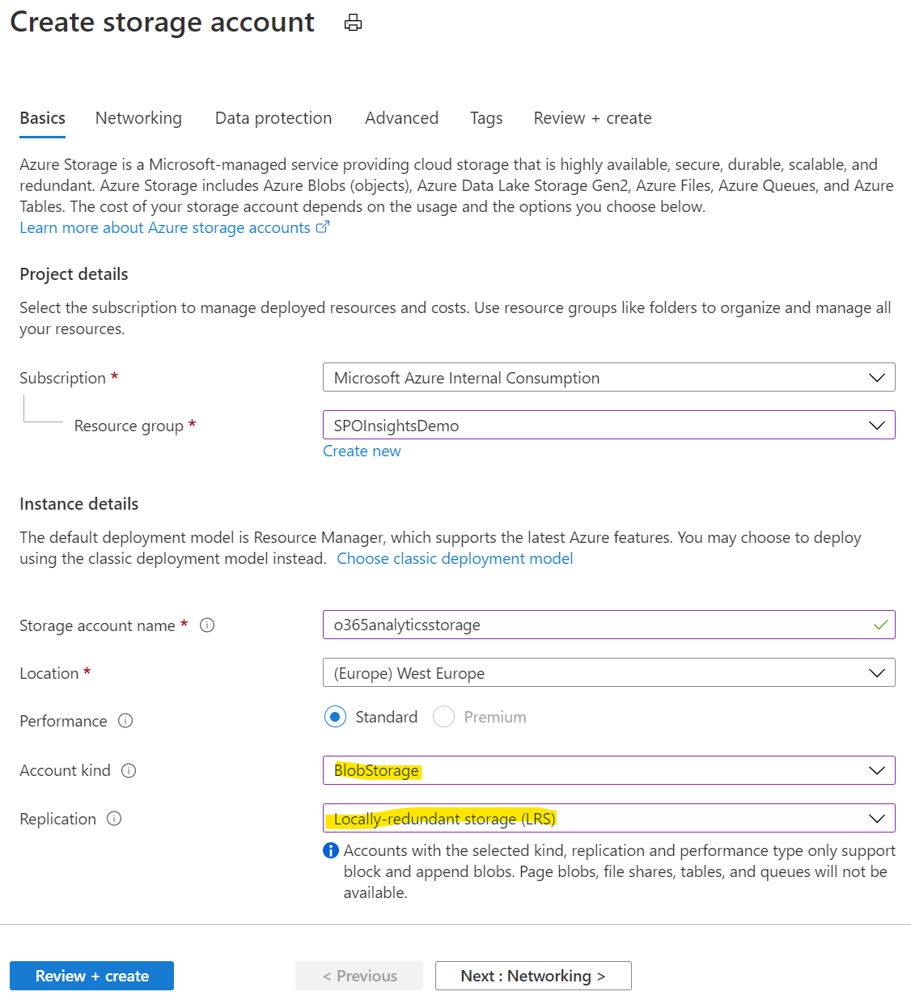

Copy the connection string for this storage account; they will be needed to configure the web-jobs later.

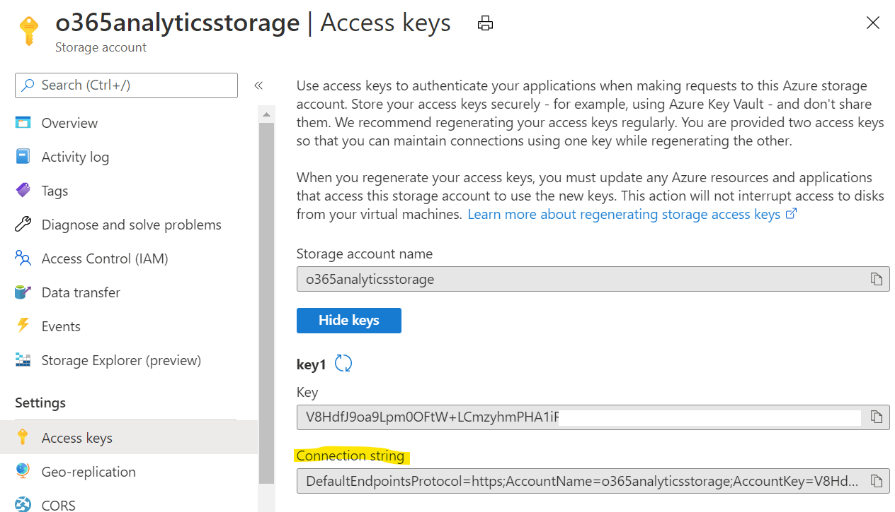

**Keep a copy of this key.** We’ll need it for later.

Create & Configure Application Insights

Application Insights is what Office 365 Advanced Analytics Engine uses to build user session data.

1.  Create Application Insights app to receive telemetry data from SharePoint. Use the same region as your storage account to avoid unnecessary data transfer fees.

    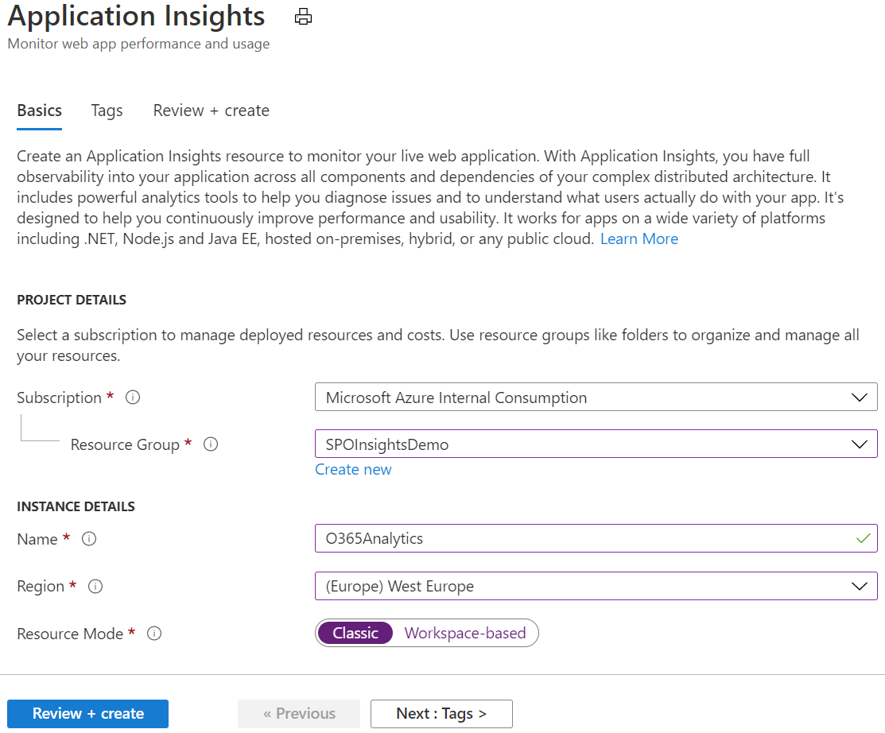

    **Recommended**: create a workspace-based instance, which will also create a log analytics instance too. Classic-based Application Insights will be deprecated in the coming years.

    1.  Take note of the Application Insights **instrumentation key**, from properties blade.

        

        You also will need this instrumentation key later to configure the client-side code (AITracker.js) for Office 365 Advanced Analytics Engine.

        The instrumentation key is also the “**AppInsightsInstrumentationKey**” value used for web-job trace logging, and optionally “**APPINSIGHTS_INSTRUMENTATIONKEY**” configuration value used for Azure app-service general runtime logging.

    2.  Configure API access to Application Insights. Create a new API called “O365 Adv Analytics” and add permissions “Read telemetry” only. Click “generate key”
    3.  Copy the key value of the new permission:

        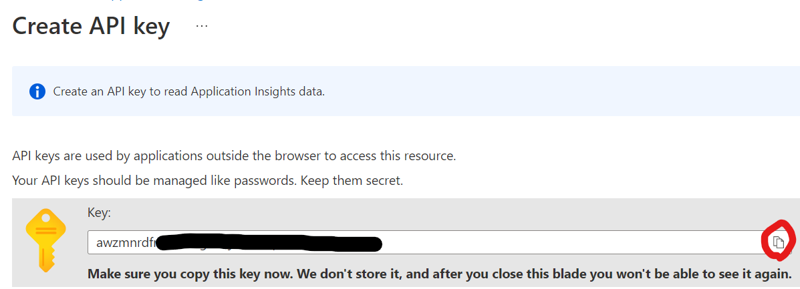

        The key value is the “**AppInsightsApiKey**” configuration value for the app-service.

    4.  Back in the previous screen, copy the “Application ID” value. This is the “AppInsightsAppId” configuration value.

        Application Insights is now fully configured.

Create & Configure App Service Deployment Credentials

An Azure App Service is needed to host the web-jobs that perform the data processing in Office 365 Advanced Analytics Engine: both to import the data from Application Insights, and to import activity data from Office 365.

No website content is needed; it’s purely for the continuously running web-job functionality we need an App Service.

**Note***: It is also possible to just run these web-jobs as normal console applications on any Windows PC if App Services is not viable.*

1.  Create web-app (app service) to host the import web-jobs.
    1.  Create service-plan if needed. Requirements.
        1.  App-plan scale: **Basic (B1)** – **important:** remember to scale-up later if this is for production!
        2.  Location: **same location as storage account**.
        3.  Operating system: **Windows**.
1.  New App Service details:
    1.  Operating system: **Windows**
        1.  Runtime stack: **ASP.NET 4.8**
        2.  Location: **same location as storage account**.
        3.  Enabled Application Insights (monitoring tab): **no** – we don’t a separate instance from what we’ve already created.

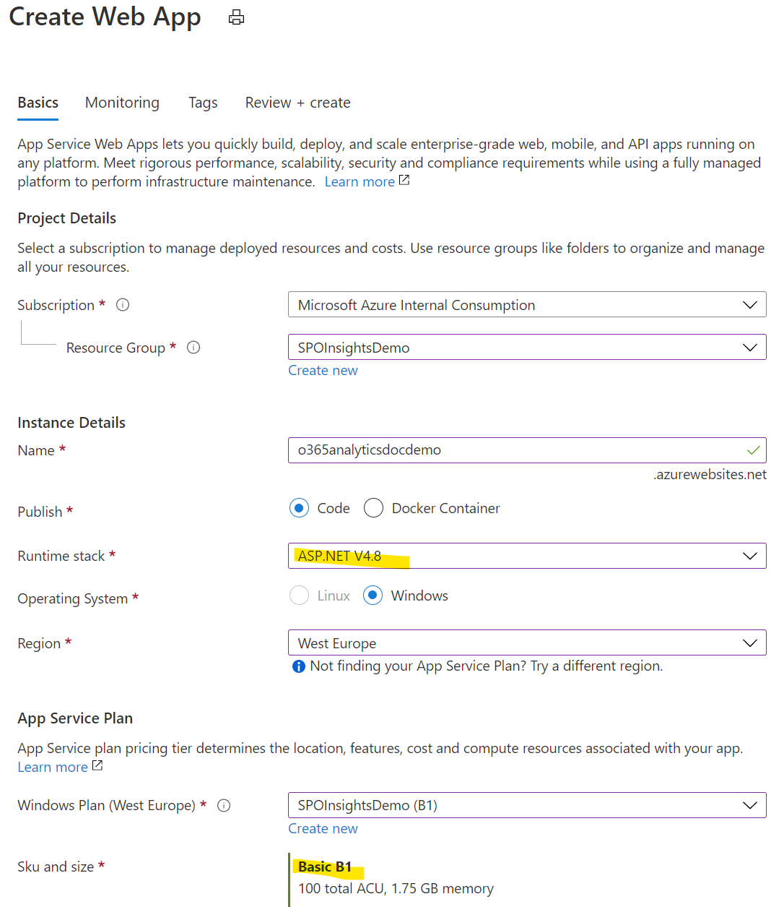

1.  We’re now going to note the FTP credentials to use later.
    1.  Go to the app-service “deployment center” and select “FTPS credentials”, then “dashboard”:

        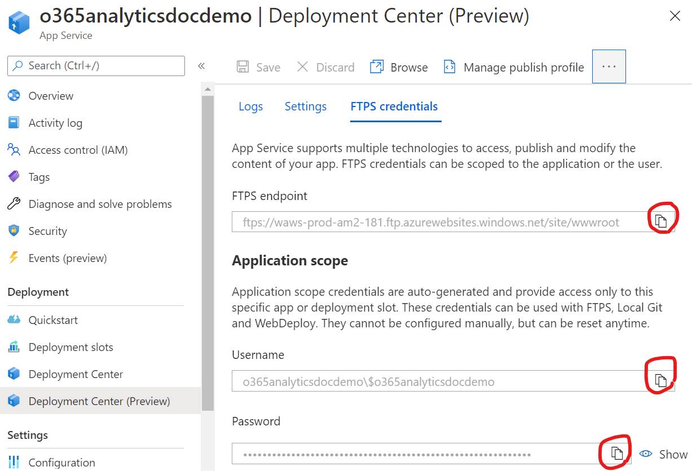

    2.  **Copy the app-service FTP URL, username & password and save for later**.
1.  Let’s just test the credentials & firewall exceptions work…
    1.  Open FTP URL copied above into Windows Explorer or other FTP tool, to make sure credentials work.

        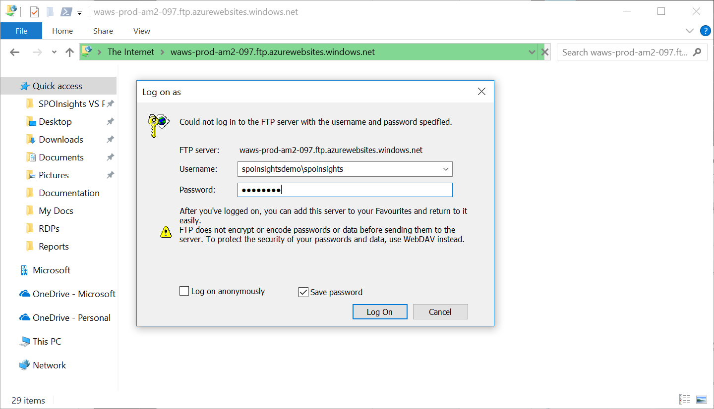

If successful, you should see the contents of the app-service. If the app-service is new, it won’t contain much:

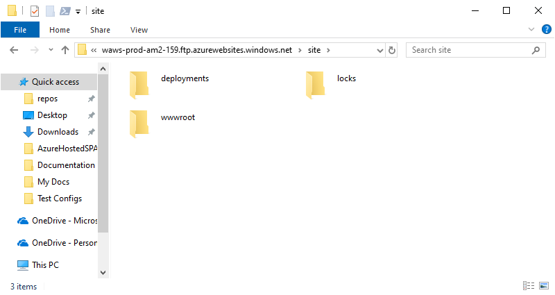

Later, we will copy the web-jobs into this FTP location – see “Publish Web-Jobs into App Service via FTP”.

**Note**: if you do not get access to the FTP root or encounter some error, you may have firewall restrictions or be hitting a limitation of Windows Explorer FTP functionality. We recommend troubleshooting with [FileZilla client](https://filezilla-project.org/download.php?type=client) if you encounter issues, or any other reputable FTP client software.

More information on FTP access with App Services- <https://docs.microsoft.com/en-us/azure/app-service/deploy-ftp>

Create SQL Database for Office 365 Advanced Analytics Engine

Office 365 Advanced Analytics Engine data is held within a SQL Server database, either on-premises or preferably in Azure SQL Database. We recommend creating a database in Azure DB:

1.  Create new SQL Database Server…
    1.  Search at the top of Azure portal “SQL” and select “SQL servers”.

        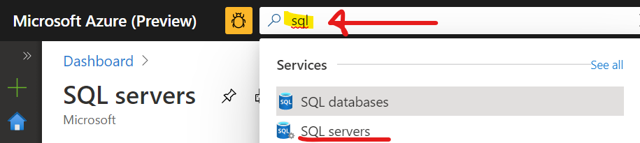

        **Note**: a “SQL server” is not actually a server, just a virtual endpoint which will host databases later.

        New server details:

    2.  Same location as app-service.
    3.  Server name as you wish.
    4.  Create admin logon + password. **Save these details for later.** We need them to build a database connection-string.

        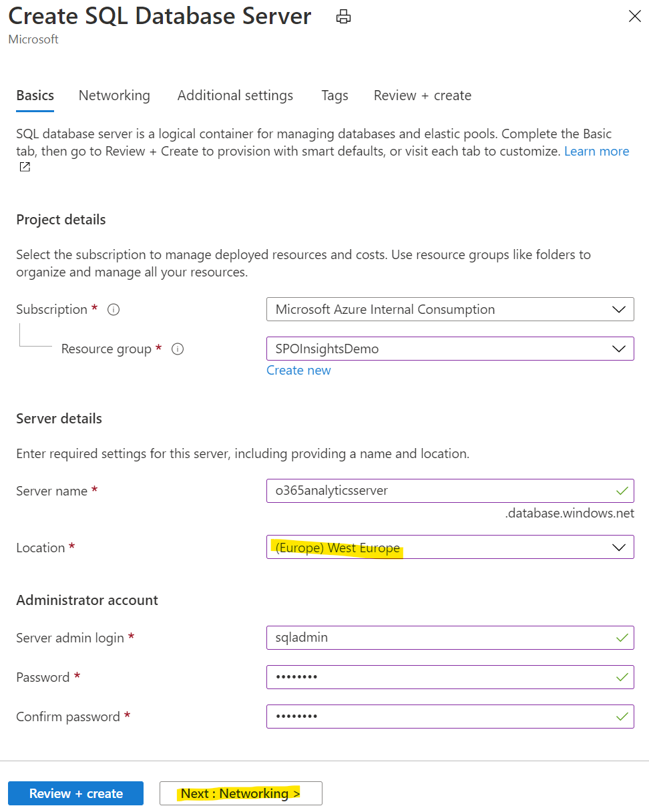

    5.  In networking, make sure you enable

        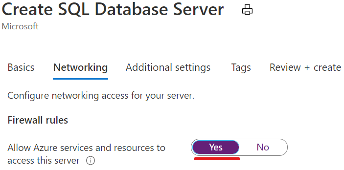

1.  …or select existing server in same region as App Service + storage account.
2.  Create new database on the SQL server you created/selected:
    1.  Basic tier should be fine initially for testing, but production databases should be on a minimum of S0.
    2.  No elastic pool.
    3.  Default collation for the database (SQL_Latin1_General_CP1_CI_AS).

Your database should now be ready!

The full connection-string we’ll formulate & configure later in section “Configure App Service Connection Strings & App Settings”.

Create Azure Cache for Redis

The solution depends on a Redis instance for various caching layers, so we need to create one.

1.  Search for “Azure Cache for Redis” and create an instance.
    1.  Cache type: can be basic C0, as we do not make heavy use of Redis.

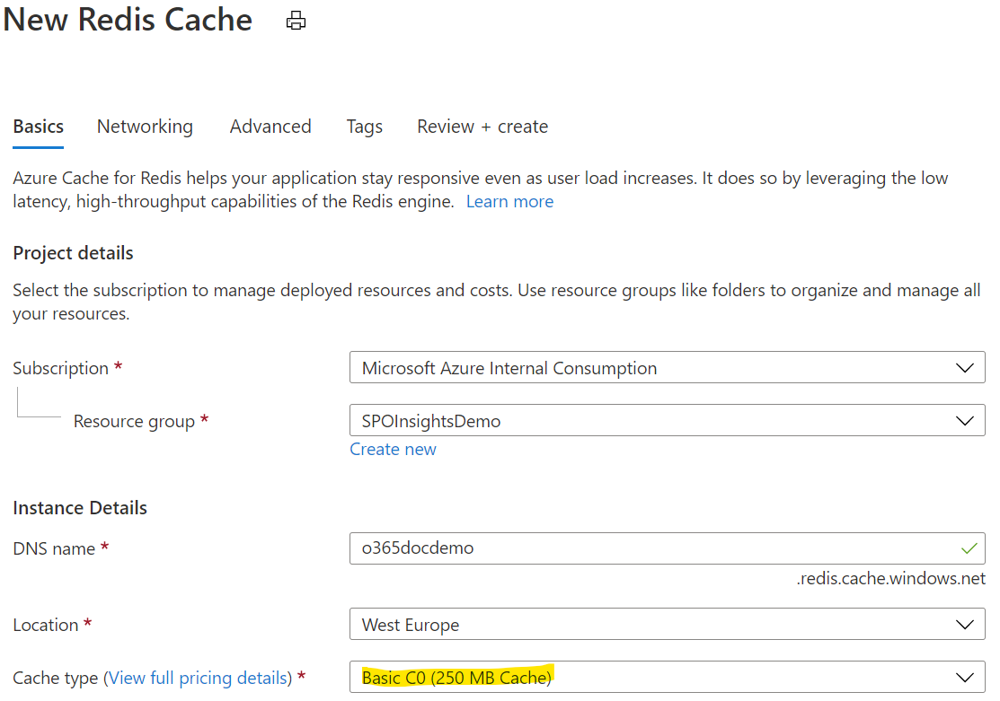

1.  Leave the defaults and let it create.
2.  Once created, copy the primary connection string, and **save the value for later**:

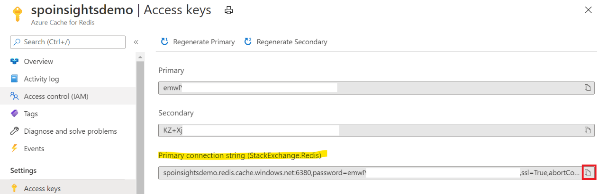

Create Service Bus Namespace + Queue

The solution uses service-bus to queue asynchronous events for background processing, for example incoming call notifications.

1.  Search for “Service Bus” and create a new namespace.

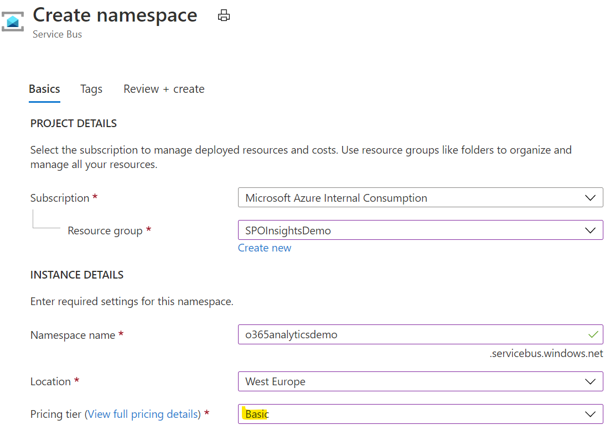

Basic tier is enough for our needs for this solution, for now.

1.  Once the namespace is created, we need to add a queue with name “graphcalls”.

    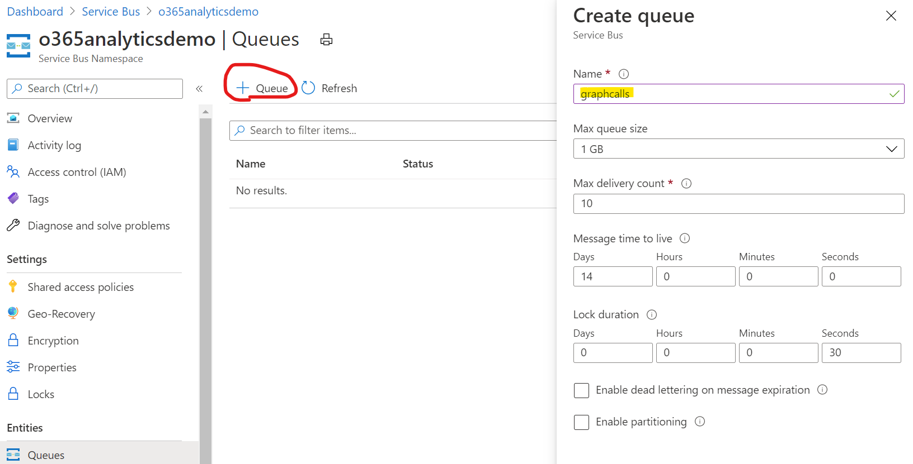

    The default values are fine.

2.  Add access policy to the namespace root.

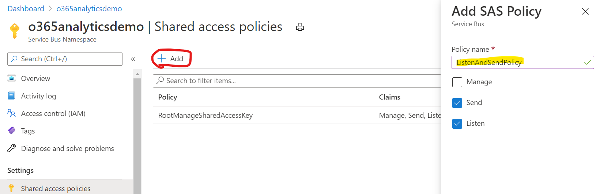

1.  Name “ListenAndSendPolicy”, permissions “listen” and “send”.
    1.  Once created, click on the policy to copy the connection string:

        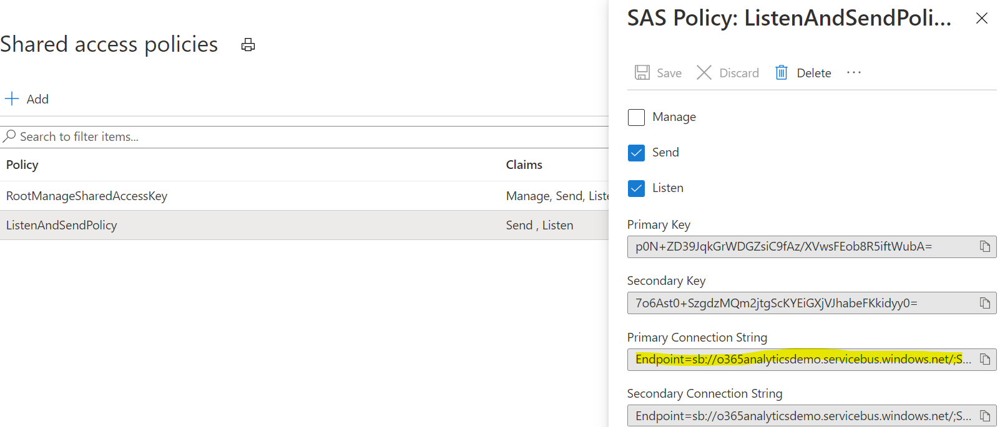

    2.  At the end of this copied value, add to the end “;EntityPath=graphcalls” (no quotes).
    3.  Your connection-string should look like something this:

        Endpoint=sb://contosoanalytics.servicebus.windows.net/;SharedAccessKeyName=ListenAndSendPolicy;SharedAccessKey=XYZ=;EntityPath=graphcalls

    4.  **Save Service-Bus connection-string value & store for later**:

Optional: Cognitive Services

The solution can use cognitive services to extract sentiment analysis from Teams channel chat and other areas of M365, if enabled. If this is wanted, we need to create a service for it.

Search for “cognitive services” in the marketplace.

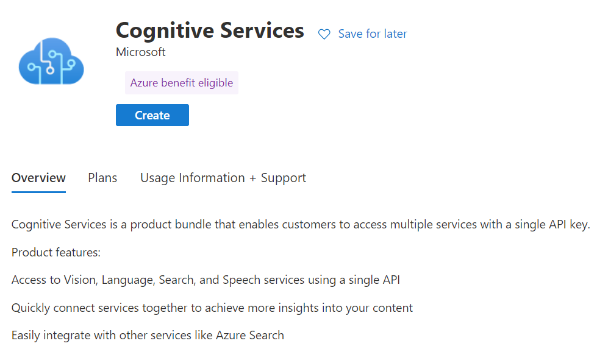

Create a new resource.

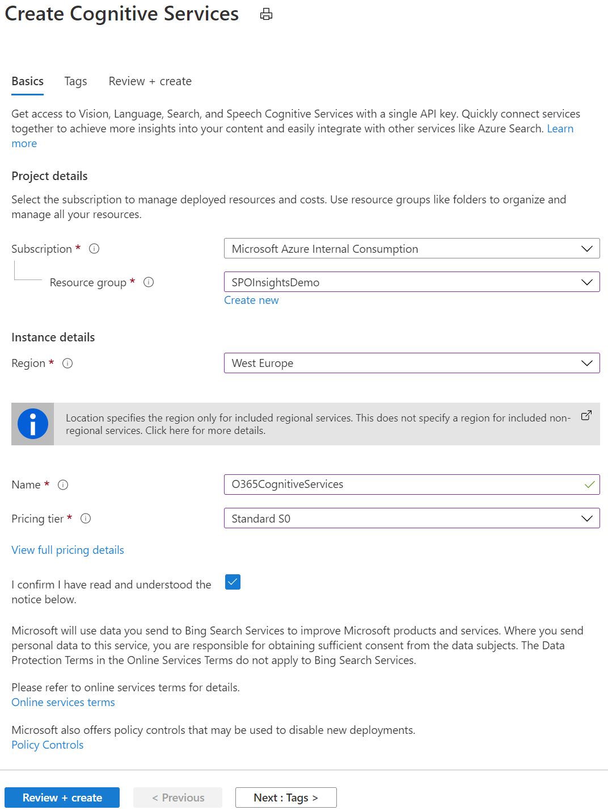

Ensure the same location is used as the rest of the solution.

Once created, copy the endpoint & 1st key values & **store for later**.

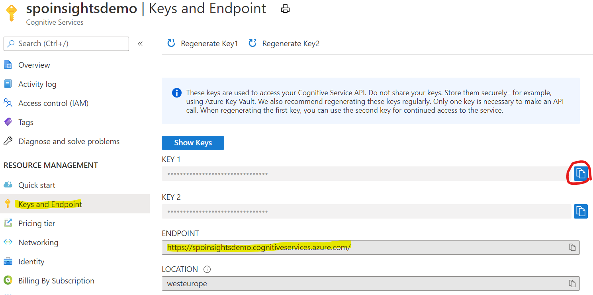

All Azure PaaS resources have now been created!

#### Publish Web-Jobs into App Service via FTP

Having prepared the web-jobs & the app-service, we need to upload them to the App Service we created via FTP in the steps above.

You’ll need to extract “Website.zip”, “AppInsightsImporter.zip” and “Office365ActivityImporter.zip” as below:

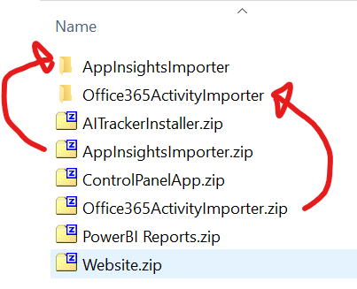

Make sure there’s only one subdirectory per folder

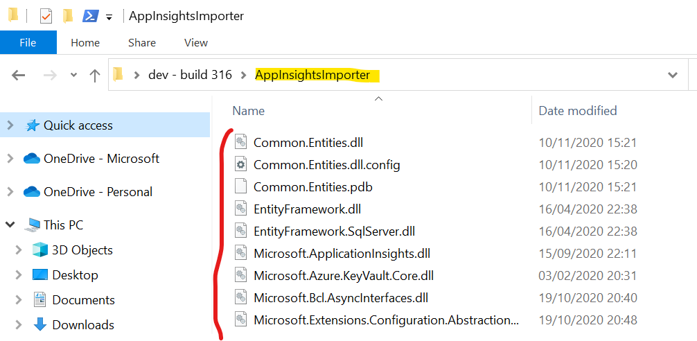

Now we can upload the web-jobs & website to the app-service.

You’ll need the FTP details configured earlier otherwise most FTP details are on the “overview” screen for the app-service.

1.  Open FTP site in an FTP upload tool (Windows Explorer normally works well enough).
    1.  **Note**: Username for FTP is the “sitename\\username” not just “username”.
2.  For web-jobs:
    1.  In directory “/site/wwwroot”, ensure the following exact directory structure exists:
        1.  “/site/wwwroot/app_data/jobs/continuous/”. **Note**: by default, only “/site/wwwroot” exists in new app services, so you need to create “app_data/jobs/continuous” manually.
        2.  In this folder, copy the web-job parent directories (make sure the web-job contents are directly in each web-job folder, and not in a sub-folder).

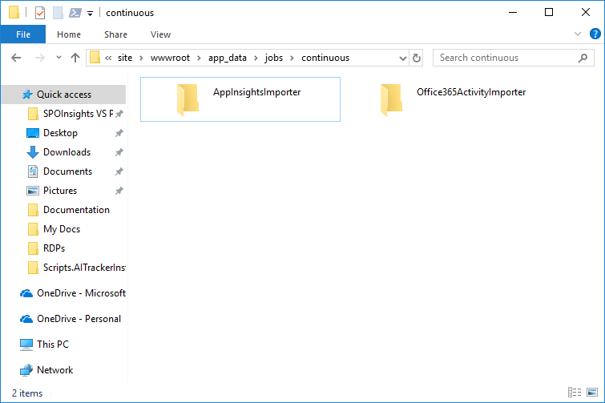

The web-jobs should be started automatically but verify this is the case from the app-service “web jobs” page in the Azure portal.

#### Publish App Service Website

As above, we need to also upload the contents of the app-service website via FTP.

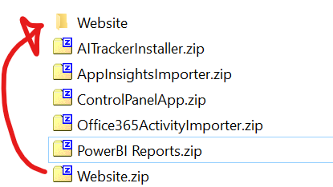

Extract the website zip (website.zip doesn’t have a nested folder at the time of writing).

Copy the contents of the zip into the “wwwroot” folder of the app-service.

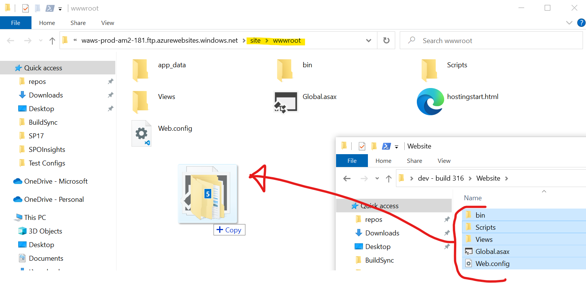

Verify the website worked by visiting the app-service URL, after configuring the app service below. See section 2.4.1 for how to verify the app-service.

#### Configure App Service Connection Strings & App Settings

Finally, with everything prepared, we need to configure the app service with the same configuration used with the web-jobs before.

1.  Configure settings for web-jobs.
    1.  Open “configuration” section of app-service.
        1.  Under “general settings” Make sure “always on” is enabled.

            

    2.  Configure “application settings”:
        1.  **ClientID** – runtime account application registration ID.
        2.  **ClientSecret** – runtime account application key created for app registration.
        3.  **TenantGUID** – runtime account Azure AD directory GUID.
        4.  **TenantDomain** – “XXX.**onmicrosoft.com**” (not any custom domain – “contoso.onmicrosoft.com” for example).
        5.  **StorageConnectionString** – connection-string of storage account.
        6.  **AppInsightsInstrumentationKey** – Application Insights key (a GUID) for trace logging.
        7.  **CognitiveEndpoint** – *optional* – cognitive services endpoint, if used.
        8.  **CognitiveKey** – *optional* – the API key for accessing cognitive services.
        9.  **WebAppURL** – the root URL for your app service, with trailing slash – e.g https://spoinsightsdemo.azurewebsites.net/
        10. **AppInsightsApiKey** – API key for App Insights REST access
        11. **AppInsightsAppId** – API app ID for App Insights REST access (not the same as instrumentation key)
    3.  **Optional**: enable import logging (not recommended for production).
        1.  In “app settings” add “ImportLogging” with value “True”. This will enable verbose logging for both web-jobs which can help troubleshooting if there’s any problem later.
    4.  Connection strings:
        1.  **SPOInsightsEntities**, type “**SQL Server**”. Copy and paste this connection-string, changing the highlighted areas –

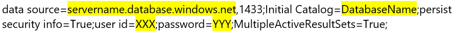

1.  **AzureWebJobsStorage**, “custom” – storage connection from above.
    1.  **AzureWebJobsDashboard**, “custom” – storage connection from above.
        1.  **Redis**, “custom” – Redis primary connection string.
        2.  **ServiceBus**, “custom”, service-bus connection string.

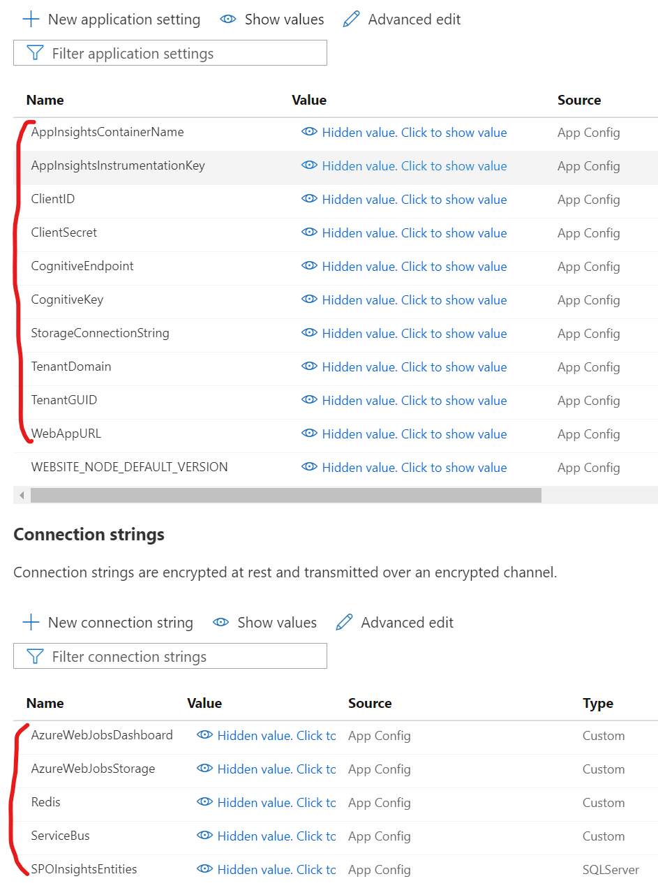

Ignore any value not inside the red brackets (‘WEBSITE_NODE_DEFAULT_VERSION’ for example)

The app-service configuration is common for both web-jobs.

#### Deploy AITracker via PowerShell

Once Application Insights is setup & we have the AITrackerInstaller source, we need to deploy the Office 365 Advanced Analytics Engine “AITracker.js” file to the SharePoint Online sites we want to track users on.

Download “AITrackerInstaller.zip” from the builds website, and extract to your PC if you don’t have it already.

**Note**: this method can also be used later to automate the deployment to new SharePoint Online sites.

1.  Deploy AITracker.js to SharePoint site-collection(s).
    1.  Open the Office 365 Advanced Analytics Engine build folder, then “Scripts.AITrackerInstaller”.
    2.  Create/edit install json config file used by the PowerShell install script in the configuration file (DevConfig.json for example – edit or create your own).
    3.  Change mandatory values in your new configuration file:
        1.  **TargetSites** – a JSon array of the root sites (all sub-sites will be included automatically) to deploy to. **Important** – URL is the root-site URL only, with no trailing backslashes or pages/lists. See example config files shipped with the script.
        2.  **AdminUsername** – a user ID with site-collection admin rights to the target site-collection (not needed for PnP PowerShell version)
        3.  **ApplicationInsightsKey** – the “instrumentation key” for the Application Insights application created.
        4.  The other keys can be changed if desired but aren’t critical.

**Note**: you may need to unblock the script for the script to run:

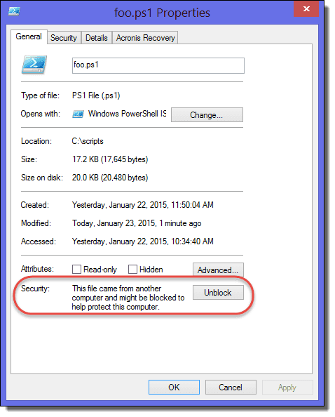

1.  Run one of the scripts to deploy, depending on target needs, passing config filename as a parameter:
-   “**InstallSPOInsightsTracker.ps1**” to install AITracker.js to SharePoint Online site-collections(s). Use this one by default if the SharePoint account isn’t strictly limited to multifactor authentication logins.
-   “**InstallSPOInsightsTracker-OnPrem.ps1**” for on-premises SharePoint.
-   “**InstallSPOInsightsTracker.PnP.ps1**” for SharePoint Online with multifactor authentication (MFA) enabled. This uses a web-login, so no username is read from the configuration file.
    1.  . Example:
        1.  Example execution:

            .\\InstallSPOInsightsTracker.ps1 -ConfigFileName "MyConfig.json".

        2.  The first time it runs, it’ll need to save credentials in a secure-string file. A login box will appear; use the same username as configured in **AdminUsername**, set the password and click “OK”.

            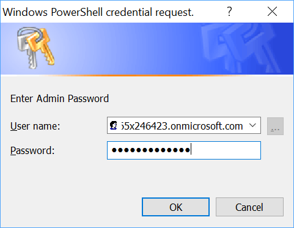

            1.  The script will test if the user has site-collection admin rights. If it does it’ll save the credentials in a secure string.

                ERROR: Problem reading password cipher from SecureString.txt. Please enter the password for admin@M365x246423.onmicrosoft.com in a sec...

                Refreshing secure-string file - please enter credentials

                Updated .\\SecureString.txt with refreshed password

                SUCCESS! .\\SecureString.txt updated with new password hash. Please run the script again & hopefully it'll work now!

                Couldn't upload tracker JS - see above!

        3.  **Run the PowerShell script again to now successfully install the tracker**.

AITracker uploads results to Application Insights to track “page views” and “custom events”, containing the time the users spent on the previous page. Accurate time-tracking for users on pages is not standard Application Insights functionality.

Read configuration for environment name 'Development M365x246423 - sambetts@microsoft.com'...

Read encrypted password from .\\SecureString.txt. Installing AITracker.js...

Checking if https://M365x246423.sharepoint.com/sites/spoinsights/Style%20Library/AITracker.js exists...

AITracker.js doesn't exist for user admin@M365x246423.onmicrosoft.com!

AITracker.js uploaded to https://M365x246423.sharepoint.com/sites/spoinsights/Style%20Library/AITracker.js

File is checked-out. Checking in major version of AITracker.js...

Setting custom-action on all subsites to include AITracker.js in the HTML header...

Checking SPWeb.UserCustomActions...

Inserted custom-action into web: 'https://m365x246423.sharepoint.com/sites/spoinsights'...

Checking sub-webs for site 'Office 365 Advanced Analytics Engine Classic'...

18:39:04 - AITracker.js uploaded to site-collection root & referencing custom-actions inserted in all sub-sites!

This is what you should see if it worked.

#### Deploy Modern UI Extension to App Catalogue

In order that modern sites load the AITracker too, we have a SharePoint Framework (SPFx) Extension that needs to be deployed to the SharePoint app catalogue.

Upload “spoinsights-modern-ui-aitracker.sppkg”, and you’ll be prompted with this dialogue:

**Important**: ensure this option is selected. This does not deploy the analytics solution to all sites but makes it available to “staple” (activate) – done by the PowerShell on the sites you select only.

Verify the extension is loaded once you’ve run the PowerShell/installer by checking the JavaScript console on a SharePoint site page:

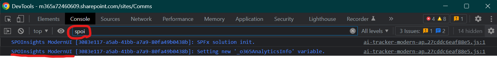

Messages from this solution can be seen in the JavaScript console in sites where the PowerShell has added the tracker, prefixed with “SPOInsights ModernUI”.

On a site not targeted by the PowerShell/installer stage, you will see no messages of this type.

### Configure Reply URLs for Azure AD Runtime Application

Part of the solution is an ASP.Net administration website that is protected with Azure AD. So that access to the administration website login works, the reply URLs need to be set in your runtime account in Azure AD.

Under the runtime account in Azure AD, in “authentication” settings of the application registration ensure the URL matches exactly the root address of your app-service URL:

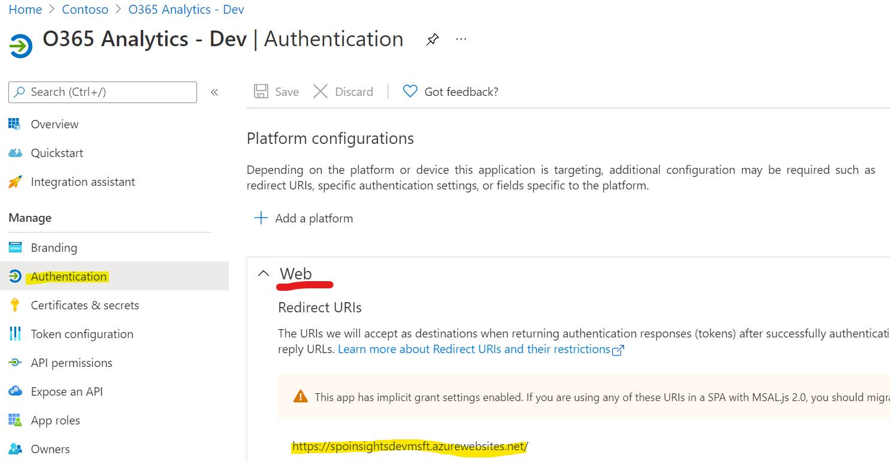

This value needs to be set to what was picked for your service-app URL:

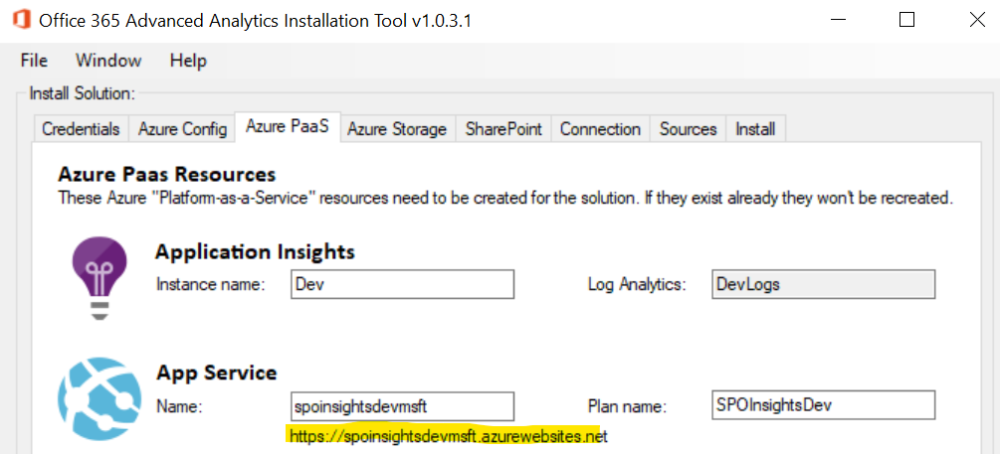

**Important**: enable access tokens & ID tokens on the same page.

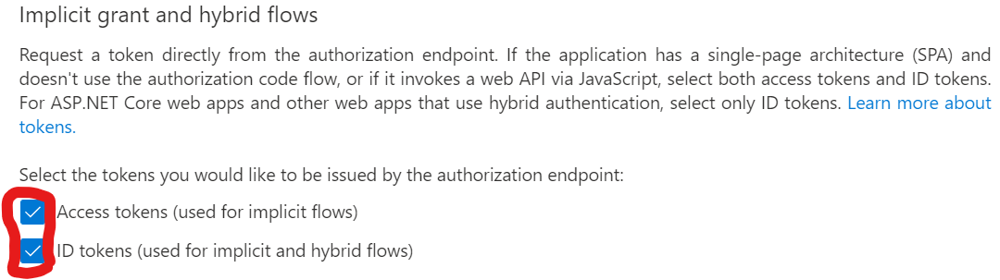

See below to check if these settings are correct & valid.

### Configure Filtered URLs

All SharePoint data for any import is ignored if it’s outside the scope of the “org_urls” table in the SQL database.

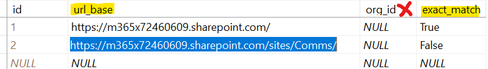

In this table the only important fields are “url_base” and “exact_match”.

“Exact match” is used to limit URLs accepted as only that site-collection, rather than a “starts-with” filter.

With the above table contents, valid & imported URLs would be:

-   https://m365x72460609.sharepoint.com/sites/Comms/SitePages/Home.aspx
-   https://m365x72460609.sharepoint.com/sites/Comms/subsite1/SitePages/MyInfo.aspx
-   https://m365x72460609.sharepoint.com/SitePages/Intranet.aspx
-   https://m365x72460609.sharepoint.com/Documents/Welcome.docx

Ignored URLs would be:

-   https://m365x72460609.sharepoint.com/sites/HR/Intranet.aspx (root site demands exact match).

If you’re not seeing data from any given site, ensure that there’s an entry in this table for that root site-collection URL.