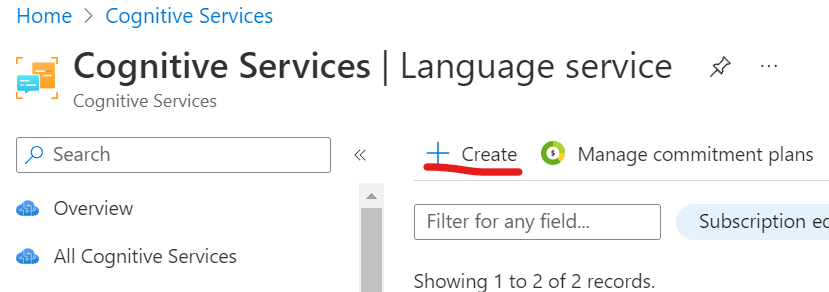
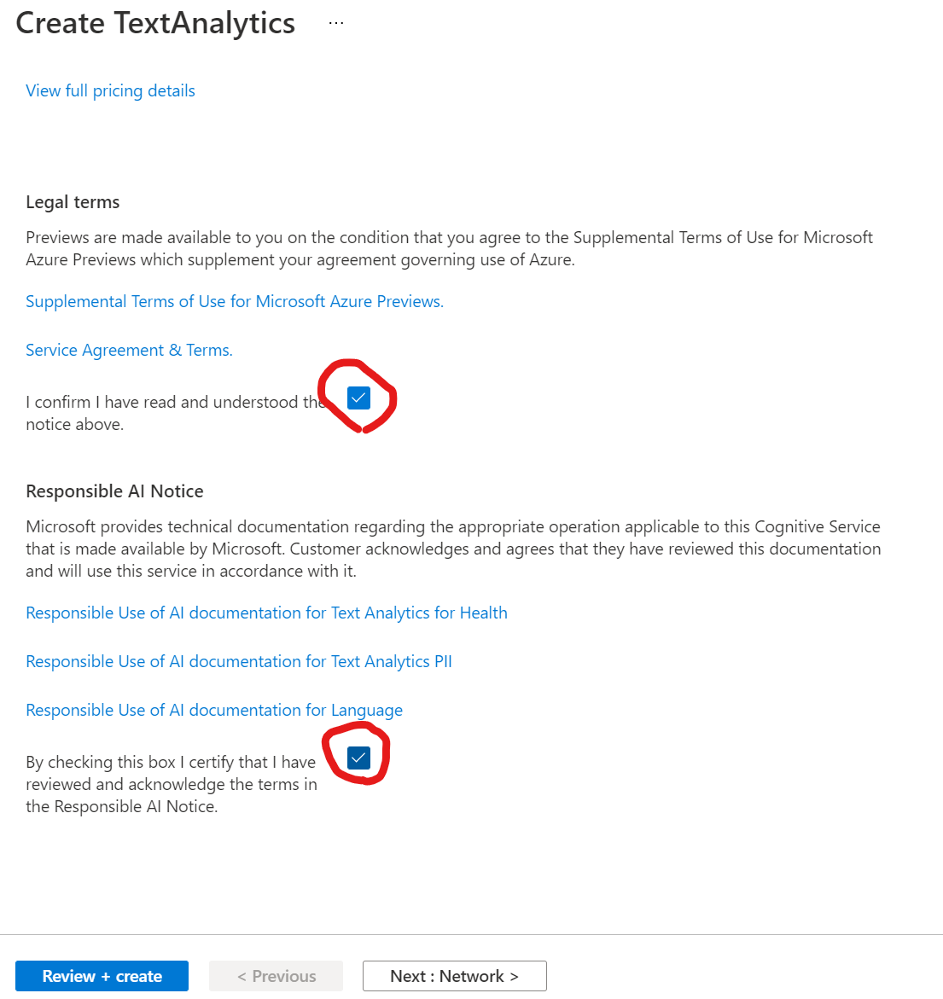
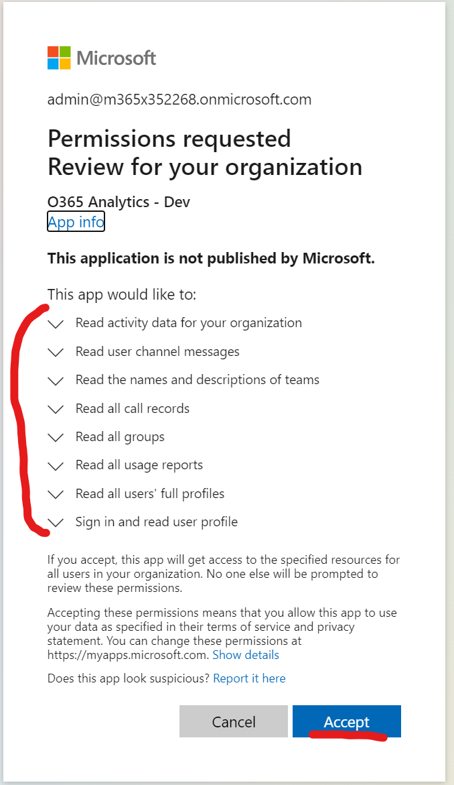
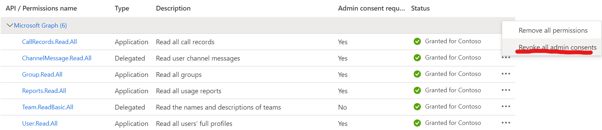
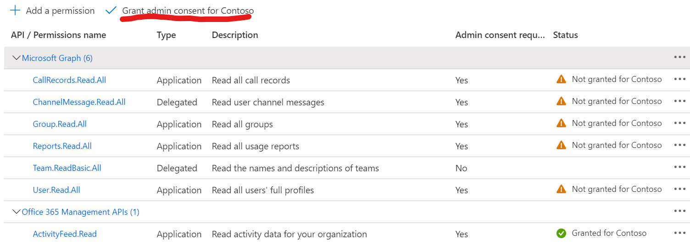
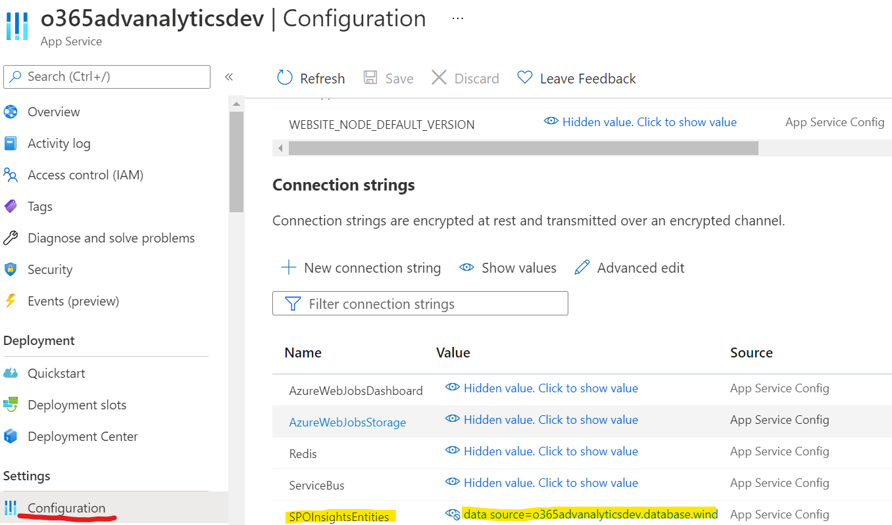
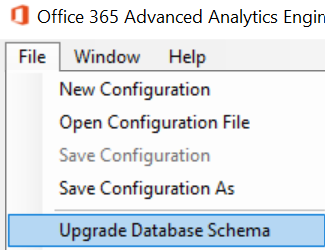
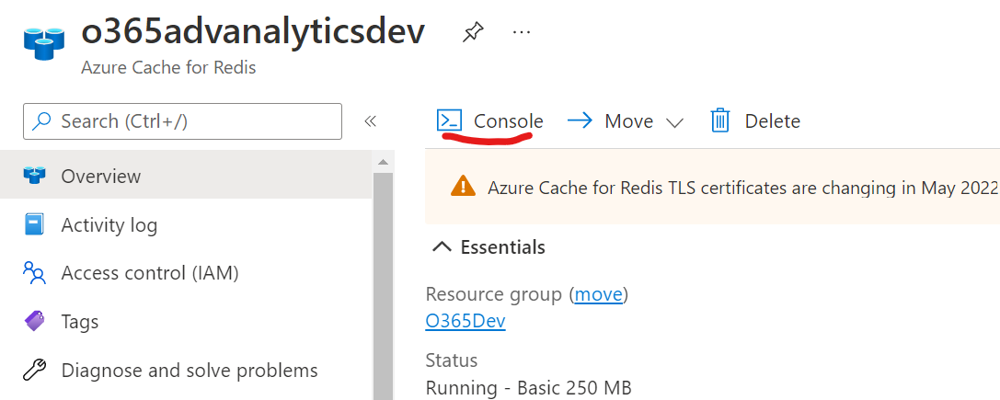

# Known Issues & Common Errors

At the time of writing, these are the known issues with the solution.

This subscription cannot create TextAnalytics until you agree to Responsible AI terms for this resource

**Reason**: everyone must agree to responsible AI usage before deploying any AI resource in Azure. More information: <https://go.microsoft.com/fwlink/?linkid=2164190>

**Workaround**: create a dummy text analytics service (also called “Language service”) in the portal & agree terms there, then delete it.

Find “language” in the Azure portal:

Create a new resource:

You’ll be shown a screen with the features of the service. Click at the bottom of the page:

Fill out the form. You can create either the actual service the solution will use, or a test one to later delete.

The important part is to agree to responsible AI usage:

Once agreed to the terms you won’t need to do so again, and the installer can automatically create the resource from an ARM template.

## AADSTS65001: The user or administrator has not consented to use the application with ID

If you see this message on logging into the app-service website, you may need to consent to the Graph permissions still or if the delegated permission are incorrect.

-   First, check all the permissions are present – both application & delegated (see “prerequisite permissions” above).
    -   **Note**: “Team.ReadBasic.All” is both an application permission and a delegated one. We need specifically the “user delegated” permission. If this distinction is incorrect, you will see the above error message.
-   Next check the consent URL works by opening this in a browser with a tenant admin user account:

    https://login.microsoftonline.com/TENANT_ID/adminconsent?client_id=RUNTIME_APP_CLIENT_ID

    This should show you the consent form:

    

    Consent for all the organization too is possible. Ensure you can at least consent for yourself.

-   Try accessing the app-service again with a browser “private/incognito” mode. Each test should be done this way.
-   Failing all these, try revoking the Graph permissions of the runtime application and reconsenting either from Azure AD portal or the URL above.

    

    …and then:

    

Still not working? Check there are no enterprise application policies that block any of these permissions/scopes, which are requested by the web-application from Azure AD:

-   openid
-   email
-   profile
-   offline_access
-   Team.ReadBasic.All - delegated
-   ChannelMessage.Read.All - delegated

## Database Schema Migration Errors

Sometimes it may be necessary to manually migrate the database schema outside of the installer. This is especially so if the target is very large – databases with several hundred-thousand hits may take some hours to migrate, especially when on performance levels of \< 100 DTUs.

Recommendation for larger databases:

1.  Upscale database tier to Premium.
2.  Run the database migration manually.

This should significantly speed up the migration time.

**Steps to manually apply a database migration**:

You can perform the migration in the installer application manually. You need the connection-string first – get this from the app service configuration:

Open the control-panel application and select this option:

From this form you can copy your connection string in, accept the warning, and upgrade manually:

The migration can take several hours if the database is an old schema & very large. Unfortunately, due to entity framework limitations there’s little reporting possible about the progress until it either finishes or fails.

**Important**: this method upgrades the schema to the version that the current installer/control-panel application knows of, as opposed to the downloaded version. Make sure it’s the right version of this application – usually the installer that applies the schema update is the same version as the installer running the install, but not necessarily.

## SQL Server Persist Security Info Requirement

Because of the connection-reuse design of some of the code, “persist security info=True;” is required for the connection-strings used. Without this, you will see unexpected SQL login failures during web-job execution.

## User Data Won’t Refresh Correctly

Users are read from Graph and updated when needed thanks to the Graph delta functionality. If for some reason user updates aren’t being applied correctly, you can force a full read of users again by deleting the delta token in Redis. First get your delta code key:

You need your tenant ID to form the cache key used to store the value in this format:

“UserDeltaCode-\$tenantGuid”

For example, “UserDeltaCode-ffcdb539-892e-4eef-94f6-0d9851c479ba”.

In Azure portal you can connect to the Redis console (or use your own connection).

Run:

-   del \$key (key name generated above)

Verify this worked by executing “keys \*”.

## Unexpected Error Installing App Service Contents

If you get any errors during this stage, and assuming the FTP tests work during “test configuration” stage, just delete the app service and have the installer reinstall it on the next run. The app service is just a compute container and hold no special data that needs to be kept.

# Uninstallation Instructions

There is no fully automatic uninstallation process, so this process is as follows:

-   Delete Azure components as needed
    -   You can delete the whole resource-group, or just individual components – leaving just the SQL database for example.
    -   Note: deleting the SQL server will lose your ability to restore deleted databases later.
-   Optional: remove the installer & runtime from Azure AD
