# Verifying the Deployment

Once deployed, these steps will ensure everything is correctly configured and healthy. There is a section on troubleshooting common problems at the end.

## Verify & Limit Access to Solution Website

One component installed as part of the solution is the administration website. It’s used to check the basic status of the system and enable deep analytics for Teams if that’s wanted.

Go-to the root address of your app service (as seen from the portal):

If the runtime authentication settings are correct, you’ll be able to login to your app-service & see the status website:

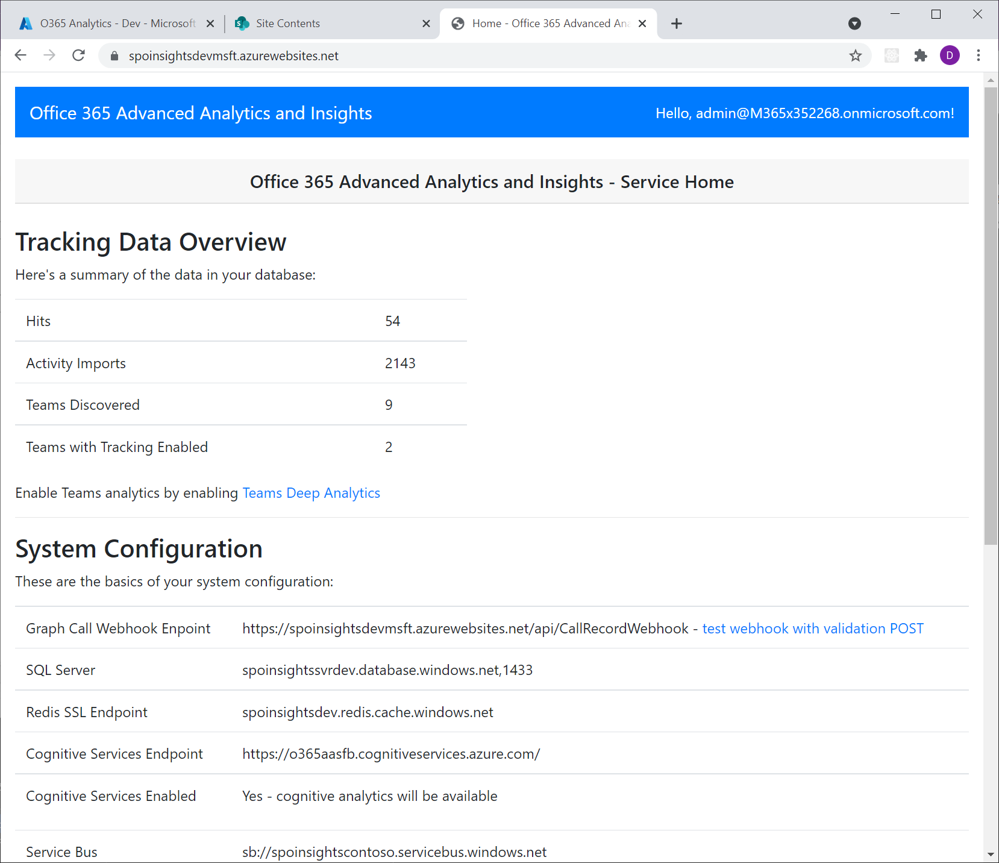

Next up: **limiting access to this website**.

Depending on your company directory policies, this website may be accessible to anyone with a valid login on the same directory. We recommend you limit access to this site to just specific users that administer the analytics solution.

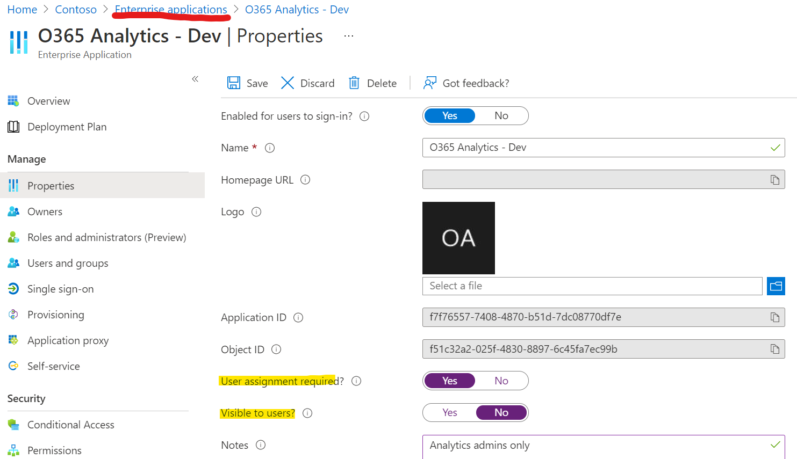

Here you can set whether only specifically assigned users should have access to the web application or anyone in the organization. We recommend limiting the access to specific administrators:

### Verify Import Jobs are Running

We need to verify that data is being imported successfully into the SQL database from the two web-jobs.

1.  In the Azure Portal, under the App Service -\> “web-jobs” blade you should see two web-jobs “AppInsightsImporter” and “Office365ActivityImport”.
    1.  They should both say “running”.

        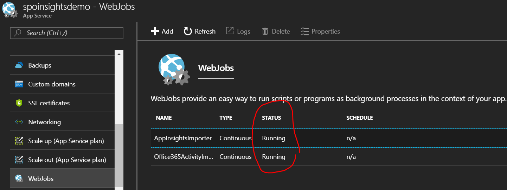

    2.  You can click “logs” to open a new tab/window & see the web-job logs to determine any errors.
    3.  Both web-jobs print their configured values at start-up, so verify these settings if there are any errors.

The AppInsightsImporter should look something like this on a good start-up:

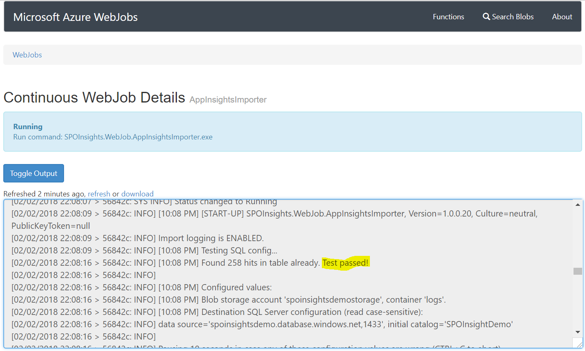

The Office365ActivityImporter job should report something like this if it is working fine:

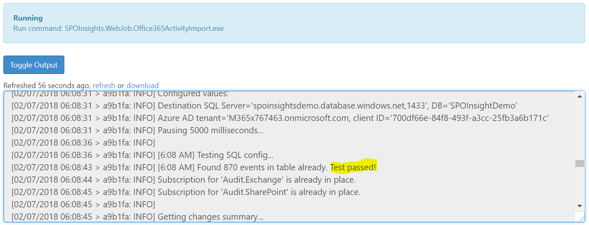

These logs are also available at “C:\\home\\data\\jobs\\continuous” on the app service if you want to look at the full log.

For more logging info, please check Application Insights trace logging– see more info in section 4.4.5.

At this point, the data-processing part of Office 365 Advanced Analytics Engine is setup!

### Monitor Performance

By default, the resources are created with minimal level performance tiers to avoid unexpected Azure consumption. It is necessary to monitor KPIs to ensure the PaaS components are sufficiently scaled.

Example of an under-scaled database:

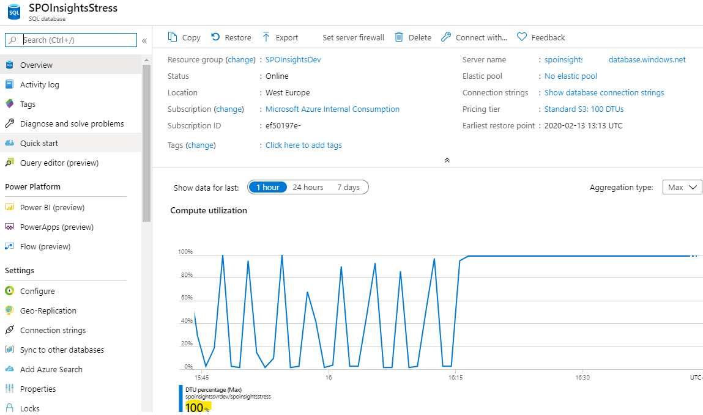

In this case we would recommend upscaling the database to the next performance tier.

Another KPI to monitor: the app service plan CPU & memory percentage.


If you see CPU at 90-100% constantly, you may need to upscale the app-service.

## Monitor System Messages in Application Insights

All system logging is also registered in the Application Insights instance created for web-tracking.

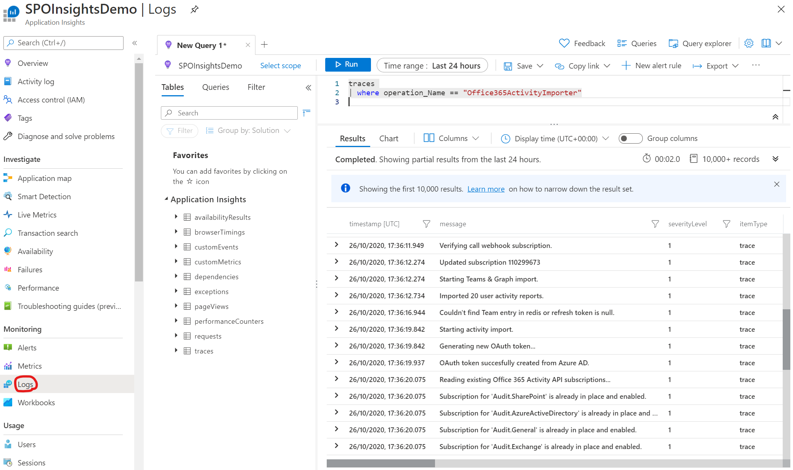

### Example Log Analytics Queries

“Office 365 importer” web-job messages (queries are multi-line):

```
traces

\| where operation_Name == "Office365ActivityImporter"
```

See when “Office 365 importer” has finished an import cycle:
```
traces

\| where operation_Name == "Office365ActivityImporter" and message == "Waiting 2 mins..."
```

For call-logging specifically:

```
traces

\| where operation_Name == "Office365ActivityImporter"

or operation_Name == "CallRecordWebhookController"
```

**Important**: this cycle/message should be no longer than once every 24 hours. Any longer & the backlog will be growing quicker than the importer is importing. If this happens, you need to upscale the database & app-service-plan (see 2.4.4).

“Application Insights importer” web-job messages:

traces

\| where operation_Name == "AppInsightsImporter"

Graph API Webhook messages

```
traces

\| where operation_Name == "CallRecordWebhookController"
```

Call records read from Service Bus
```
traces

\| where message contains "ServiceBus"
```
### General Exception Searching

If you want to see where an error may be logged but are unsure where, you can query for all exceptions being logged to get a start:

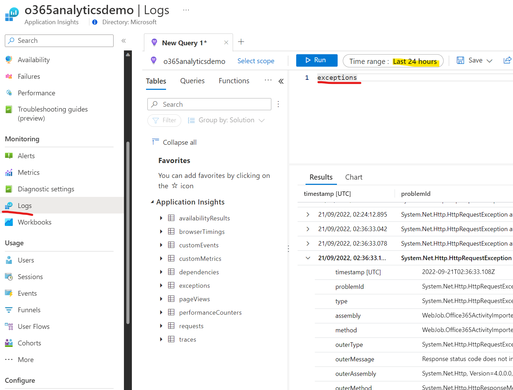

This gives you a good idea of what may be causing problems, although be careful; some exceptions are normal to see, depending on the circumstances.

For example, if audit data is loaded for external users then those users won’t be found when the web-job tries to load the user from your Azure AD and a “not found” exception will be logged. These errors need to be studied, but exception reporting can give a clue why a certain table isn’t being populated for example, if there’s a blocking issue.

### Web-Job Log Files

If Application Insights does not show data for some reason, web-jobs also log files to the standard web-job logs on the app-service:

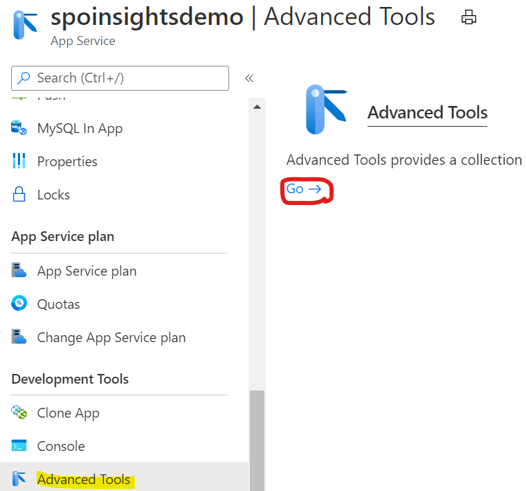

In Kudu, the app-service logs are available, including any output from either web-job.

Navigate to “D:\\home\\data\\jobs\\continuous” + name of web-job, to see the file-system log.

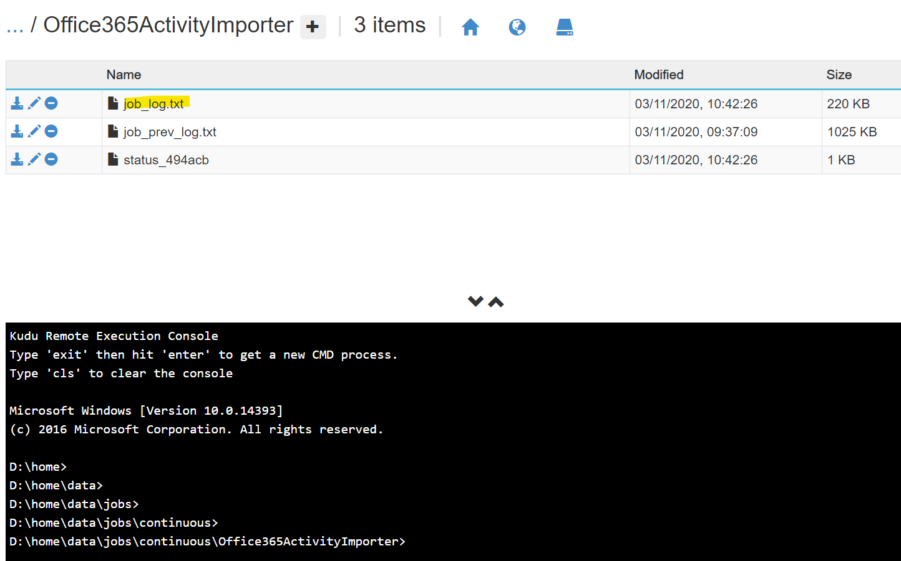

You can edit the file directly to see the contents or download to your local computer.

### Recommended: Setup Health Alerts

Once everything is running, we highly recommend creating alerts for the system to monitor health & be able to respond to problems, should they happen.

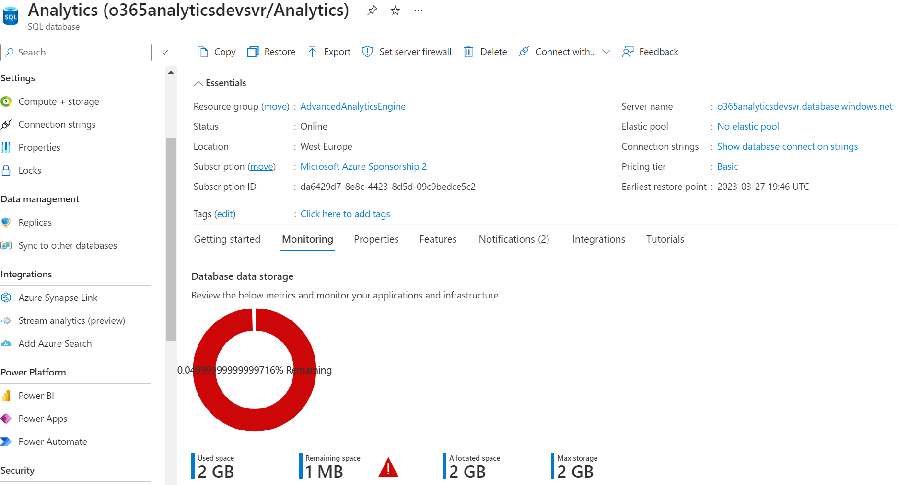

If something like this happens, you need alerts to warn you before the imports stop working.

We’re going to monitor the following metrics & problems:

**Data flow health status**

-   No recent data from App Insights
-   No recent data from Activity API
-   Issue writing data in SQL

**Infrastructure KPIs for capacity monitoring**

-   App service plan
-   SQL Database
-   Redis

**Permissions**

-   Access denied errors:
    -   AAD App secret expiration
    -   Yammer access issue (given it’s tied to a service account)

This we can do with Application Insights alerts.

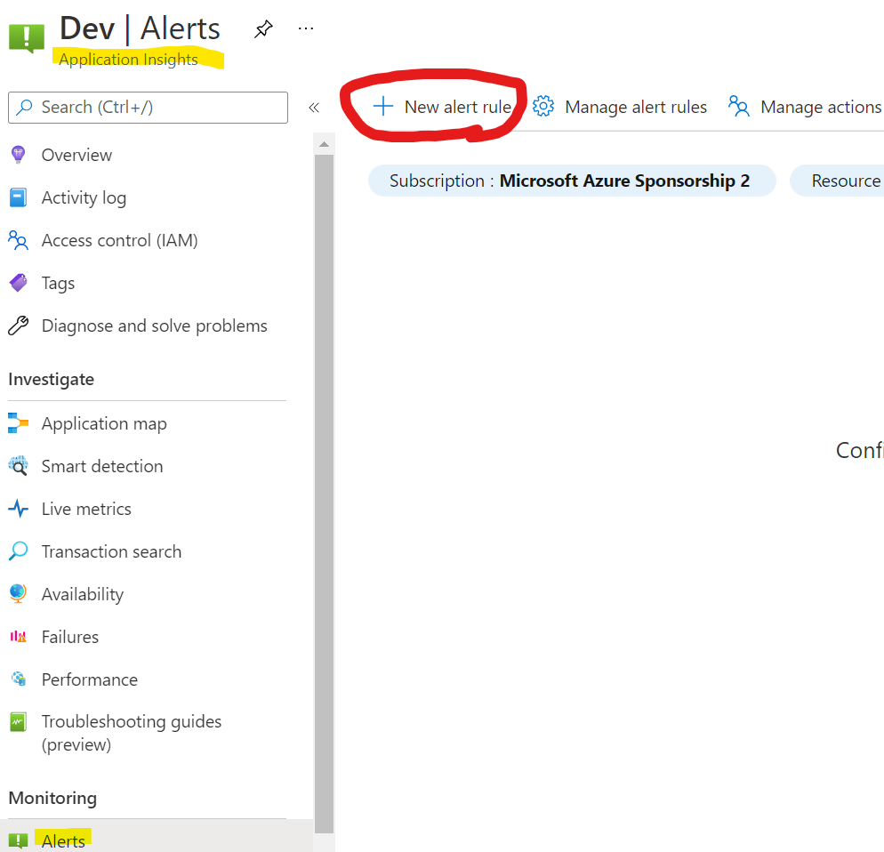

Rules allow us to be notified when specific events occur.

Example: create a rule to check if there’s no recent data into App Insights.

Why might this happen? A bad deploy of a new tracker version for example. It probably won’t happen, but it could for many reasons potentially; but we need to know if this happens ASAP so we can fix it.

Create a new rule & add a condition:

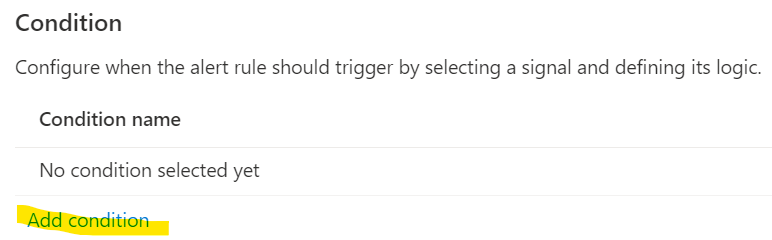

The signal for the condition will be “custom log search” meaning, from the results of an Application Insights query.

For the query we just want “pageViews”, nothing else.

For the alert logic, in this case, we want to know when no hits are arriving “for X time”. That is obviously going to be enough time that it’s clear there’s a problem instead of just inactivity, so lets say “48 hours”.

If there’s been no hits at all in 48 hours on any sites, then the chances are there’s something wrong – you may have your own ideas what X may need to be, but in this example, our alert will look like this:

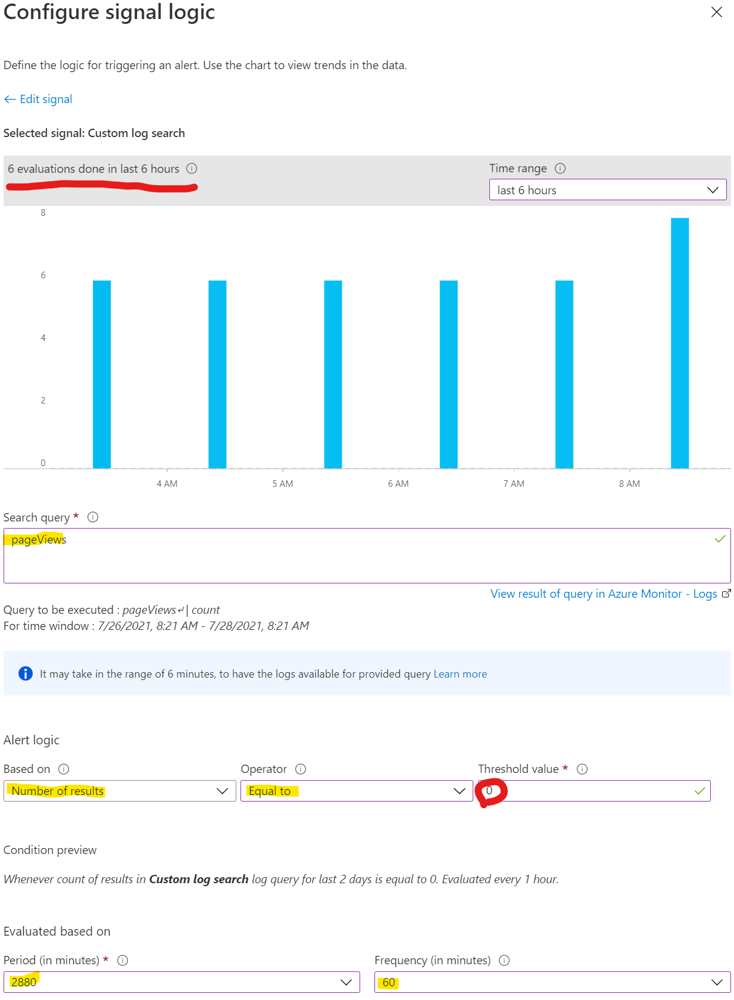

Here we can see that when page-views are equal to 0 over the last 48 hours (2880 minutes), the rule will trigger. In this case we’ve had 6 hits over the last 48 hours, which has been the case each 6 times it’s been checked over the last 3 hours (the number of evaluations is shown to give you an idea of the evolution of the data over time, but in our case it’s a demo environment hence the low traffic).

Save the trigger.

Next up: define an action when the trigger is hit, which we do with “action groups”, which is basically a way configuring a collection of things to happen when a trigger is hit. You pre-save an action group & associate it to an alert.

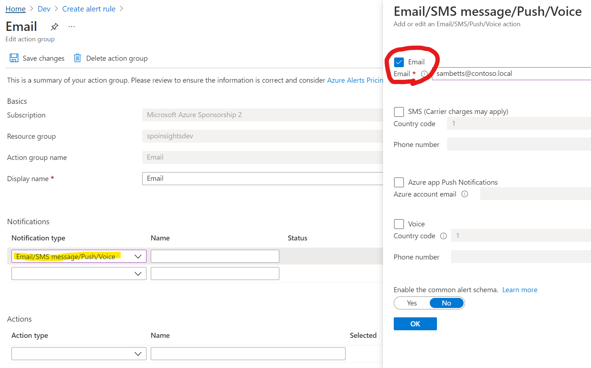

From an alert, this is now selectable.

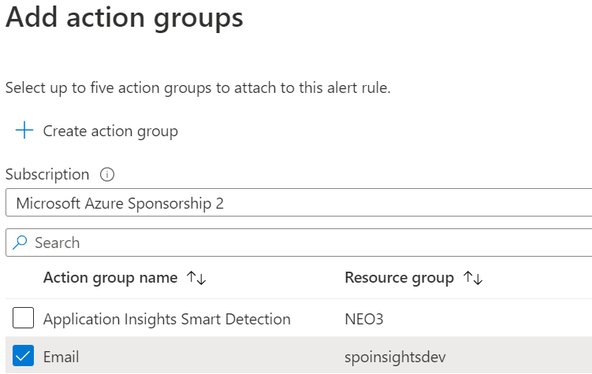

Now add the alert details…

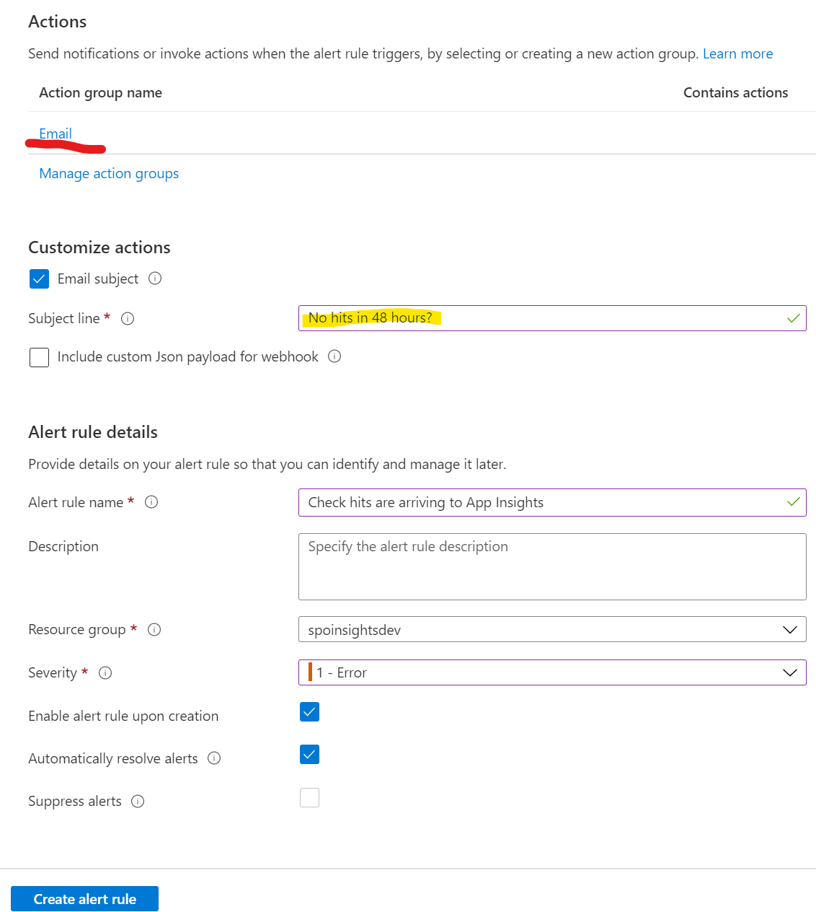

…and create. It will now be active.

#### Alert Rules

To create alerts for the other rules, here are the triggers you need to create. All are based on the “custom log search” signal.

All assume that when the count of the results are 0, then something bad has happened and should fire the trigger.

-   No recent data from Activity API

| App Insights Query                                          | Time Period             | Trigger count |
|-------------------------------------------------------------|-------------------------|---------------|
| traces \| where message contains "Finished activity import" | 24 hours (1440 minutes) | 0             |

This is the message logged at the end of an activity import cycle, assuming no error. We should see at least one a day.

-   Issue writing data in SQL

| App Insights Query                                                            | Time Period | Trigger count |
|-------------------------------------------------------------------------------|-------------|---------------|
| exceptions \| where outerMessage contains "because the database is read-only" | 10 minutes  | \> 2          |
| exceptions \| where outerType == "System.Data.SqlClient.SqlException"         | 1 hour      | \> 10         |

This will give alerts for persistent SQL errors, and much sooner, any problems with database sizing.

**Infrastructure Load**

-   App service plan

For this, you need to add an alert to the “app service plan” of the “app service”.

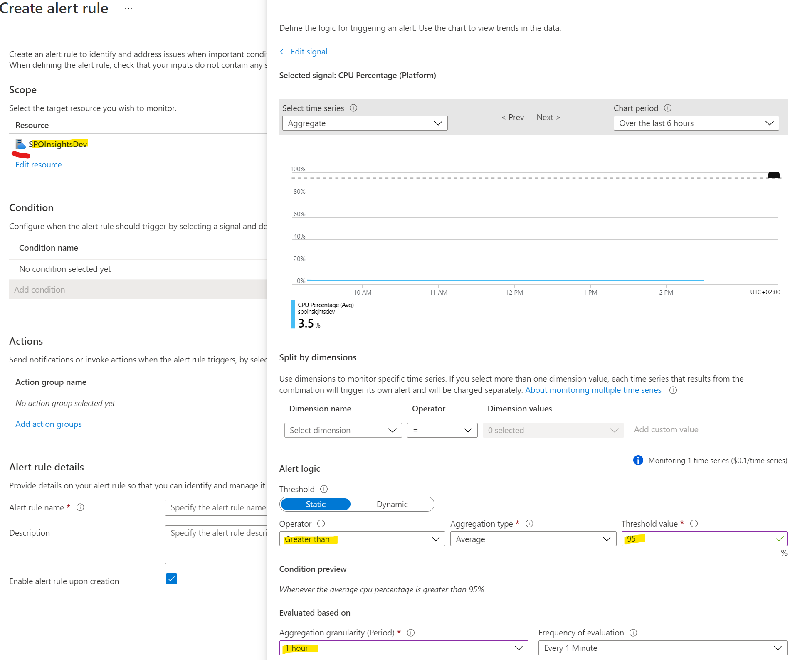

It’s normal to have high CPU, so set this trigger value high for a fairly long period.

-   SQL Database

Create the alert on the database & select “DTU percentage” for the signal (not DTUs used). DTUs are a simplified measure of CPU, memory, disk R/W all together. If the database is consistently at 100% then you need to scale up the number of DTUs available.

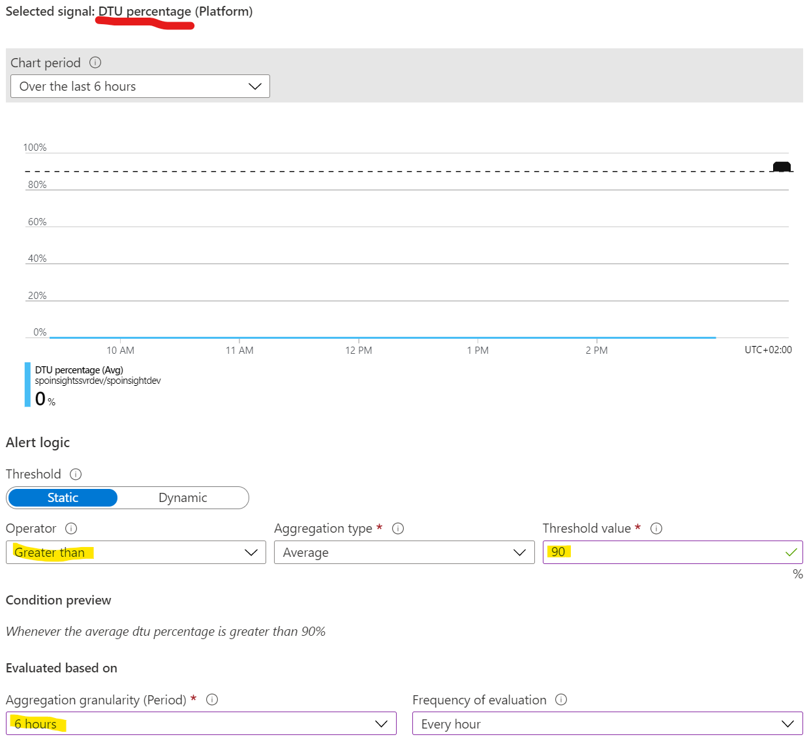

DTUs explained - [Service tiers - DTU-based purchase model - Azure SQL Database \| Microsoft Docs](https://docs.microsoft.com/en-us/azure/azure-sql/database/service-tiers-dtu)

-   Azure Cache for Redis

Redis is unlikely to need scaling as it’s usage is fairly limited, but just in case, measure “Server Load (Instance Based)” and keep below 80%.

-   Service Bus

Service bus can need scaling if the number of calls to be tracked is very high. Check the “Throttled Requests” signal and make sure it stays at 0 always, as with “server errors”.

Other

-   AAD App secret expiration

| App Insights Query                                                                | Time Period | Trigger count |
|-----------------------------------------------------------------------------------|-------------|---------------|
| exceptions \| where innermostMessage contains "Invalid client secret is provided" | 10 minutes  | \> 2          |

-   Yammer access issue (given it’s tied to a service account)

| App Insights Query                                                | Time Period | Trigger count |
|-------------------------------------------------------------------|-------------|---------------|
| traces \| where message contains "No auth code found for Yammer"  | 10 minutes  | \> 2          |
| traces \| where message contains "Error requesting Yammer export" | 10          | \> 2          |

The 1st error occurs when there’s no code in Redis for Yammer, and the 2nd one when the code is invalid. Both should have alerts created for them.

# Troubleshooting Dataflows & Setup

Here are some common issues & resolutions for getting Office 365 Advanced Analytics Engine setup.

## General Troubleshooting

Troubleshooting the system involves two steps:

1.  Figure out which imports are working/not-working by detecting a “finished” event for each one.
2.  For each import not finishing, what logs & errors are generated for it?

For step 2, the process is to disable everything except that failing import to get a clean set of traces and logs for when is fails.

There are several import flows in the system involved in any given import cycle:

-   AppInsightsImporter import channels:
    -   Web + events (from Application Insights).
-   Office365ActivityImporter import channels:
    -   Audit (from the Activity API).
    -   Graph import:
        -   User metadata
        -   Usage reports (all)
        -   Teams/channels

Each channel will report when it is successfully finished importing with a “FinishedSectionImport” custom event name in Application Insights, along with how long it took. When the importer has finished a whole cycle is a “FinishedImportCycle” event is logged; also with the total time taken.

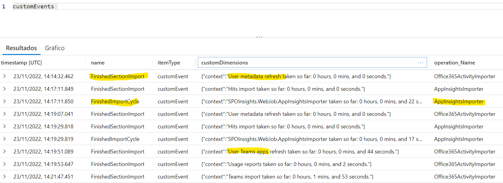

Here we can see import cycles per process, and in each cycle the sections being confirmed as completed.

On a healthy environment, with all imports enabled you will see (in no particular order):

-   FinishedSectionImport - Hits import
    -   FinishedImportCycle – **AppInsightsImporter**
-   FinishedSectionImport - User Teams apps refresh
-   FinishedSectionImport - Usage reports
-   FinishedSectionImport - Teams import
-   FinishedSectionImport - Audit events
-   FinishedSectionImport - User metadata refresh
-   FinishedSectionImport - User Teams apps refresh
    -   FinishedImportCycle - **Office365ActivityImporter**

Check you can see these messages with this query in Application Insights:

customEvents \| where name == "FinishedSectionImport" or name == "FinishedImportCycle"

This will give you all section finished events from both importer jobs. If you just want the activity imports, run this:

customEvents \| where (name == "FinishedSectionImport" or name == "FinishedImportCycle") and operation_Name == "Office365ActivityImporter"

If you are missing any of those events within a 24-hour period and ImportJobSettings is set to import them, you should follow the below advice to start investigating why.

## Getting Problem Logs

If you suspect a problem with a particular flow the method to troubleshoot is the following:

1.  Disable all other imports via the “ImportJobSettings” setting (see below).
2.  Once configured, review exceptions logged for that single flow.
3.  Confirm you can/cannot see the “FinishedSectionImport” event is seen for the flow.
4.  Repeat the process with other import flows – verify each one can finish without fatal exceptions.
5.  Check on the app-service-plan free memory especially. If there is a lot of data the import processes can crash from running out of memory. It can also be worth increasing the scale of the app-service-plan to a much higher SKU temporarily to verify the problem isn’t around performance.

If you find a fatal exception that isn’t obvious what the cause is, please email with the details. We may need your configuration to be able to test and reproduce the error with a debugger.

## Teams, Calls, Events Data Issues

This data is all imported with the “Office365ActivityImporter” web-job. It imports data in the following order:

-   Teams
    -   User activity – usage & device reports
    -   Teams, channels: apps installed, members, etc, per day
    -   Deep analytics if enabled: channel chat metadata processing
        -   Keywords
        -   Sentiment score
        -   Languages spoken
-   Activity import
    -   Audit-log import for SharePoint, and other enabled workloads.

#### No Calls Data in Database

If you have no records in the “call_records” table, this could be for any number of reasons.

Call records are pushed from Graph into the solution via a webhook notification & a subscription, all of which should be created automatically. From the webhook, the call JSon is added to a service-bus queue & then picked-up by the importer web-job.

If call records aren’t being imported into SQL, you need to:

-   Verify the Graph webhook is available.
    -   Go-to the app-service webpage.
    -   Click the “test webhook with validation POST” link to simulate a web-hook call.

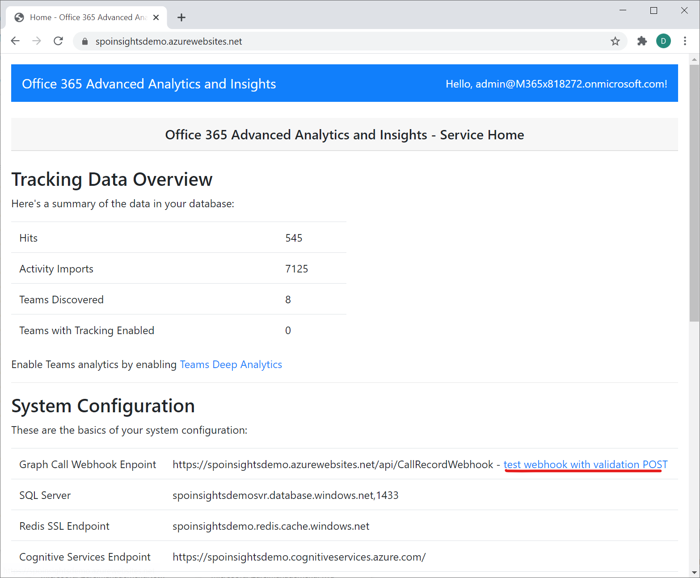

-   Verify the subscription for Graph calls is created.
    -   In Application Insights, log analytics: run this query:
        -   To see if the webhook subscription was created ok from the importer web-job:

            traces

            \| where operation_Name == "Office365ActivityImporter" and (message contains "Verifying call webhook subscription" or message contains "Updated subscription" or message contains "Created subscription")

        -   If you want to see webhook subscription failures:

            traces

            \| where operation_Name == "Office365ActivityImporter" and message contains "Couldn't create webhook"

-   To see if the webhook has been called (which will add them to the service-bus queue for calls):

    traces

    \| where operation_Name == "CallRecordWebhookController"

-   Check for service-bus processing messages.

    traces

    \| where message contains "ServiceBus"

This data will tell you where in the chain the call records are failing.

**Note**: it can take 15-20 minutes for a call webhook to trigger, after a call.

#### No Events Data in Database

Imports

#### “Office365ActivityImporter” Web-Job Restarts

Also seen in logs: “FATAL ERROR: No org URLs found in database!”.

Make sure there is at least one record in the “orgs_urls” table

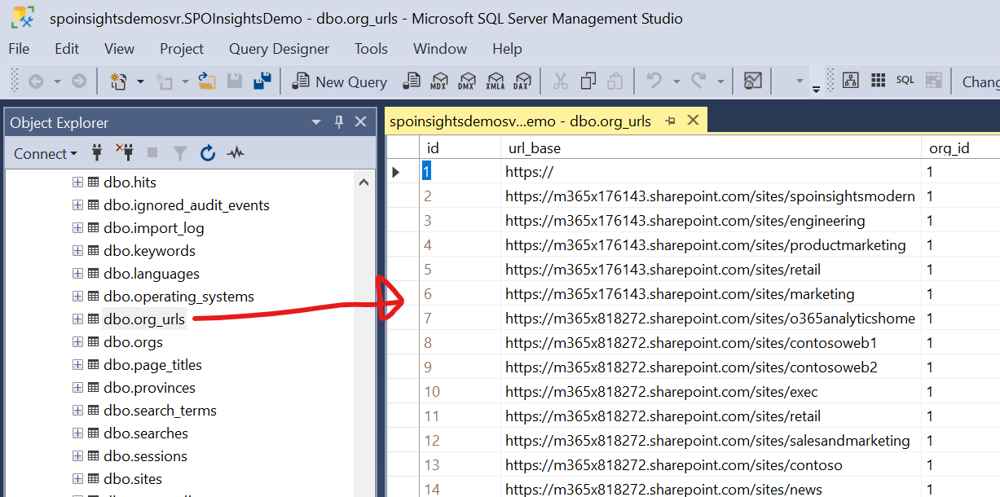

Without anything here, all activity would be imported, so if the table is empty then the web-job aborts execution & hence this error.

#### No Logging in Application Insights

If you see no data in Application Insights for any of the importer web-jobs like this:

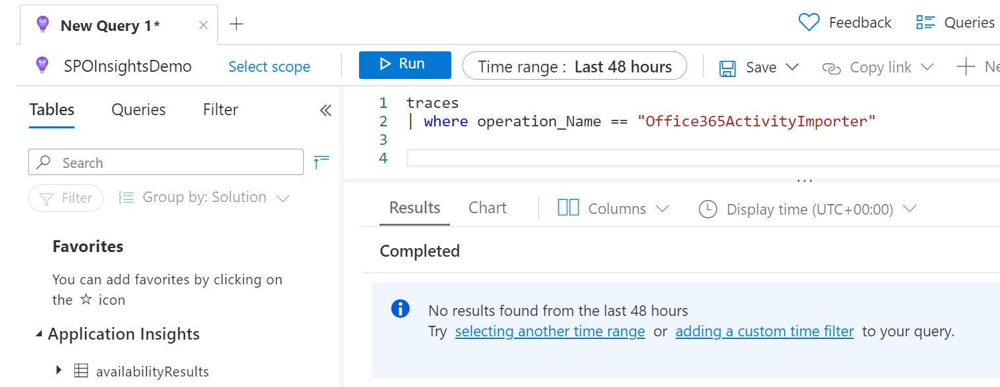

You need to check the app-service logs to figure out why.


In this case, we’ve updated the system without migrating the database correctly to the new schema, so the data-layer (entity framework) can’t initialise the database correctly & crashes.

Misc Errors

#### Database Schema/Context Model Error

You may see this error:

*The model backing the 'SPOInsightsEntitiesContext' context has changed since the database was created.*

This is due to a mismatch between the solution binaries & the database; usually newer binaries running on an old schema.

The installer application can update the schema if needed & should be done when applying updates, with this option:

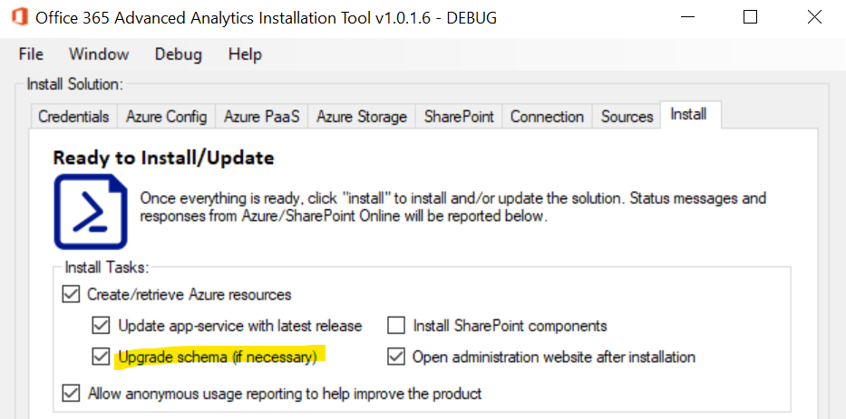

This option will use the installer in the software sources (not the installer running the install) to initialise & upgrade the database schema. The installer calls a copy of itself.

The reason we use the “downloaded” installer is so we can be reasonably sure the installer has the same context model version as the web-jobs being uploaded & installed, so there will not be any mismatches.

**Forcing Schema Updates**

If you want to forcibly update a database to the same data-model as the installer itself, you can do so via this menu option:

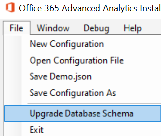

This window will perform the same operation as the proxy install, but in this installer instance.

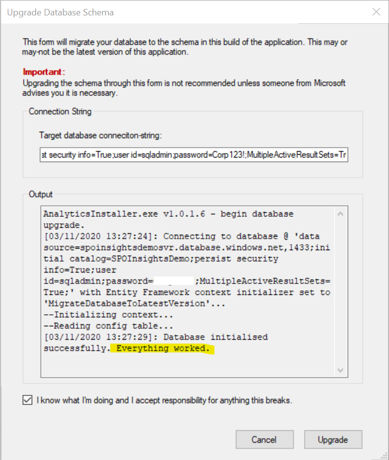

**Important**: only do this if you are absolutely certain the installer you are running is the right build.

Enabling/Disabling Imports

The system can be set to only import certain data with a “ImportJobSettings” app-service configuration setting:

**Calls**=True;**GraphUsersMetadata**=True;**GraphUserApps**=True;**GraphUsageReports**=True;**GraphTeams**=True;**ActivityLog**=True;**WebTraffic**=True

Setting any category as “false” will mean that part is skipped.

These options are also set on the installer:

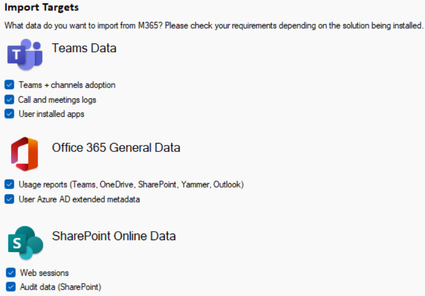

If you want to change them later, you can change them in the app service configuration:

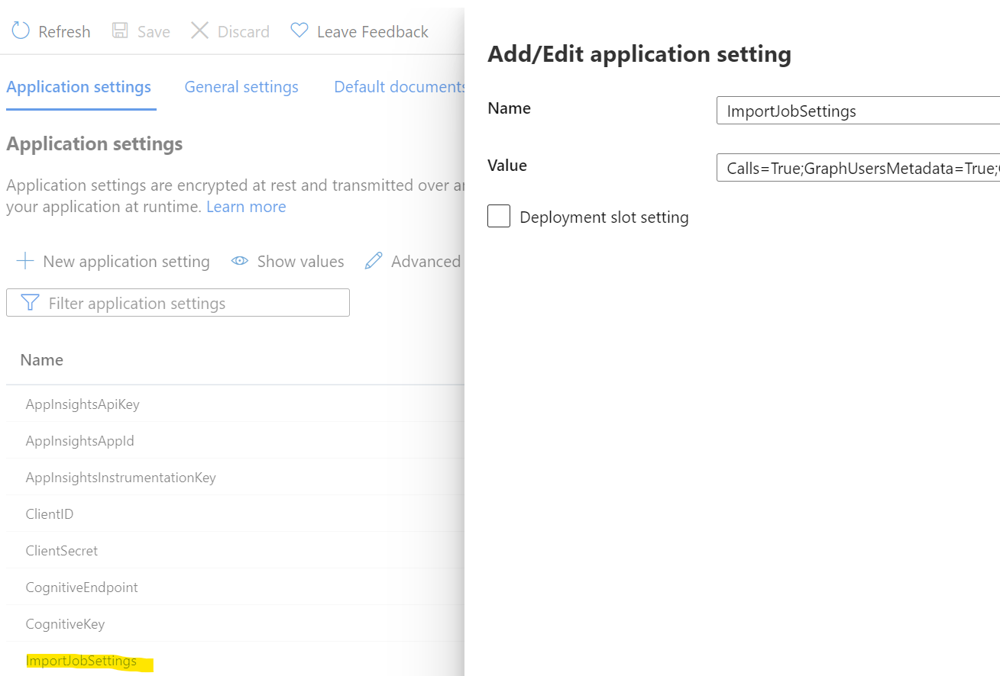

Save configuration, and the next import cycle will skip whatever’s not enabled.

## Updating the Solution

Occasionally it’s necessary to update the solution to a new version; either to resolve an issue or to take advantage of new capabilities.

The new version can either be a stable build or a testing build if you need a fix more urgently.

### Installer Upgrade Method

For stable builds, just follow the installation instructions again making sure that the “latest stable” release option is selected in the sources tab:


For testing/dev builds you need to download each component manually from the releases website, and then in the installer specify each file location:


Make sure you don’t mismatch each file.

Start the installation as before from the same configuration file + the above settings. The process will be as before:

1.  Create Azure resources where necessary (if this is an upgrade, it shouldn’t need to create anything new).
2.  Update the import web-jobs with the configured versions above.
3.  Upgrade the SQL schema with any new changes.
    1.  Most new versions don’t introduce schema changes, but some do.
4.  Save the configuration applied in the SQL database & enter SharePoint URLs installed to, to the “org_urls” table so activity imports work there too.
5.  Restart the app service.

The output should look something like this:


**Important**: once done, verify the web-jobs are running as per section 4.4.2. If a database schema change has been applied or is required, then you should double-check the new binaries are running correctly.

See section 6.5 for more information.

## Network Restrictions for FTPS & SQL Outbound Ports

Some customers may have firewall restrictions that limit outbound traffic. For the installer, we need specific ports to be able to install or update the contents of the database & app-service.

We have built a test functionality to help clarify if the right ports are open:


You can test FTPS and SQL outbound in the installer using either an example FTPS & SQL endpoint we’ve provisioned for these tests, or after creating your own App Service & SQL server, use those endpoints for the “test configuration”.

This is useful if your security teams require the outbound rule to be for a specific endpoint and you want to verify with the test configuration button.

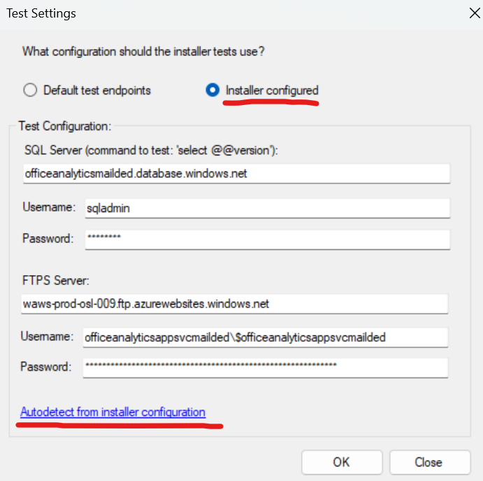

Here we’re automatically detecting the FTP host used in our app-service that’s been created and configured in the installer (either created already by the installer, or manually). These endpoints can then be used for the tests.

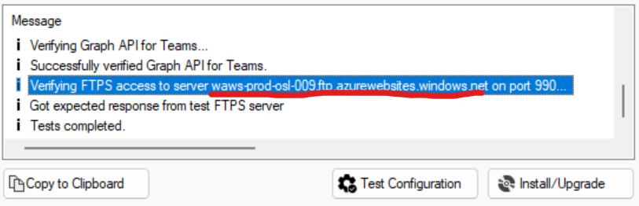

If your networking team require outbound ports open to a specific endpoint and you wish to use the test functionality, this is how you can change the test configuration.

## Optional: Enable Private Endpoints

If you need to ensure that all endpoints are private, you can integrate with a virtual network and restrict access to each resource via the same VNet.

Example network:

The resources in Azure should be accessible only via private IP addresses, accessible optionally via another private, on-premises network.

### Limitations

In this mode, the system does have some limitations around data collection and configuration.

-   The installer does not take into account private endpoint resources, so once an installation is converted to private endpoints, manual upgrades are needed if version updates are deployed. The manual process for installation and upgrade is documented.
-   Also, due to how calls are tracked with Graph pushing notifications to the app service, this won’t be possible with privately protected endpoint.

The lack of calls can be mitigated if the only app service has a public endpoint, but assuming that too is private, it’s impossible to receive [webhook notifications from Graph API for calls](https://learn.microsoft.com/en-us/graph/api/resources/callrecords-callrecord?view=graph-rest-1.0) and therefore we can’t log call data.

### VNet Configuration

For these steps to work, we need a virtual network (VNet) pre-configured with x2 subnets – a default one and then one for app services.


All the dependencies will use the default subnet, and the app service will integrate with a second one.

Private endpoints are created on the VNet and add DNS zones for each resource as needed, so that each service has a private, internal IP address.

**Example**: for App Insights, when we create the endpoint, we get a new network interface card for it with a private IP address (10.0.0.X) + a DNS “westeurope-5.in.ai.privatelink.monitor.azure.com” (same as the public address).


In this case, the browser will now route requests to the private address, will pass internally to the App Insights instance and therefore be accepted.

In our example we’re using Azure DNS, so resource name registration happens automatically.


Your own infrastructure may have different requirements.

**Important**: if you have your own DNS infrastructure to integrate with, please add verification steps for each Azure service added below.

### Configure Services for Private Access Only

In this guide, we assume that you have a working system created by either the installer or the manual configuration method.

#### App Service

Add a private endpoint so access to it is restricted. In the “networking” blade of the app service:


<https://learn.microsoft.com/en-us/azure/private-link/private-endpoint-overview>

Next, we need to integrate the app service into our VNet so the web-jobs can access private resources. Back in the networking blade click “VNet integration”


Now, any HTTP calls from outside the private network will not arrive at the app service.

#### SQL Server

Restrict public access and enable a private endpoint.


This will create a network interface for the private endpoint:


Select the same VNet.


You may wish to create a specific IP address. We’re going for automatic configuration.


Now, apps need to use this internal address to connect to any database on this server.

#### Redis Cache

A similar setup with Redis is needed.

https://learn.microsoft.com/en-us/azure/azure-cache-for-redis/cache-private-link


#### Service Bus

Private endpoints and network isolation require a Premium tier service-bus. The installer creates a basic tier bus, so this needs to be upgraded first – via a “standard tier” level too.


The service bus created by default is a basic tier one, so we need to migrate through the standard tier too:


…meaning we need to create a standard tier namespace, and also a premium one.


Once your options are configured, you can start the migration from basic to premium.


Once done we can create private endpoints as before:


As before this will create a network interface in the selected VNet + register with DNS if managed by Azure.

#### Storage Account

For storage, we need to configure private endpoints for table + blob services.


Enable private endpoints for blob & table storage.


Ensure the right sub-resource is selected.


DNS configuration is done if managed by Azure. Manual configuration will be needed if DNS is handled by your own infrastructure.


Repeat the same for blob storage.

#### Optional: Language Service

Language service is optionally used for Teams channel sentiment analysis and other areas of M365. If your configuration doesn’t include this, you don’t need to follow this step.


Disable public access and save changes.


There’s only one sub-resource:


Configure how you want the endpoint to appear on the VNet:


Specify DNS


No changes should be needed for configuration thanks to the CNAME above mapping the public DNS to the private DNS.

#### Application Insights

Access to App Insights ingestion and tracking is limited via “Azure Monitor Private Link Scopes” on the “Network Isolation” blade.


Create new:


Add a network interface for private endpoint scope: 


Configure DNS. There are a few services that App Insights need to have DNS for:


One the scope & endpoint are added, you can configure Application Insights to use them.


With public-network ingestion disabled, any attempts to log data will be denied. Here’s an example response:


Equally with reading the data:


You can only now read/write telemetry data from a device on the same VNet.

#### Log Analytics

Configure the workspace in the same way as Application Insights.


Important: if you don’t configure log analytics with the same Azure Monitor Private Link Scope, no telemetry data will be readable.

### Configure App Services

Once components have been configured, the app service configuration will need to be updated.

#### Disable Call Imports

As public endpoints are needed for webhooks and this is precisely what we’ve disabled, we should stop the solution from even trying to setup the webhook as it will fail and generate errors.

In the app-services configuration, disable the calls import:


Save changes.

#### Change SQL Connection

Changing the SQL server connection will start the web-jobs to crash as they’ll no longer be able to access SQL from the previous DNS with this error:

SqlException: Reason: An instance-specific error occurred while establishing a connection to SQL Server. Connection was denied since Deny Public Network Access is set to Yes. To connect to this server, use the Private Endpoint from inside your virtual network.

In the app services configuration, change the SQL connection DNS:


Check app-service web job logs from a virtual machine on same VNet:


Verify web-jobs are running:


Both web-jobs should be in the “running” state, without restarts.

#### Redis

Redis doesn’t require a change as a CNAME record is added so, in my example, “advanalyticsdev.redis.cache.windows.net” points to “advanalyticsdev.privatelink.redis.cache.windows.net”, which is pointed at the local VNet IP address.

This means that no changes should be needed for the app-service to work with the old, public DNS.

#### Service Bus

Equally the service-bus DNS should still work for the same reasons.

### Power BI Service (Optional)

The Power BI service will need to access the private endpoint for SQL if you’re using PBI reports - <https://learn.microsoft.com/en-us/power-bi/enterprise/service-security-private-links>

## Optional: Configure Runtime Account for Certificate Authentication

You can run the system with certificates instead of client secrets. Here’s how to set that up.

By default, no permissions are given for certificates in the key vault for any users – just service-accounts:


We need to add permissions for the current user in Azure portal & the application identity for certificates (note: the installer now grants the runtime account “get” rights for certificates).

Grant User Access to Key Vault

Go to vault access policies.


Create a new policy for the current user to manage certificates:


It’s up to you what permissions you give yourself; your user permissions aren’t used by the import web-jobs. Your permissions should include though the ability to upload/generate certificates.


These are for your user only.

Grant Runtime Account Read Permissions

In case you haven’t got the permissions configured already, allow the runtime account read access to certificates.


We assume vault access policies are used.


Make sure “get” is selected:


Click “Next” and “save” to apply the permission changes.

Generate Certificate to Authenticate With

Create a new certificate to use for authentication. You can have Key Vault generate it for you, or use your own CA if you prefer that way.

Recommended: give it a long validity as access to APIs will break when it expires until the configuration in the app service is manually updated with the new certificate.


**Important**: the subject-name and certificate name must be “**O365AdvancedAnalytics**” (CN=O365AdvancedAnalytics) as that’s what the solution expects. For now, this isn’t configurable.

Also note: the private key for the generated certificate is stored as a managed secret, so the app service identity will need secret get permission too.

Now open and download the public key:


Take note of thumbprint:


Upload Public Key to Entra ID (Azure AD) Application

The corresponding public-key can now be used for the application registration. In “certificates” for the application registration:


Verify thumbprint is the same as certificate stored in Key Vault.

How to Enable Certificate Authentication

By default the system will use client-secret authentication. To force certificate authentication, add a setting “UseClientCertificate” with value “true” to the app service configuration and save. You can optionally remove the “ClientSecret” value too; with the 1st setting as “true”, the secret is ignored.

Another mandatory setting to have is “WEBSITE_LOAD_USER_PROFILE” with value “1” so the app service can parse X509 certificates. [More information online](https://learn.microsoft.com/en-us/azure/app-service/reference-app-settings?tabs=kudu%2Cdotnet#build-automation).

Recommended: Verify Web-Job Logs

Make sure the certificate is read successfully by checking the logs of the “Office365ActivityImport” job:


Here we see that the operation has failed because there’s no certificate in the key vault.

Certificate Rotation

There is no automatic certificate rotation support. When the certificate is renewed in Key Vault, you must overwrite the certificate in Entra ID with the new one too and restart the web-jobs.

