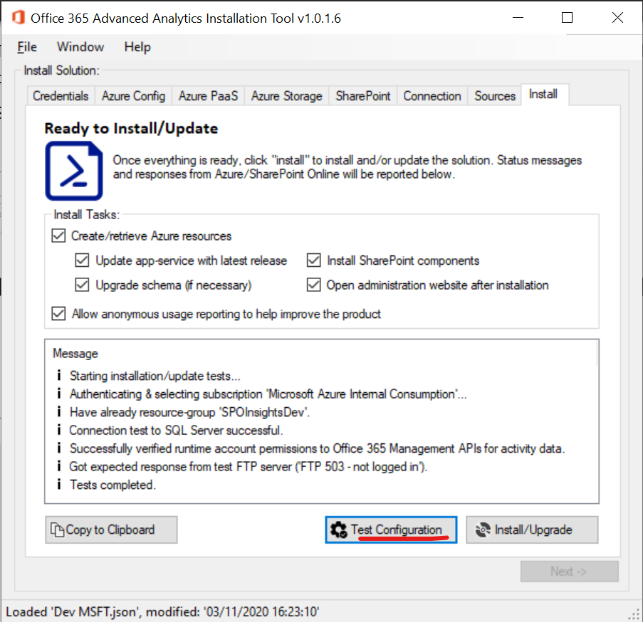
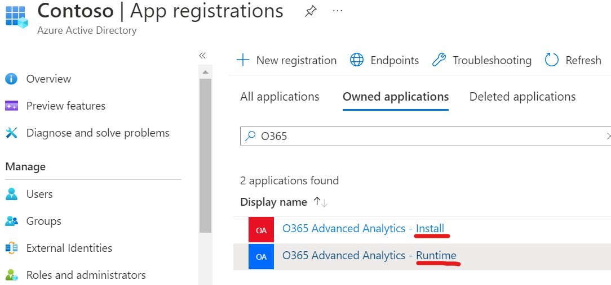
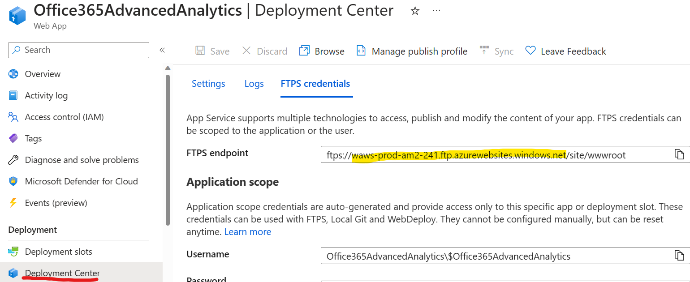

# Prerequisites

This solution has various prerequisites that should be confirmed as ready before installation if possible. Please verify which areas of the data-collection will be required before checking if a prerequisite is needed or not.

Some prerequisites can be pre-verified with the installer application:

See section 4.2 for obtaining the installer/control-panel application.

## Solution Service Accounts

This solution uses two service accounts: one runtime account to grant access to the required Office 365 APIs and one optional installation account for the installer to create & update the solution in Azure.

You will need client IDs & secrets for both.

**Permissions:**

The installer account just needs adding to Azure role-based access control (Azure RBAC).

-   Owner of a resource group.
-   Reader for the subscription.

The runtime account must have the permissions specified below in “Prerequisite Permissions” assigned and consented by an administrator.

See section 4.3.1 for more details on how to create these accounts.

## Preparation Checklist

Review the sections below to understand the prerequisite information necessary before attempting installation.

The main requirements are around the two Azure AD application registrations used in the solution: an installer app registration to create resources in Azure, and a runtime app registration.

Before attempting to install, verify all the tests work from the installer.

## Prerequisite Permissions

The system requires various permission prerequisites to work. Please verify these are in place before installation.

|Element|Description|
|-|-|
| Installer application/service principal: **Owner** of solution Azure resource group. **Read** access to subscription. | The control-panel application creates Azure resources in a single resource-group. The installation service account requires owner permissions of this group (see below). |
| Office 365 Runtime application/service principal: **Read access** to Office 365 Activity API. **Read access** to Graph API. **Note**: it is possible to run the solution without some of these permissions if an incomplete dataset is acceptable. Where access isn’t granted, the solution will log an error and continue working. | Application permission to read Office 365 data is required & consented from an Azure AD administrator. **Important**: without an Azure AD administrator’s consent, these permissions will not be active.  **Application permissions**  – Graph API: **CallRecords.Read.All** – for reading call-record data after calls are made. **Group.Read.All** – for enumerating Teams data. **Reports.Read.All** – for reading Teams user usage reports. **User.Read.All** – for resolving user IDs to email addresses. Required for various processes.  **Organization.Read.All** – for reading SKUs for users at an org level.  **TeamsAppInstallation.ReadForUser.All** – for reading Teams apps users have installed for themselves. Optional if data not needed. **AppCatalog.Read.All –** for reading apps in the app catalog. Delegated permissions – Graph API: **ChannelMessage.Read.All** – for deep analytics in selected Teams where enabled (see section 2.4.1). **Team.ReadBasic.All** – same as above. Application permissions  – Office 365 Management APIs: **ActivityFeed.Read** – for reading audit data for SharePoint Online events. |
| Yammer application registration (optional) | Setup needed as defined in [/export · Yammer Developer Site](https://developer.yammer.com/docs/data-export-api) if analytics to Yammer is required. |
| **User credentials:** | |
| SharePoint tenant administrator credentials – **only needed if deploying SPO web components**. | Used to install a SharePoint extension add-in into the app-catalog. |
| SharePoint site-collection administrator credentials – **only needed if deploying SPO web components**. | Usually same user as above; site-collection administrator rights required for target site-collections. |
| Azure subscription owner credentials. | Needed to grant **owner** rights to the installer service account on the Azure resource-group and **read** rights to the subscription.  Once granted, these user credentials should not be needed again. |
| Windows 10/11 machine with local administrator rights for installer machine. | Needed to run installation PowerShell scripts that rely on the SharePoint Online Management shell (another pre-requisite – see below). |

**Important:** as permissions are a customer-specific dependency which can take some time to organize & agree, we recommend organizing these permissions first.

## Prerequisite Information

These configuration details should be clarified before deployment. Service account/app registration steps are described in section 2.3.

| Element | Description |
|-|-|
| Azure Subscription Name | Name of the subscription to deploy solution to. |
| Azure Subscription Id | ID of Azure subscription. |
| Office 365 Tenant | Name of the Office 365 Tenant being deployed to. |
| **Optional**: Office 365 Tenant Global SharePoint Administrator credentials | A SharePoint Global Administrator with site-collection permissions to sites being deployed to. |
| OnMicrosoft domain for Office 365 | Tenant name used for Office 365 resources |

## Prerequisite Firewall Rules

These configuration details should be clarified before deployment.

| Rule | Description |
|-|-|
| SQL Server - TCP outbound 1433 to your destination SQL server DNS. | Used by installer to create/update database. |
| FTPS outbound to the app service to be created. FTPS control connection port: 990 FTPS data connection port: 989, 10001-10300 | Used to publish app-service binaries (web-jobs & website). More info: [https://docs.microsoft.com/en-us/azure/app-service/deploy-ftp?tabs=portal\#troubleshoot-ftp-deployment](https://docs.microsoft.com/en-us/azure/app-service/deploy-ftp?tabs=portal#troubleshoot-ftp-deployment)  Ports can be opened only to the FTP domain of the created app service (see below). |
| **Recommended** – HTTP port 80 to website <http://icanhazip.com> with no proxy blocking. | Used to detect public IP address, to configure a firewall exception in SQL Server created by setup wizard. If not possible to have setup call the website due to proxy restrictions, add a firewall rule to SQL Server with name “O365 Adv Analytics Setup Rule” so setup will not detect public IP address & create the rule. |
| Azure Monitor rules | Application Insights needs to be accessible from all client machines that are to be tracked - <https://docs.microsoft.com/en-us/azure/azure-monitor/app/ip-addresses> |

Get your FTP domain from the app service deployment center (requires the app service to be pre-created):

This allows you to limit the outbound ports to a specific DNS name.

## Prerequisite Azure & Office 365 Configuration

These configuration details should be verified/configured before deployment.

| Element | Description |
|-|-|
| App registration for **installation account** in target Azure AD where PaaS resources will be created| Client ID + secret for app registration. |
| App registration for **Office 365** **runtime account** in target Azure AD used by Office 365 | Client ID + secret for app registration. App registration must have permissions to Office 365 APIs (see below) |
| De-identified information on Office 365: **disabled**. | If “de-identified reports” setting is enabled, the import cannot match Teams or Activity usage reports.  <https://docs.microsoft.com/en-us/office365/troubleshoot/miscellaneous/reports-show-anonymous-user-name>  This setting isn’t critical but without de-identified reports disabled, activity across all workloads won’t be matched to the same user. For example: SharePoint will show user activity for the right user record, but Teams device activity will only show data for anonymized usernames. The result is this solution will look like x2 users, one anonymized and one real for the same user activity. |
| **Optional:** SharePoint Online Application Catalog | For the tenant being deployed to, the Application catalog needs to be available & configured to upload of the SharePoint Framework Extension. |
| **Optional**: custom scripts on sites/tenant | Custom scripts need to be enabled on any target SharePoint site-collection for classic page tracking: <https://support.office.com/en-us/article/allow-or-prevent-custom-script-1f2c515f-5d7e-448a-9fd7-835da935584f?ui=en-US&=amp&rs=en-US&ad=US&fromAR=1>  Modern pages do not require this. |
| Resource providers enabled on Azure subscription being used by the solution – see <https://docs.microsoft.com/en-us/azure/azure-resource-manager/management/resource-providers-and-types> | These resource-providers need to be enabled on the subscription used to create the PaaS resources: Microsoft.Automation Microsoft.Cache Microsoft.Insights Microsoft.KeyVault Microsoft.OperationalInsights Microsoft.ServiceBus Microsoft.Sql Microsoft.Storage Microsoft.Web Microsoft.CognitiveServices (optional; used if sentiment analysis is wanted) Microsoft.Logic (for Adoptify only) |
| Azure policies to allow public IP/endpoint addresses. | SQL Server PaaS uses public endpoints for databases (with own firewall). Policies that restrict public IP addresses can prevent this required resource from being created, so exceptions must be used if these policies are in place. |
| Storage firewall configuration to allow storage access. | Allow trusted Microsoft services to access the storage account. Allow access to storage account from installer machine via client IP address/CIDR. |

## Prerequisites for Installer Machine

We need at least one Windows 10 PC (virtual is fine) with the following configuration to run the installation from.

| Element | Details |
|-|-|
| **Optional**: SharePoint Online Management Shell | <https://www.microsoft.com/en-us/download/details.aspx?id=35588> |
| PowerShell execution policy | Remote signed enabled: `Set-ExecutionPolicy **Unrestricted**` (Not recommended for normal machines) |
| Windows version | Windows 10/11 or Windows Server 2016/2019 |
| .Net framework 4.8 runtime installed. | <https://dotnet.microsoft.com/download/dotnet-framework/net48> |
| **Recommended**: SQL Server Management Studio, to interact with database from. | <https://docs.microsoft.com/en-us/sql/ssms/download-sql-server-management-studio-ssms?view=sql-server-ver15> |
| Windows Defender SmartScreen | Set SmartScreen to “`warn only`” (installer is currently unsigned) |

The firewall requirements mean it may make sense to create a VM inside Azure to act as a “jump box” to be able to FTP upload the solution binaries to the App Service created.

Please use the “test configuration” functionality in the installer app to verify requirements are met.
