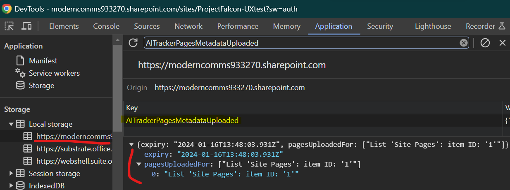
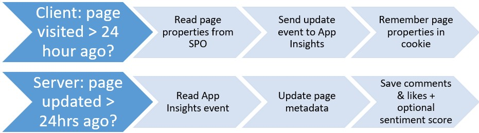

# Design Documentation

Misc notes of how the system is expected to work is detailed here.

## Page Metadata Updates

As part of the client-side scripts to track page-views, it also is responsible for to collect page metadata. This is to avoid having to crawl sites from the server which would require extra permissions to manage aside from the client-side deployment. However, the downside of having crawling done via client-side deployment is we need to throttle updates, as every visiting client is responsible for providing those updates.

Collection is done with the AITracker JavaScript for pages that are new to each browser of every visitor. “New” is defined as “not visited with within 24 hours” and is stored within the “AITrackerPagesMetadataUploaded” local storage of the browser.

This data tells the tracker for which pages in which lists we’ve read & sent page-properties to Application Insights for.

So to avoid flooding the SharePoint Online API and Application Insights, the script implements these throttling controls.

*Note: page property values over 1000 characters in length are discarded, as some properties are very long in length.*

Finally, regardless on the updates sent to App Insights, on the server-side, pages are only updated that either haven’t been updated or were updated over a day ago (URL field “file_last_refreshed”).

This is all designed so the system can scale with lots of users/pages, without causing performance problems or too much cost for Application Insights.

All the above does mean however, that if you’re testing with just a couple of users to browse a site.

