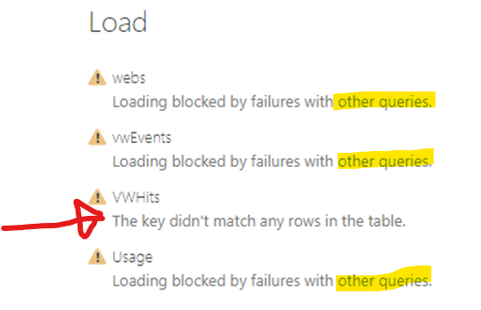
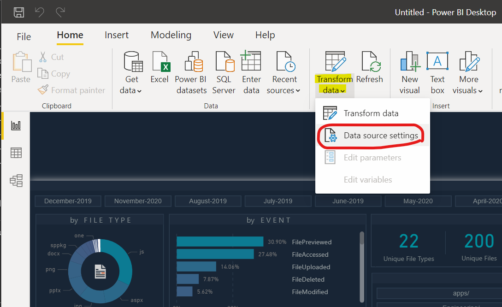
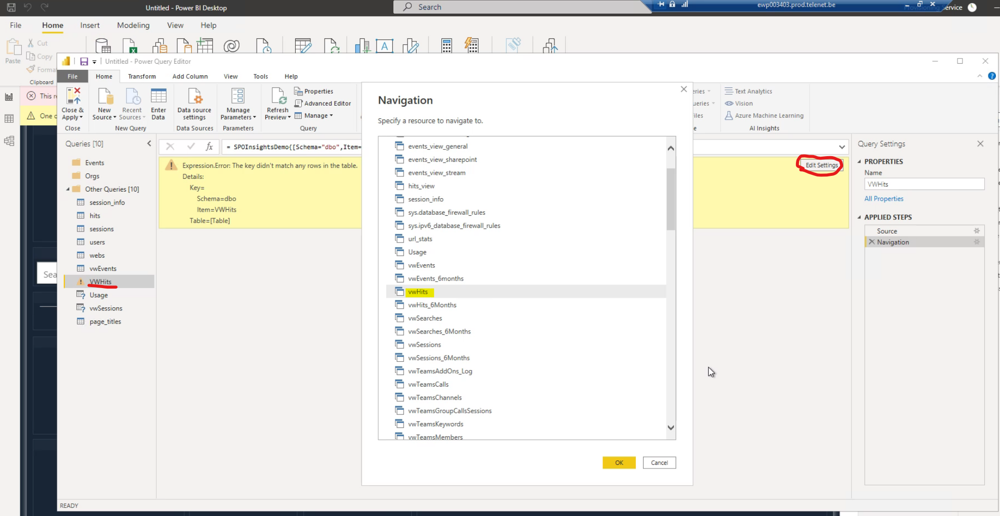
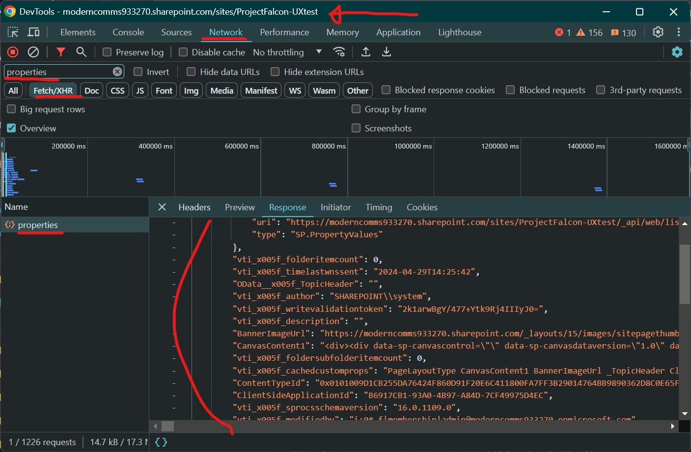

# Troubleshooting Dataflows & Setup

Here are some common issues & resolutions for getting Office 365 Advanced Analytics Engine setup.

Contents:
* [General Troubleshooting](#general-troubleshooting)
* [Getting Problem Logs](#getting-problem-logs)
* [Teams, Calls, Events Data Issues](#teams-calls-events-data-issues)
* [Network Restrictions for FTPS & SQL Outbound Ports](#network-restrictions-for-ftps--sql-outbound-ports)
* [Power BI Refresh Troubleshooting](#power-bi-refresh-troubleshooting)
* [Unexpected SharePoint Page Properties](#unexpected-sharepoint-page-properties)

## General Troubleshooting
Troubleshooting the system involves two steps:

1.  Figure out which imports are working/not-working by detecting a “finished” event for each one.
2.  For each import not finishing, what logs & errors are generated for it?

For step 2, the process is to disable everything except that failing import to get a clean set of traces and logs for when is fails.

There are several import flows in the system involved in any given import cycle:

-   AppInsightsImporter import channels:
    -   Web + events (from Application Insights).
-   Office365ActivityImporter import channels:
    -   Audit (from the Activity API).
    -   Graph import:
        -   User metadata
        -   Usage reports (all)
        -   Teams/channels

Each channel will report when it is successfully finished importing with a “FinishedSectionImport” custom event name in Application Insights, along with how long it took. When the importer has finished a whole cycle is a “FinishedImportCycle” event is logged; also with the total time taken.


Here we can see import cycles per process, and in each cycle the sections being confirmed as completed.

On a healthy environment, with all imports enabled you will see (in no particular order):

-   FinishedSectionImport - Hits import
    -   FinishedImportCycle – **AppInsightsImporter**
-   FinishedSectionImport - User Teams apps refresh
-   FinishedSectionImport - Usage reports
-   FinishedSectionImport - Teams import
-   FinishedSectionImport - Audit events
-   FinishedSectionImport - User metadata refresh
-   FinishedSectionImport - User Teams apps refresh
    -   FinishedImportCycle - **Office365ActivityImporter**

Check you can see these messages with this query in Application Insights:

```
customEvents | where name == "FinishedSectionImport" or name == "FinishedImportCycle"
```

This will give you all section finished events from both importer jobs. If you just want the activity imports, run this:

```
customEvents | where (name == "FinishedSectionImport" or name == "FinishedImportCycle") and operation_Name == "Office365ActivityImporter"
```

If you are missing any of those events within a 24-hour period and ImportJobSettings is set to import them, you should follow the below advice to start investigating why.

## Getting Problem Logs

If you suspect a problem with a particular flow the method to troubleshoot is the following:

1.  Disable all other imports via the “ImportJobSettings” setting (see below).
2.  Once configured, review exceptions logged for that single flow.
3.  Confirm you can/cannot see the “FinishedSectionImport” event is seen for the flow.
4.  Repeat the process with other import flows – verify each one can finish without fatal exceptions.
5.  Check on the app-service-plan free memory especially. If there is a lot of data the import processes can crash from running out of memory. It can also be worth increasing the scale of the app-service-plan to a much higher SKU temporarily to verify the problem isn’t around performance.

If you find a fatal exception that isn’t obvious what the cause is, please email with the details. We may need your configuration to be able to test and reproduce the error with a debugger.

## Teams, Calls, Events Data Issues

This data is all imported with the “Office365ActivityImporter” web-job. It imports data in the following order:

-   Teams
    -   User activity – usage & device reports
    -   Teams, channels: apps installed, members, etc, per day
    -   Deep analytics if enabled: channel chat metadata processing
        -   Keywords
        -   Sentiment score
        -   Languages spoken
-   Activity import
    -   Audit-log import for SharePoint, and other enabled workloads.

### No Calls Data in Database

If you have no records in the “call_records” table, this could be for any number of reasons.

Call records are pushed from Graph into the solution via a webhook notification & a subscription, all of which should be created automatically. From the webhook, the call JSon is added to a service-bus queue & then picked-up by the importer web-job.

If call records aren’t being imported into SQL, you need to:

-   Verify the Graph webhook is available.
    -   Go-to the app-service webpage.
    -   Click the “test webhook with validation POST” link to simulate a web-hook call.


-   Verify the subscription for Graph calls is created.
    -   In Application Insights, log analytics: run this query:
        -   To see if the webhook subscription was created ok from the importer web-job:

```
traces | where operation_Name == "Office365ActivityImporter" and (message contains "Verifying call webhook subscription" or message contains "Updated subscription" or message contains "Created subscription")
```

If you want to see webhook subscription failures:

```
traces
| where operation_Name == "Office365ActivityImporter" and message contains "Couldn't create webhook"
```

To see if the webhook has been called (which will add them to the service-bus queue for calls):

```
traces
| where operation_Name == "CallRecordWebhookController"
```
Check for service-bus processing messages.

```
traces
| where message contains "ServiceBus"
```

This data will tell you where in the chain the call records are failing.

**Note**: it can take 15-20 minutes for a call webhook to trigger, after a call.

#### No Events Data in Database
Check webjobs are running and any exceptions in Application Insights. 

#### “Office365ActivityImporter” Web-Job Restarts

Also seen in logs: “FATAL ERROR: No org URLs found in database!”.
Make sure there is at least one record in the “orgs_urls” table


Without anything here, all activity would be imported, so if the table is empty then the web-job aborts execution & hence this error.

### No Logging in Application Insights
If you see no data in Application Insights for any of the importer web-jobs like this:


You need to check the app-service logs to figure out why.


In this case, we’ve updated the system without migrating the database correctly to the new schema, so the data-layer (entity framework) can’t initialise the database correctly & crashes.

Misc Errors

### Database Schema/Context Model Error

You may see this error:

*The model backing the 'SPOInsightsEntitiesContext' context has changed since the database was created.*

This is due to a mismatch between the solution binaries & the database; usually newer binaries running on an old schema.

The installer application can update the schema if needed & should be done when applying updates, with this option:


This option will use the installer in the software sources (not the installer running the install) to initialise & upgrade the database schema. The installer calls a copy of itself.

The reason we use the “downloaded” installer is so we can be reasonably sure the installer has the same context model version as the web-jobs being uploaded & installed, so there will not be any mismatches.

**Forcing Schema Updates**

If you want to forcibly update a database to the same data-model as the installer itself, you can do so via this menu option:


This window will perform the same operation as the proxy install, but in this installer instance.


**Important**: only do this if you are absolutely certain the installer you are running is the right build.

Enabling/Disabling Imports

The system can be set to only import certain data with a “ImportJobSettings” app-service configuration setting:

**Calls**=True;**GraphUsersMetadata**=True;**GraphUserApps**=True;**GraphUsageReports**=True;**GraphTeams**=True;**ActivityLog**=True;**WebTraffic**=True

Setting any category as “false” will mean that part is skipped.

These options are also set on the installer:


If you want to change them later, you can change them in the app service configuration:


Save configuration, and the next import cycle will skip whatever’s not enabled.

## Network Restrictions for FTPS & SQL Outbound Ports

Some customers may have firewall restrictions that limit outbound traffic. For the installer, we need specific ports to be able to install or update the contents of the database & app-service.

We have built a test functionality to help clarify if the right ports are open:


You can test FTPS and SQL outbound in the installer using either an example FTPS & SQL endpoint we’ve provisioned for these tests, or after creating your own App Service & SQL server, use those endpoints for the “test configuration”.

This is useful if your security teams require the outbound rule to be for a specific endpoint and you want to verify with the test configuration button.


Here we’re automatically detecting the FTP host used in our app-service that’s been created and configured in the installer (either created already by the installer, or manually). These endpoints can then be used for the tests.


If your networking team require outbound ports open to a specific endpoint and you wish to use the test functionality, this is how you can change the test configuration.

## Unexpected/Missing SharePoint Page Properties


## Power BI Refresh Troubleshooting

If you have an issue with some of the reports refreshing against your own database, like so:



…you may need to remap some of the SQL views to the report.

Why this happens isn’t clear, but when creating a Power BI report from a template, references to some SQL views can get lost.

To fix this click the “transform data” button in Power BI desktop:



Once there, find any table that’s showing a yellow exclamation point. Click “edit settings” which will open a browser to the SQL objects in the database (tables & views).



Select the view that’s got the same name and click “OK”. You’ll have to close & apply the changes but hopefully the data refresh will now work.

Multifactor Authentication (MFA) Causing SharePoint Install Errors

Error text: “*'IdcrlException': The sign-in name or password does not match one in the Microsoft account system”*

If the SharePoint account used to install the tracking JavaScript has MFA enabled, this installer stage will fail. The standalone PowerShell will also likely not work for the same reason.

This is due to how both authenticate with that account. Work is being done to utilise the PnP PowerShell cmdlets to overcome this limitation.

Workarounds:

-   Use the SharePoint add-in to deploy to each site-collection.
-   Use a SharePoint account without MFA applied.
-   Deploy to SharePoint with the “PnP” PowerShell script .

## Unexpected SharePoint Page Properties
If you're not seeing the properties you're expecting for pages in SP and you've verified the page has been refreshed with the [notes](productnotes.md#page-metadata-updates), the next step is to check the API call the tracking JS makes to read page properties.



These are the fields that'll be sent to update for the page in question. Verify the field you're expecting is in this list. 

If you can't see this request when you visit the page, you're expecting to see the field on, you should clear the "AITrackerPagesMetadataUploaded" cookie (see [product notes](productnotes.md#page-metadata-updates)).

