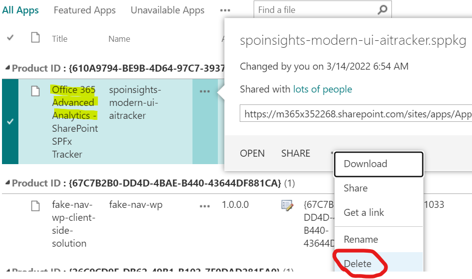

# Uninstallation Instructions

There is no fully automatic uninstallation process, so this process is as follows:

-   Unregister web-tracker from deployed SharePoint sites with:

    .\\InstallSPOInsightsTracker.PnP.ps1

    \-ConfigFileName "MyConfig.json"

    \-**UninstallOnly**

    -   The configuration file is the same created to deploy to sites (see the manual setup steps above).
    -   Uninstall the SPFx solution from the app store:

        
