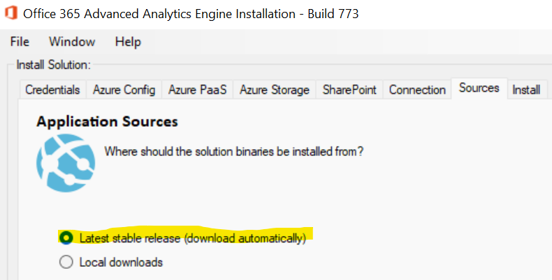
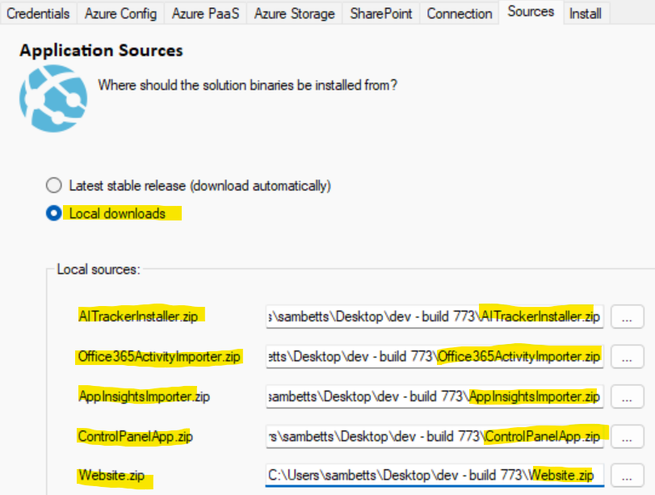
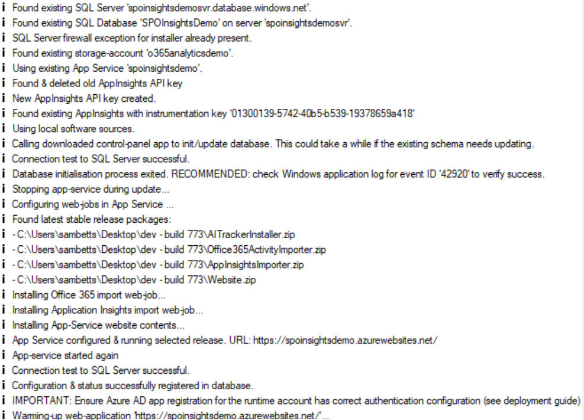

## Updating the Solution

Occasionally it’s necessary to update the solution to a new version; either to resolve an issue or to take advantage of new capabilities.

The new version can either be a stable build or a testing build if you need a fix more urgently.

### Installer Upgrade Method

For stable builds, just follow the installation instructions again making sure that the “latest stable” release option is selected in the sources tab:

For testing/dev builds you need to download each component manually from the releases website, and then in the installer specify each file location:

Make sure you don’t mismatch each file.

Start the installation as before from the same configuration file + the above settings. The process will be as before:

1.  Create Azure resources where necessary (if this is an upgrade, it shouldn’t need to create anything new).
2.  Update the import web-jobs with the configured versions above.
3.  Upgrade the SQL schema with any new changes.
    1.  Most new versions don’t introduce schema changes, but some do.
4.  Save the configuration applied in the SQL database & enter SharePoint URLs installed to, to the “org_urls” table so activity imports work there too.
5.  Restart the app service.

The output should look something like this:

**Important**: once done, verify the web-jobs are running as per section 4.4.2. If a database schema change has been applied or is required, then you should double-check the new binaries are running correctly.

See section 6.5 for more information.
